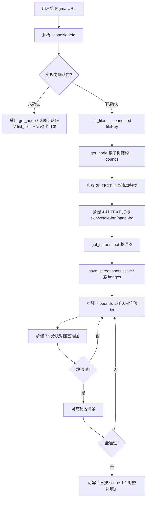

# Figma UI 1:1 还原（Figma Agent Kit）

沟通：简体中文。

## 定位

本 Skill 指导 Agent 用 **本仓库配套工具链**完成通用 UI 稿还原：

| 组件 | 用途 |
|------|------|
| **Figma Agent Kit 插件** | Figma Desktop 中运行；桥客户端、可选切图 UI |
| **`figma-agent-mcp`** | stdio MCP：读节点 / 截图 / `save_screenshots` 等 |

**不是**：某一活动仓专用流水线；不绑定 partyActivity / hh-active / fe-prd-plan。  
**是**：任意前端项目里「对着 Figma scope 做结构还原 + 切图 + 验收」的通用流程。

前置文档（需要时 Read）：

- 上手 / 工具表：仓库 `docs/zh/getting-started.md`、`docs/zh/tools.md` 或文档站  
- 桥协议：`docs/zh/bridge-protocol.md`

---

## 一句话总览

```text
锁 scope →（确认门）→ list_files → get_node 读结构 → TEXT 全量归类
  → 切图打标 → get_screenshot 基准图 → save_screenshots×3 落盘
  → bounds 落码 → 分块对照 → 验收清单勾完才能说「1:1」
```

默认 **`figmaMode: strict`**。仅用户明文「快速 / fast」时可压缩步骤 3 的冗长层级表、可省略步骤 5 **落盘**基准图；**不得**跳过 **3b TEXT 清单**与**步骤 4 切图粒度**，**不得**整页一图兜底。

---

## 流程总图



---

## 0. 前置检查（工具链）

```
- [ ] Figma Desktop 已打开目标文件（设计模式；勿依赖易休眠的浏览器标签）
- [ ] 已 Import 并运行 Plugins → Development → Figma Agent Kit
- [ ] 插件显示 MCP Bridge 已连接（绿色）
- [ ] Cursor（或其它宿主）已配置 figma-agent-mcp：npx -y figma-agent-mcp
- [ ] MCP 面板可见工具（约 37 tools）
- [ ] node-id：URL 中 1-234 → MCP 用 1:234
```

**MCP 调用约定**

1. 优先使用已连接的 **figma-agent-mcp**（宿主里名称可能是 `figma-agent-mcp` / `user-figma-agent-mcp` 等）。  
2. **先 `list_files`**，用返回的 **connected `fileKey`**；勿只用 URL 里的 fileKey（易出现 No plugin connected）。  
3. 默认端口 **1998**（与 `bridge.config.json` / 插件构建一致）；自定义端口须 MCP 与插件同改。  
4. 调用前用 `GetMcpTools`（若环境要求）确认参数 schema。

常用工具：

| 用途 | 工具 |
|------|------|
| 探活 / 取 fileKey | `list_files` |
| 读选区 | `get_selection` |
| 读节点树 | `get_node`（`nodeIds`，可选 `depth`） |
| 选中 / 聚焦 | `set_selection`、`scroll_and_zoom_into_view` |
| 视觉基准（Agent 侧预览） | `get_screenshot`（默认 PNG，`scale` 默认 2；基准建议 scale 1～2） |
| 切图落盘 | `save_screenshots`（**`scale: 3`**，PNG **`compress: true`**） |

---

## 1. 范围与确认门（先于切图）

| 规则 | 说明 |
|------|------|
| **单链接默认** | URL 只有 1 个 `node-id` → 只处理 **`scopeNodeId` 子树** |
| **禁止扩扫** | 不为「还原整站 / 盘点全部页面」自动扫 scope 外；须用户明文多个 `node-id` 或等价授权 |
| **确认前** | **禁止**为本还原做 `get_node` / `save_screenshots` / 全树 walk；允许 `list_files`、在仓库里定输出目录 |
| **需求先验** | 若用户提供或仓库已有需求/交互说明：**先 Read**，作 3b 文案先验，仍须对稿校对 |

解析：`node-id=aaa-bbb` → `scopeNodeId = aaa:bbb`。

确认门话术示例（实现向任务）：先复述 scope、目标技术栈/目录、figmaMode，得到用户明确「开始还原」后再进步骤 1。

---

## 2. 操作顺序（strict · 勿跳关键步）

| 步 | 动作 | 产出 |
|----|------|------|
| **0** | 有需求文档 → Read | 文案与模块先验 |
| **1** | `list_files` | connected `fileKey` |
| **2** | 锁定 `scopeNodeId` | 仅子树内操作 |
| **3** | `get_node` 读 bounds / 层级；需要时可辅选区 | DOM/CSS 分区规划；**禁止整页一图硬顶** |
| **3b** | **TEXT 全量清单**（切图前必做） | 每条 TEXT 已归类；未归类 **不得** `save_screenshots` |
| **4** | **切图打标** | 只导 `skin` / `whole-btn` / `panel-bg`（含 `modal-panel-bg`） |
| **5** | `get_screenshot(scopeNodeId)` | 全程视觉基准（会话内保留） |
| **6** | `save_screenshots` | 3× PNG，`compress: true`，路径指向项目约定目录 |
| **7** | 落码 | bounds 相对**布局父**换算；strict 时 **bounds 优先于 flex 均分** |
| **7b** | **分块增量对照** | 每大块对照基准图；不过关不进入下一块 |
| **8** | **对照验收清单** | 全过才能写「1:1 对照验收」 |

`fast`：可压缩步骤 3 层级表、可省略步骤 5 **文件落盘**（仍建议会话内看过截图）；**3b / 4 仍必做**。

---

## 3. 步骤 3b · TEXT 节点清单

对 scope 内**每一个** `type: TEXT`（及可见文本等价层）登记，**禁止**只在心里过一遍。每条**只能**归入一类：

| 归类 | 落码 | 典型 |
|------|------|------|
| **`whole-btn-text`** | 与按钮底同组导出 **whole-btn**；页上透明可点控件 + 整图 | 「去送礼」「立即开通」等艺术字按钮 |
| **`jsx-fixed` / `dom-fixed`** | 代码写死可见文案；**不**进皮肤 PNG | 时间说明、静态提示、步进器旁固定句 |
| **`dynamic`** | mock/接口 + DOM 文本节点 | 标题可配置项、昵称、进度 `5/10`、价格 |

**图片字 / 位图艺术字（须登记）**：

| 归类 | 落码 |
|------|------|
| 弹窗内固定标题 art | 优先并入 **`modal-panel-bg`**；禁止底+标题无故各切一层硬叠 |
| 主/次 CTA art | 与底一起 **whole-btn** |
| 会随状态/语言变 | `dynamic` 或 `dom-fixed` |

**同级底 + TEXT**：禁止只导无字底再假装有字；须升组 **whole-btn**，或底 `skin` + TEXT 在 DOM **可见**落地。**禁止**仅有 `aria-label`、页面看不见字。

---

## 4. 步骤 4 · 切图打标

**原则**：导出可复用皮肤或含固定艺术字的整钮；**运行时会变的文案/商品图不进 PNG**。

| 打标 | 含义 | 是否导出 |
|------|------|----------|
| **`skin`** | 纯底、装饰、空格底、角标 | 是 |
| **`whole-btn`** | 固定艺术字与底一体的按钮 Group/Frame | 是；PNG 须肉眼可见文案 |
| **`dynamic`** | 会变的图/名/数量/列表项内容 | **否**（DOM/数据） |
| **`panel-bg`** | 面板仅底（不含业务子层） | 是 |
| **`modal-panel-bg`** | 居中弹窗：固定底+图片标题+静态装饰 **一张** | 是 |
| **`skip`** | 重复参考、scope 根仅作容器、默认隐藏关闭层等 | 否 |

**常用映射**：

| 稿面 | 导出 | 落码 |
|------|------|------|
| 主 CTA | `whole-btn` | 透明 button/可点层 + 整图背景 |
| 商品/材料格 | 空底 `skin` + 角标 | `` + 文本组件 + 数量 |
| 奖励条/列表区 | 分区 `panel-bg` | `map` 子项；禁止 PNG 烤死 mock 名再叠同文案 |
| 步进器 | 左右固定句 `dom-fixed`；中间数字 `dynamic` | 数字来自 state |
| 居中弹窗（未特别指定） | **`modal-panel-bg` 一张** | 单底；动态区 DOM；操作钮单独 whole-btn |

**硬红线**：

- 含将由接口替换的 TEXT 的 Frame → **禁止**整图导出再叠同样文案  
- 含多个业务卡片+TEXT 的父 Frame → 拆 `panel-bg` + 单格 `skin`，禁止一块导完  
- 弹窗默认禁止「整框底 + 同级标题 art」无必要的双 `skin` 叠层  
- scope 内 TEXT 无归类，或归了 `dom-fixed`/`dynamic` 但 DOM 未实现 → 禁止交付为通过  

**切图落盘（figma-agent-mcp）**：

```text
save_screenshots
  scale: 3
  format: png（或工具默认 PNG）
  compress: true
  path / items：指向仓库内目录的绝对路径（如 …/src/assets/figma/ 或用户指定）
```

- 文件名：`snake_case`，建议前缀 `bg_` / `btn_` / `card_` / `modal_`  
- 批量用工具支持的 `items[]`（以当前 MCP schema 为准）  
- 成功后**不要**再无意义地二次全量压缩（除非用户要求）  
- **禁止**把 MCP 临时 URL 当长期资源提交；以本地文件为准  

---

## 5. 步骤 7 · 落码（1:1）

目标技术栈随仓库而定（React/Vue/小程序/CSS Modules 等）；原则通用：

| 原则 | 说明 |
|------|------|
| **数值来自稿** | `top/left/width/height` 用 bounds 相对**布局父 `nodeId`** 换算（`px` / `rem` / `vw` 等按项目约定）；落码前标明参照父，禁止混用「相对画板」与「相对子 Frame」 |
| **bounds 优先 flex** | strict 1:1 时，非等宽/非同行格子用绝对定位或逐格 bounds；**禁止**用 `flex:1` 均分 + 少量 margin 糊弄非对称稿 |
| **对齐** | 尊重 TEXT `textAlignHorizontal` 与父框宽；禁止默认强制居中顶掉稿面左/右对齐 |
| **皮肤来自切图** | 禁止随意用 CSS 渐变/色块替代稿中已导出的切图（动态宽进度条等除外，须说明） |
| **字体** | 按稿 `fontFamily`/`fontSize`/`fontWeight`/`lineHeight` 落地；无法落地须在交付说明写偏差 |

---

## 6. 步骤 7b · 分块对照

每完成一大块（例：头图+说明 / 主内容区 / 底栏 / **单个弹窗**），对照步骤 5 基准图：

- 有无**缺字**  
- 有无**块级上下/左右偏移**  
- 切图是否缺、字号/颜色是否明显漂  

**未通过不得继续下一块。**

---

## 7. 对照 Figma 验收清单（交付前）

- [ ] **布局**：间距、对齐、区块尺寸与 scope 一致（±1px 抗锯齿可接受）  
- [ ] **字体**：族/号/重/行高一致或已说明降级  
- [ ] **颜色**：文案/描边/填充一致或已说明替代  
- [ ] **切图**：均来自本地资源目录；无临时 URL；无「整 Frame 含 mock」与 DOM 叠切  
- [ ] **切图粒度**：主 CTA = whole-btn；可变文案 = 数据 + DOM；弹窗默认 modal-panel-bg 含固定标题  
- [ ] **文案**：固定说明句可见且与稿一致  
- [ ] **TEXT 清单**：3b 每条已在页上或 whole-btn 中可见；无漏字、无仅 aria-label  
- [ ] **分块对照**：7b 已过，无未修块级偏移  
- [ ] **状态**：对应当前帧；其它 Tab/弹窗帧未验须标注  
- [ ] **scope**：未用 scope 外节点擅自扩布局  

**措辞**：仅当上表（含 TEXT + 分块）全过，才可写 **「已按 scope 画板做 1:1 对照验收」**；否则列出未通过项，禁止形式勾选。

---

## 8. 与其它 Skill / 工作流的关系

| 场景 | 用谁 |
|------|------|
| 按 Figma **还原 UI 代码 + 切图验收** | **本 Skill（figma-ui-restore）** |
| 仅图层语义命名 / 视觉分组（稿面整理） | 仓库或个人向的 layers 类 Skill（若有）；可作还原前置，不替代本流程 |
| 活动仓完整研发（PRD、接口类型、Pattern 总入口） | 各业务仓自己的 agent Skill；**不要**假定本仓库包含活动业务脚手架 |

本 Skill **刻意不包含**：业务 PRD 拉取、接口 codegen、Storybook 像素 diff 矩阵——用户明文要求时再叠加其它流程。

---

## 9. 过程输出模板（建议）

```markdown
## Figma 还原过程

- scopeNodeId: …
- fileKey(connected): …
- figmaMode: strict | fast
- MCP: figma-agent-mcp
- 输出目录: …

### 3b TEXT 清单
| nodeId | 文案摘要 | 归类 |
|--------|----------|------|
| … | … | whole-btn-text / dom-fixed / dynamic |

### 4 切图清单
| nodeId | 打标 | 文件名 |
|--------|------|--------|
| … | skin / whole-btn / panel-bg / modal-panel-bg | … |

### 7 布局参照父
- 参照父 nodeId: …
- 模块 → top/left/w/h（设计 px）→ 项目单位

### 7b 分块对照
- [ ] 块A …
- [ ] 块B …

### 8 验收
- 通过项 / 未通过项 / 是否可声称 1:1
```

---

## 10. 排障速查

| 现象 | 处理 |
|------|------|
| No plugin connected | Desktop 开插件；`list_files` 换 connected `fileKey` |
| 工具列表为空 | 检查 MCP 配置与 `npx -y figma-agent-mcp`；插件灯是否绿 |
| 切图像素发糊 | `save_screenshots` 使用 **`scale: 3`** |
| 多窗口抢端口 | 保持默认选举；勿手动起多个冲突端口的 MCP |
| URL fileKey 无效 | 始终以 `list_files` 为准 |
