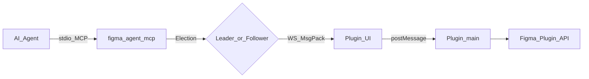

# Figma Agent Kit

**English** | [简体中文](./README.zh-CN.md)

[](https://github.com/ChinaCarlos/figma-agent-kit/actions/workflows/ci.yml)
[](https://www.npmjs.com/package/figma-agent-mcp)
[](https://www.npmjs.com/package/figma-agent-mcp)
[](https://github.com/ChinaCarlos/figma-agent-kit/releases)
[](https://github.com/ChinaCarlos/figma-agent-kit/actions/workflows/pack-mcp.yml)
[](https://github.com/ChinaCarlos/figma-agent-kit/actions/workflows/pack-plugin.yml)
[](./LICENSE)
[](https://nodejs.org)

**Open-source Figma Desktop plugin + local MCP bridge** so AI agents (Cursor, Claude Code, Codex, …) can read and write the file you have open — without uploading the canvas through Figma’s REST API.

<p align="center">
  
</p>



Deep dive: [docs/architecture.md](./docs/architecture.md) · [Screenshot gallery](./docs/screenshots.md).

## Why

| Need | What this kit does |
|------|---------------------|
| Agent ↔ live canvas | 37 MCP tools (read / write / screenshots / Motion) |
| Local privacy | Bridge traffic on `localhost` (default port **1998**) |
| Multi-window agents | Leader / Follower election — one WS bridge, many MCP processes |
| Designer workflows | Optional AI rename & grouping, 3× slice export, zh/en UI |

## Packages

| Package | Distribution | Description |
|---------|--------------|-------------|
| [`figma-agent-mcp`](https://www.npmjs.com/package/figma-agent-mcp) | npm / [GitHub Packages](https://github.com/ChinaCarlos/figma-agent-kit/pkgs/npm/figma-agent-mcp) | Stdio MCP server + HTTP/WS bridge |
| `figma-agent-plugin` | [GitHub Releases](https://github.com/ChinaCarlos/figma-agent-kit/releases) ZIP | Figma plugin (bridge client, AI, export) |

Keep MCP and plugin on the **same version** (see [npm](https://www.npmjs.com/package/figma-agent-mcp) / [Releases](https://github.com/ChinaCarlos/figma-agent-kit/releases)).

## Features

- **37 MCP tools** — document/selection/node reads, fills, text, auto-layout, create/group/delete, Motion beta, and more ([catalog](./docs/tools.md))
- **MessagePack bridge** — binary WS + follower RPC; screenshots as raw PNG bytes on the wire
- **`save_screenshots`** — TinyPNG-style PNG compression; `scale=3` matches plugin slice export
- **Plugin AI** — vision rename & nested visual grouping via OpenAI-compatible APIs ([details](./docs/ai-features.md))
- **Slice export UI** — 1× preview, 3× PNG / ZIP ([details](./docs/exporting-slices.md))
- **i18n** — Chinese / English plugin UI

## Quick start

### 1. Plugin

Download `figma-agent-plugin-v*.zip` from [Releases](https://github.com/ChinaCarlos/figma-agent-kit/releases), unzip, then in Figma Desktop:

**Plugins → Development → Import plugin from manifest…** → select `manifest.json` → run **Figma Agent Kit**.

A green **MCP Bridge connected** status means the plugin can talk to the local MCP server:

| Full panel | Mini mode |
|------------|-----------|
|  |  |

### 2. MCP clients

Step-by-step for **Cursor, Claude Code, Codex, Qoder, CodeBuddy, Trae**:

**[docs/agent-setup.md](./docs/agent-setup.md)** · [中文](./docs/zh/agent-setup.md)

**Cursor quick example** — `~/.cursor/mcp.json`:

```json
{
  "mcpServers": {
    "figma-agent-mcp": {
      "command": "npx",
      "args": ["-y", "figma-agent-mcp"]
    }
  }
}
```


Restart MCP, open a file, run the plugin. In Cursor → MCP settings you should see **figma-agent-mcp** with **37 tools enabled**:


Then ask the agent to call `list_files` → `get_selection`.

### 3. From source

```bash
git clone https://github.com/ChinaCarlos/figma-agent-kit.git
cd figma-agent-kit
pnpm install
pnpm build:all
# Import packages/figma-agent-plugin/manifest.json
# pnpm start:mcp   # optional local server
```

Full walkthrough: [docs/getting-started.md](./docs/getting-started.md).

## Documentation

Default docs are **English**. Switch language: **English** (this page) · [简体中文](./README.zh-CN.md).

| Doc | Description |
|-----|-------------|
| [Getting started](./docs/getting-started.md) · [中文](./docs/zh/getting-started.md) | Install, configure, smoke test |
| [Connect AI agents](./docs/agent-setup.md) · [中文](./docs/zh/agent-setup.md) | Cursor / Claude Code / Codex / Qoder / CodeBuddy / Trae |
| [Screenshots](./docs/screenshots.md) · [中文](./docs/zh/screenshots.md) | Plugin + Cursor UI gallery |
| [Chinese docs index](./docs/zh/README.md) | Full 简体中文 documentation set |
| [Architecture](./docs/architecture.md) · [中文](./docs/zh/architecture.md) | Modules, stack, Mermaid flows |
| [Bridge protocol](./docs/bridge-protocol.md) · [中文](./docs/zh/bridge-protocol.md) | WS / HTTP / MsgPack |
| [MCP tools](./docs/tools.md) · [中文](./docs/zh/tools.md) | Tool reference |
| [AI features](./docs/ai-features.md) · [中文](./docs/zh/ai-features.md) | Rename & group |
| [Exporting slices](./docs/exporting-slices.md) · [中文](./docs/zh/exporting-slices.md) | Plugin + MCP export |
| [FAQ](./docs/faq.md) · [中文](./docs/zh/faq.md) | Troubleshooting |
| [MCP release](./docs/mcp-release.md) · [中文](./docs/zh/mcp-release.md) / [Plugin release](./docs/plugin-release.md) · [中文](./docs/zh/plugin-release.md) | Publishing |

## Security & privacy

- Bridge tools talk to Figma only through the **local** plugin — no cloud upload of the document for MCP.
- Optional AI rename/group sends **screenshots + layer metadata** to the API base URL you configure; keys stay in Figma `clientStorage`.
- See [SECURITY.md](./SECURITY.md) to report vulnerabilities.

## Contributing

See [CONTRIBUTING.md](./CONTRIBUTING.md) and the [Code of Conduct](./CODE_OF_CONDUCT.md).

```bash
pnpm install
pnpm build:all
pnpm sync:bridge   # after changing bridge.config.json
```

## License

[MIT](./LICENSE)

## Acknowledgments

Inspired by local Figma ↔ agent bridge patterns in the wider design-tooling community. Built for Desktop + MCP-first workflows.
