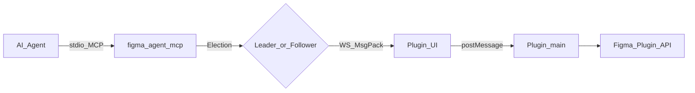

# Figma Agent Kit

[English](./README.md) | **简体中文**

[](https://github.com/ChinaCarlos/figma-agent-kit/actions/workflows/ci.yml)
[](https://www.npmjs.com/package/figma-agent-mcp)
[](https://www.npmjs.com/package/figma-agent-mcp)
[](https://github.com/ChinaCarlos/figma-agent-kit/releases)
[](https://github.com/ChinaCarlos/figma-agent-kit/actions/workflows/pack-mcp.yml)
[](https://github.com/ChinaCarlos/figma-agent-kit/actions/workflows/pack-plugin.yml)
[](./LICENSE)
[](https://nodejs.org)

**开源 Figma Desktop 插件 + 本地 MCP 桥**：让 Cursor / Claude Code / Codex 等 AI Agent 读写当前打开的设计稿，而无需把画布经 Figma REST API 上传到云端。

<p align="center">
  
</p>



深入阅读：[架构说明](./docs/zh/architecture.md) · [截图图库](./docs/zh/screenshots.md) · [英文文档](./docs/README.md)

## 为什么需要它

| 需求 | 本项目提供 |
|------|------------|
| Agent ↔ 实时画布 | 37 个 MCP 工具（读 / 写 / 截图 / Motion） |
| 本地隐私 | 桥接流量走 `localhost`（默认端口 **1998**） |
| 多 Agent 窗口 | Leader / Follower 选举 — 共用一条 WS 桥 |
| 设计师工作流 | 可选 AI 重命名 / 分组、3× 切图、中英 UI |

## 包说明

| 包 | 分发方式 | 说明 |
|----|----------|------|
| [`figma-agent-mcp`](https://www.npmjs.com/package/figma-agent-mcp) | npm / [GitHub Packages](https://github.com/ChinaCarlos/figma-agent-kit/pkgs/npm/figma-agent-mcp) | Stdio MCP + HTTP/WS 桥 |
| `figma-agent-plugin` | [GitHub Releases](https://github.com/ChinaCarlos/figma-agent-kit/releases) ZIP | Figma 插件（桥客户端、AI、切图） |

请保持 MCP 与插件为**同一版本**（见 [npm](https://www.npmjs.com/package/figma-agent-mcp) / [Releases](https://github.com/ChinaCarlos/figma-agent-kit/releases)）。

## 功能特性

- **37 个 MCP 工具** — 文档/选区/节点读写、填充、文本、Auto Layout、创建/分组/删除、Motion 等（[目录](./docs/zh/tools.md)）
- **MessagePack 桥** — 二进制 WS + Follower RPC；截图在链路上为原始 PNG 字节
- **`save_screenshots`** — TinyPNG 风格 PNG 压缩；`scale=3` 与插件切图一致
- **插件内 AI** — 视觉重命名与嵌套分组（OpenAI 兼容 API）（[说明](./docs/zh/ai-features.md)）
- **切图导出 UI** — 1× 预览、3× PNG / ZIP（[说明](./docs/zh/exporting-slices.md)）
- **i18n** — 插件界面中文 / English

## 快速开始

### 1. 安装插件

从 [Releases](https://github.com/ChinaCarlos/figma-agent-kit/releases) 下载 `figma-agent-plugin-v*.zip`，解压后在 Figma Desktop：

**Plugins → Development → Import plugin from manifest…** → 选择 `manifest.json` → 运行 **Figma Agent Kit**。

状态显示绿色 **MCP Bridge 已连接** 表示插件可与本地 MCP 通信：

| 完整面板 | Mini 模式 |
|----------|-----------|
|  |  |

### 2. 配置 MCP 客户端

**Cursor、Claude Code、Codex、Qoder、CodeBuddy、Trae** 的完整接入步骤：

**[docs/zh/agent-setup.md](./docs/zh/agent-setup.md)** · [English](./docs/agent-setup.md)

**Cursor 快速示例** — `~/.cursor/mcp.json`：

```json
{
  "mcpServers": {
    "figma-agent-mcp": {
      "command": "npx",
      "args": ["-y", "figma-agent-mcp"]
    }
  }
}
```


重启 MCP，打开文件并运行插件。在 Cursor → MCP 设置中应看到 **figma-agent-mcp** 且 **37 tools enabled**：


然后让 Agent 调用 `list_files` → `get_selection`。

### 3. 从源码构建

```bash
git clone https://github.com/ChinaCarlos/figma-agent-kit.git
cd figma-agent-kit
pnpm install
pnpm build:all
# 导入 packages/figma-agent-plugin/manifest.json
# pnpm start:mcp   # 可选本地启动
```

完整步骤见 [上手指南](./docs/zh/getting-started.md)。

## 文档索引

| 文档 | 说明 |
|------|------|
| [上手指南](./docs/zh/getting-started.md) | 安装、配置、冒烟测试 |
| [接入 AI Agent](./docs/zh/agent-setup.md) | Cursor / Claude Code / Codex / Qoder / CodeBuddy / Trae |
| [截图图库](./docs/zh/screenshots.md) | 插件 + Cursor 界面截图 |
| [架构说明](./docs/zh/architecture.md) | 模块、技术栈、流程图 |
| [桥接协议](./docs/zh/bridge-protocol.md) | WS / HTTP / MsgPack |
| [MCP 工具](./docs/zh/tools.md) | 工具参考 |
| [AI 功能](./docs/zh/ai-features.md) | 重命名与分组 |
| [导出切图](./docs/zh/exporting-slices.md) | 插件与 MCP 导出 |
| [常见问题](./docs/zh/faq.md) | 排障 |
| [MCP 发版](./docs/zh/mcp-release.md) / [插件发版](./docs/zh/plugin-release.md) | 发布流程 |
| [English docs](./docs/README.md) | 英文文档索引 |

## 安全与隐私

- MCP 桥工具仅通过**本地**插件访问 Figma，不会为 MCP 上传整份文档。
- 可选 AI 重命名/分组会把**截图 + 图层元数据**发往你配置的 API；密钥保存在 Figma `clientStorage`。
- 漏洞披露见 [SECURITY.md](./SECURITY.md)。

## 参与贡献

见 [CONTRIBUTING.md](./CONTRIBUTING.md) 与 [Code of Conduct](./CODE_OF_CONDUCT.md)。

```bash
pnpm install
pnpm build:all
pnpm sync:bridge   # 修改 bridge.config.json 后
```

## 许可证

[MIT](./LICENSE)

## 致谢

灵感来自社区中各类本地 Figma ↔ Agent 桥接实践，面向 Desktop + MCP 优先工作流打造。
