# Using Figma Agent Kit: Plugin + MCP + Restore Skill for Local Design Collaboration

> A long-form technical write-up for frontend engineers, designers, design engineers, and AI-coding practitioners.  
> Project: **Figma Agent Kit** · stable **v1.0.0** · MIT  
> Docs: https://chinacarlos.github.io/figma-agent-kit/en/  
> Repo: https://github.com/ChinaCarlos/figma-agent-kit  
> Chinese version: [tech-share-zh.md](./tech-share-zh.md)

> **Positioning (please read):**  
> The “Desktop plugin + local MCP bridge” approach is **not something we invented**. The community already has multiple local Figma ↔ agent bridge projects. This article describes **Figma Agent Kit**—our **adaptation, reorganization, and open-source release** after studying those practices, shaped around our own engineering goals. When we say “we built / we chose,” we mean **decisions in this repository**, not a claim that we created the category.

---

<p align="center">
  
</p>

<p align="center">
  <em>Figma Desktop ↔ local MCP ↔ Cursor / Claude Code / Codex … read and write the canvas you have open</em>
</p>

---

## What this post is about

“AI can write code” is no longer news. Delivery still often stalls on the **gap between design and code**:

- Agents cannot see the Figma selection you are editing;  
- Official / commercial Figma MCP offerings often come with seats, plans, or usage gates;  
- Screenshot-and-describe workflows lose structure, Auto Layout, and the real node tree.  

The community already sketched a clear path: **touch the canvas via a Figma Desktop plugin, expose capabilities from a local process as MCP**, and let hosts like Cursor call them. We did **not** invent that path from scratch. After surveying existing open-source work, we produced a maintainable, releasable, better-documented adaptation—**Figma Agent Kit** (Desktop plugin + npm package `figma-agent-mcp`)—so Cursor, Claude Code, Codex, Qoder, CodeBuddy, Trae, and other stdio MCP hosts can talk to **the file you currently have open**.

Outline (jump ahead as needed):

1. Background (including **commercial Figma MCP cost barriers**)  
2. Design thinking: how we chose and adapted after studying community work  
3. Value for developers and designers  
4. End-to-end architecture of **this** repo  
5. Implementation notes (election, MsgPack, RPC, two AI paths)  
6. Getting started (with screenshots)  
7. **Plugin + MCP + Cursor Skill: a general 1:1 UI restore workflow**  
8. Who it is / isn’t for  
9. Links, docs, acknowledgments  
10. Closing  

This is not “another README translation,” and not a dunk on anyone else’s project. The goal is to explain **why we adapted, what we chose, how to run it, and how to connect the toolchain to a serious restore workflow**—so you can reproduce, compare, and file issues.

---

## 1. Background: the last mile between design and code

### 1.1 AI coding got faster; delivery still breaks

AI coding sped up “write a function / tweak a component / add tests.” Real product work still burns time on:

- Guessing radius, spacing, and type size from a mock;  
- Marketing / campaign pages where design changes copy and engineering re-checks everything;  
- Agent-generated UI that does not match **this** Frame in Figma.  

The core tension is simple:

> **Models are strong, but they lack a standard tool interface that can touch the live canvas.**

### 1.2 Common approaches and their costs

| Pain | Common approach | Cost |
|------|-----------------|------|
| Agent cannot “read” the live file | Paste screenshots / verbal description | Loss of precision; hard to iterate |
| Agent cannot change layers | Read-only export / manual design edits | Loop breaks on the design side |
| Need structured nodes | Figma REST / JSON export | Tokens, permissions, not “current selection” |
| Want an official MCP experience | Figma / commercial MCP | **Paid** seats and usage limits |
| Multiple agent windows | Each process fights for a local port | Unstable bridge; hard to debug |

The experience we want in one line:

> **Open Figma Desktop → open Cursor → ask the agent “inspect the selected Frame and change the title to …” → the canvas updates.**

This is not “yet another design tool.” It is: **plug the AI editor you already use into the file you are already editing.**

### 1.3 Commercial Figma MCP pricing shuts many people out

MCP (Model Context Protocol) standardized “tools for agents.” The Figma ecosystem quickly gained official or commercial MCP-style capabilities—great UX, but real barriers for individuals, small teams, students, and side projects:

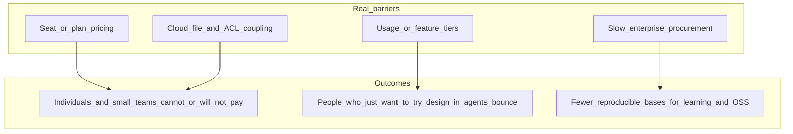

That is not a dismissal of official products—enterprise security, compliance, and cloud collaboration need vendors.  
The point is: **“I want to try this locally against the file I have open in Cursor”** should not hit a paywall on day one.

So staying on the community-validated **local bridge** path is pragmatic for us: not a replacement for commercial offerings, but a self-hostable, auditable complement.

Engineering goals for **this** repository:

| Dimension | Choice in this repo |
|-----------|---------------------|
| Cost | **MIT**; install from npm / GitHub |
| Data | Bridge traffic defaults to **localhost**; the MCP tool path does not upload the whole document via REST just to read/write |
| Capabilities | Read/write tools aimed at the **currently open file** (see the tool catalog in docs) |
| Ecosystem | Standard **stdio MCP**; avoid locking to one IDE |
| Engineering | Plugin and MCP **released together**; bilingual docs site; reproducible CI |

One careful summary:

> **Commercial Figma MCP can be excellent—and may still carry cost and procurement friction. Community local bridges solve a different job: reproduce on your machine first, stay auditable by default, stay forkable. We ship one open-source implementation, not the only answer.**

---

## 2. Design thinking: study existing OSS, then adapt

### 2.0 Standing on community shoulders (important)

“Access the canvas via a plugin + expose a local process to agents” shows up repeatedly in open source. In research we kept seeing the same shape:

- Desktop / plugin side calls the Figma Plugin API;  
- Local WebSocket / HTTP as the bridge;  
- MCP (or a similar tool protocol) for Cursor and other hosts.  

**Figma Agent Kit does not claim to invent that architecture.**  
We read and compared existing work, then rewrote/adapted a version for our maintenance goals—and filled in release automation, docs, and multi-client guides that make day-to-day use easier. If you already love another local Figma MCP / bridge, keep using it. This post only explains **this** repo’s trade-offs. Cross-reading is welcome; imprecise wording in our docs is also welcome as Issues.

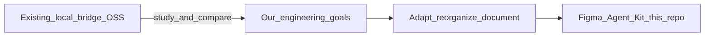

### 2.1 Three technical routes (for this repo)

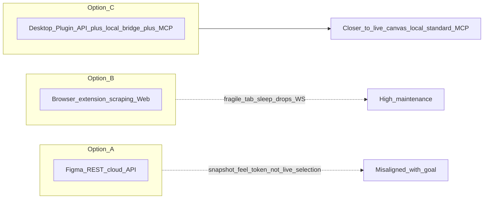

1. **Pure REST / official API** — cloud files and tokens; more “document snapshot” than live page/selection.  
2. **Browser extension scraping** — brittle across Web UI changes; sleeping tabs break WebSockets.  
3. **Desktop Plugin API + local bridge + MCP** (what this repo uses; also common in the community) — closer to live canvas; bridge stays local by default; agents speak standard MCP so switching hosts is mostly config.

### 2.2 How this repo packages: plugin + MCP, versioned together

On top of the common “two-sided” split, we ship:

| Package | Distribution | Role |
|---------|--------------|------|
| `figma-agent-plugin` | [GitHub Releases](https://github.com/ChinaCarlos/figma-agent-kit/releases) ZIP | Bridge client, panel UI, optional AI rename/group, 3× slice export |
| `figma-agent-mcp` | [npm](https://www.npmjs.com/package/figma-agent-mcp) | stdio MCP + HTTP/WS bridge (including Leader / Follower when multiple processes compete) |

> **The plugin calls the Figma Plugin API; the MCP process is what agents call; they meet over a local WebSocket (business frames are MessagePack in this implementation).**  
> That is **this** repo’s module split. Similar splits appear elsewhere; details differ.

<p align="center">
  
</p>

<p align="center"><em>Plugin panel: green “MCP Bridge connected” means agents can reach the current file</em></p>

---

## 3. What’s in it for you? Developers × designers

### 3.1 For developers

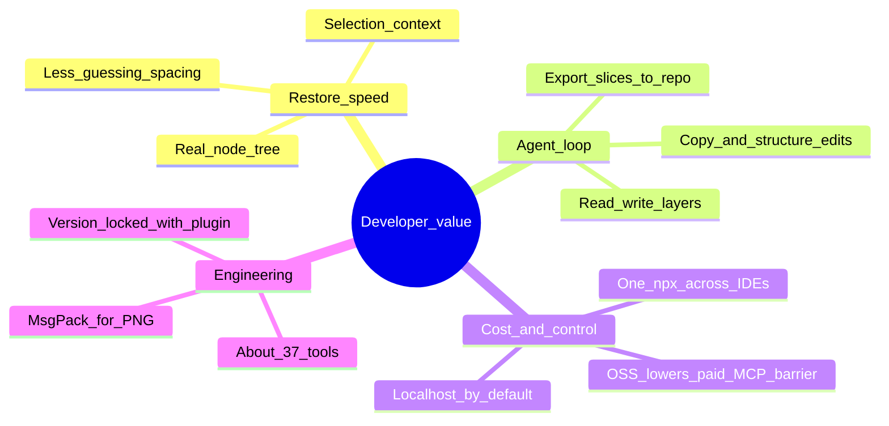

| Benefit | What it looks like |
|---------|-------------------|
| **Faster restores** | Agent uses `get_selection` / `get_node` for structure, not a blurry screenshot |
| **Closed-loop edits** | Copy, fills, Auto Layout, create/group via write tools—fewer round trips |
| **Lower commercial MCP barrier** | Individuals / small teams can validate a workflow on OSS first (still free to buy official later) |
| **Better default privacy** | Bridge stays on-box; sensitive files need not sync to a third party “just so the agent can look” |
| **Multi-editor reuse** | Configure MCP once in Cursor; Claude Code / Codex still use the same `npx` |
| **Slices into the repo** | `save_screenshots` + compression aligned with the plugin’s 3× export baseline |

Example prompts:

- “Read the selected Frame, describe the hierarchy, and flag suspicious absolute positioning.”  
- “Change the title to ‘Spring Launch’ without changing font size.”  
- “Export the selection as 3× PNGs into `./assets/hero`.”  

### 3.2 For designers

Designers may never touch MCP config—the plugin still helps alone:

| Benefit | What it looks like |
|---------|-------------------|
| **Layer hygiene** | Optional AI **visual rename**—fewer `Rectangle 128` / `Group 99` |
| **Structure cleanup** | Optional **visual grouping** on a duplicate—less “junk layers” for eng |
| **Slice handoff** | In-panel 1× preview + 3× PNG / ZIP without juggling export settings |
| **ZH / EN UI** | Designers and engineers can switch language independently |
| **Same frame as eng** | The agent reads the Frame you are looking at—fewer “wrong screenshot” fights |

<p align="center">
  
</p>

<p align="center"><em>Slice export: 1× preview, filenames, single download and ZIP (3×)</em></p>

<p align="center">
  
</p>

<p align="center"><em>Optional: OpenAI-compatible API for in-plugin rename/group (separate from the MCP bridge path)</em></p>

### 3.3 For design engineering / small teams

- **One source of truth**: file on Desktop; agent reads the same file—not a stale chat image.  
- **Repeatable onboarding**: install plugin + `npx` from docs in ~10 minutes.  
- **Auditable**: MIT, code on GitHub, bridge protocol documented.  
- **Coexists with paid plans**: company bought official MCP? Fine—local OSS still fits sensitive files, offline demos, and personal experiments.  

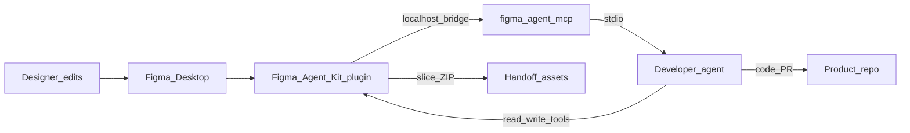

---

## 4. Implementation: end-to-end in this repository

> Architecture and sequences below describe **Figma Agent Kit as implemented today**. Other community projects may differ in ports, codecs, and election—read their docs; do not assume every local bridge looks like this.

### 4.1 Overview

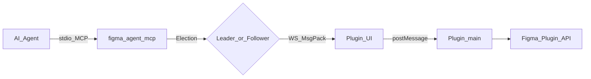

A typical call in this repo:

1. Agent connects to `figma-agent-mcp` over **stdio MCP**;  
2. That process becomes **Leader** (bound `localhost:PORT`) or **Follower** (forwards to an existing Leader);  
3. Plugin UI connects to the Leader WebSocket with **MessagePack**;  
4. UI `postMessage`s into plugin main;  
5. Main calls the Figma Plugin API; results return along the same path.

### 4.2 Agent → MCP: standard tool surface

`figma-agent-mcp` is a normal MCP server. Stable release exposes about **37 tools**, covering:

- Document / selection / node read-write  
- Fills, text, Auto Layout  
- Create / group / delete  
- Screenshots and export  
- Motion (styles, keyframes, timeline, …)  

After Cursor is configured, the MCP panel should show tools enabled:

<p align="center">
  
</p>

<p align="center"><em>Cursor: figma-agent-mcp · 37 tools enabled</em></p>

### 4.3 MCP → plugin: local bridge

Default port comes from repo-root **`bridge.config.json` (1998)**, synced at build into:

- MCP default-port constant  
- Plugin UI embedded URL  
- Related `manifest.json` fields  

So one side does not silently drift from the other.

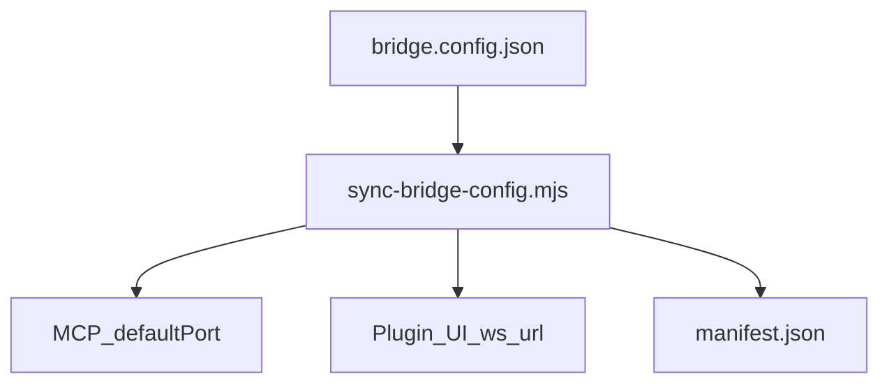

### 4.4 One real RPC

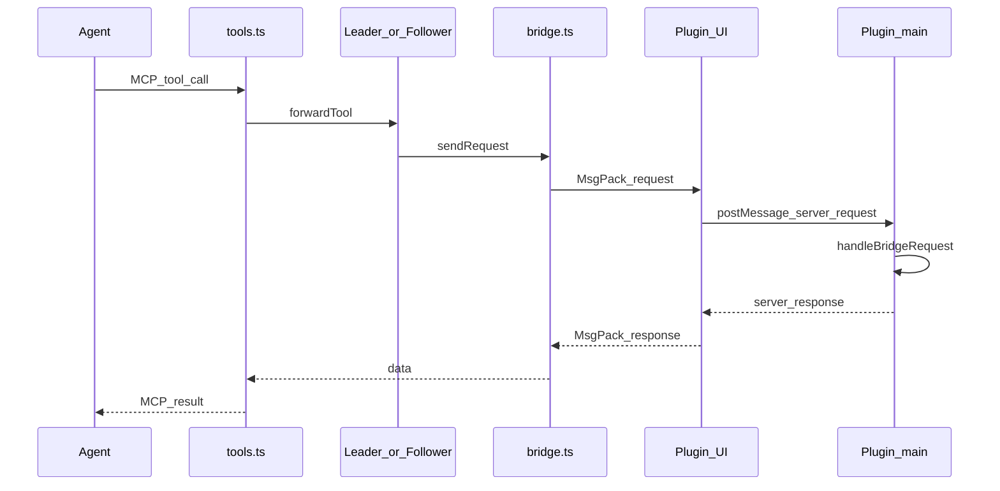

Notes:

- stdout is reserved for MCP; logs go to **stderr**;  
- Screenshots on the bridge are **raw PNG bytes** (MsgPack `bin`), not base64;  
- Agent-facing `get_screenshot` may base64 as needed.

---

## 5. Implementation notes: trade-offs in this repo

> Again: these are **engineering choices**, explaining why **this** code looks this way—not “first in the industry.”

### 5.1 Leader / Follower: port contention across windows

Reality: three Cursor windows may spawn three MCP processes, but **only one process can successfully `listen` on a given local port**. This repo uses Leader / Follower for that constraint (see source and architecture docs).

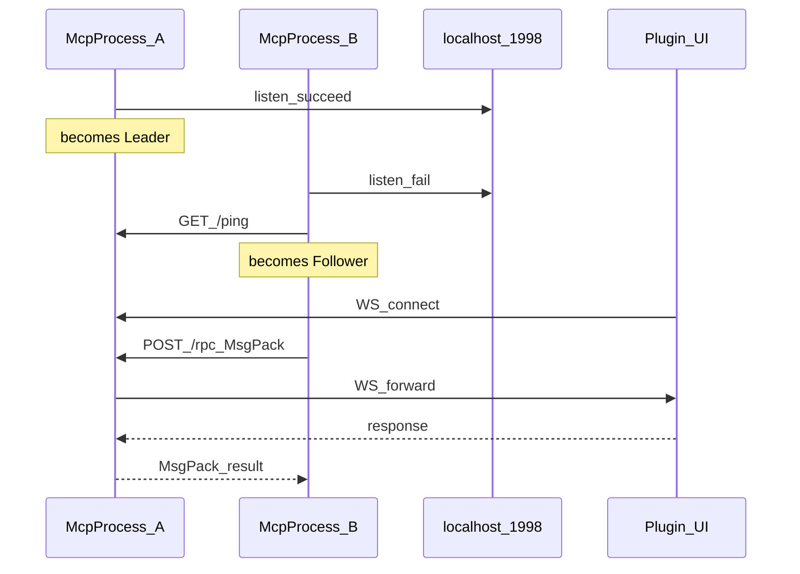

| Role | Responsibility |
|------|----------------|
| Leader | Binds port, accepts plugin WS, serves `/ping` `/files` `/rpc` |
| Follower | Tool calls → Leader `POST /rpc`; discovery → `GET /files` |
| Failure | Health poll ~3–5s; Followers may re-elect if Leader dies |

For multi-window agent use, this is closer to daily life than assuming a single MCP process forever. Other OSS projects may solve the same problem differently.

### 5.2 Why MessagePack on business frames here?

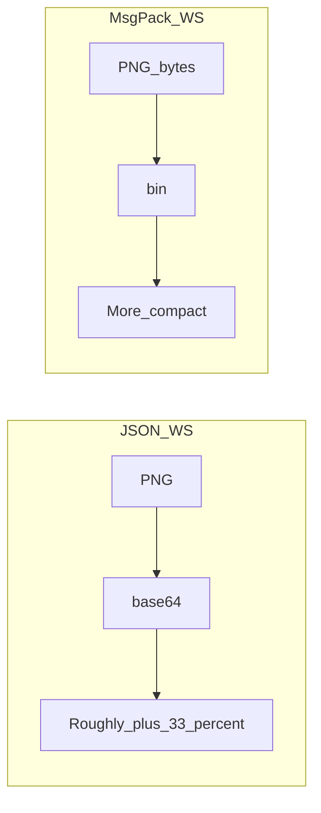

In this repo, bridge business frames and Leader↔Follower `POST /rpc` use **MessagePack** (`msgpackr`, `useRecords: false`)—a size/screenshot choice, **not** “local bridges must use MsgPack”:

- Screenshots can travel as **bin** (cheaper than base64);  
- Large node trees are usually smaller;  
- Logical message shapes still map cleanly to a JSON mental model.  

Health checks stay JSON (`GET /ping`, `GET /files`) for humans and scripts.

### 5.3 Two screenshot / slice exits

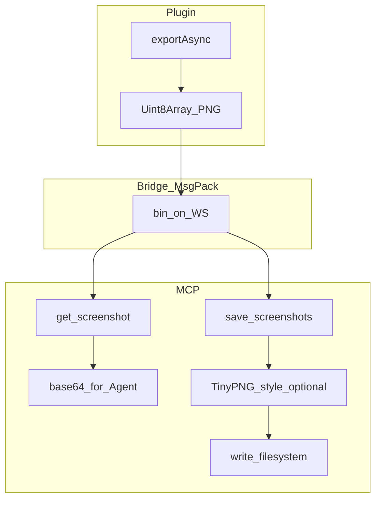

| Tool | Compression | Typical use |
|------|-------------|-------------|
| `get_screenshot` | None | Agent preview (default `scale=2`) |
| `save_screenshots` | PNG on by default | Delivery slices; `scale=3` matches plugin UI |

### 5.4 Two AI paths—do not conflate them

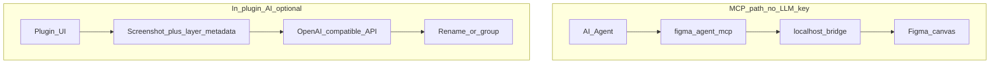

- **MCP bridge tools**: no LLM key in MCP config; canvas I/O goes through the local plugin.  
- **In-plugin AI rename / group**: optional; sends screenshot + metadata to **your** API; keys live in Figma `clientStorage`.  

<p align="center">
  
</p>

<p align="center"><em>Editable system prompts for rename / group (with placeholders)</em></p>

Say this out loud in public posts: **“local bridge” ≠ “no AI traffic ever leaves the machine.”** This repo makes **no absolute promise** of that kind—see the privacy notes and code paths.

### 5.5 Engineering: version lock and release pipeline (this repo)

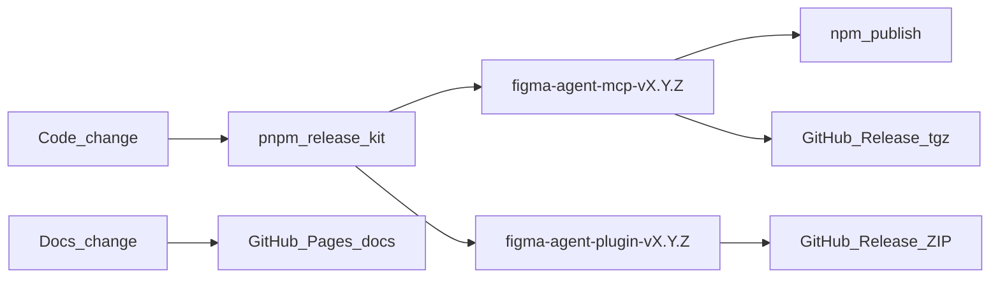

We expect MCP and plugin versions to **stay aligned**. `pnpm release:kit:*` bumps once, cuts two tags, runs two CI paths—reducing “npm is ahead, plugin is last week.” That is a **maintenance policy**, not an architecture invention.

---

## 6. Project layout (readable out of the box)

### 6.1 Repository tree

```text
figma-agent-kit/
├── bridge.config.json           # single source of truth for default port
├── packages/
│   ├── figma-agent-mcp/         # npm: stdio MCP + Leader/Follower bridge
│   └── figma-agent-plugin/      # Figma plugin: bridge client + AI + slices
├── docs/ + docs/zh/             # source docs (EN / ZH)
├── docs-site/                   # Rspress → GitHub Pages
├── articles/                    # long-form posts (this one)
└── scripts/                     # sync-bridge / sync-docs / release-kit
```

### 6.2 MCP modules

| Module | Role |
|--------|------|
| `index.ts` | CLI, election, MCP stdio |
| `election.ts` | Leader listen / Follower attach / takeover |
| `leader.ts` | HTTP `/ping` `/files` `/rpc` + WS |
| `follower.ts` | Forward to Leader |
| `bridge.ts` | WS table by fileKey, heartbeat, timeouts |
| `codec.ts` | MsgPack |
| `tools.ts` / `schema.ts` | ~37 tools + Zod |
| `compress-png.ts` | `save_screenshots` compression |

### 6.3 Plugin modules

| Module | Role |
|--------|------|
| `bridge/handlers.ts` | Tool handlers (incl. Motion, writes) |
| `bridge/serializer.ts` | Node tree serialization |
| `ui/ui.html` | WS client, settings, i18n, slices |
| `rename/*` · `group/*` | Optional AI rename / group |
| `export/slices.ts` | 1× preview / 3× PNG |

### 6.4 Stack

| Layer | Tech |
|-------|------|
| MCP | TypeScript ESM, `@modelcontextprotocol/sdk`, `ws`, `msgpackr`, Zod |
| Plugin | TypeScript, Rsbuild, esbuild inject, Figma Plugin API |
| Docs | Rspress bilingual, GitHub Actions → Pages |
| CI | build / pack / tag release / Docs |

Deeper diagrams: [Architecture](https://chinacarlos.github.io/figma-agent-kit/en/reference/architecture) · [Bridge protocol](https://chinacarlos.github.io/figma-agent-kit/en/reference/bridge-protocol).

---

## 7. Getting started: zero to first successful call

### 7.1 Flow

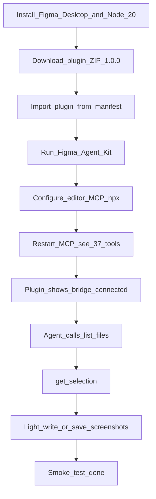

### 7.2 Requirements

- [Figma Desktop](https://www.figma.com/downloads/) (strongly recommended; browser tabs may sleep and drop WS)  
- Node.js ≥ 20  
- Any stdio MCP host (Cursor / Claude Code / Codex / Qoder / CodeBuddy / Trae …)  

### 7.3 Step 1 — Install the plugin

1. Open [Releases](https://github.com/ChinaCarlos/figma-agent-kit/releases)  
2. Download **`figma-agent-plugin-v1.0.0.zip`** matching your MCP version  
3. Unzip  
4. Figma Desktop → **Plugins → Development → Import plugin from manifest…**  
5. Select `manifest.json`  
6. Run **Figma Agent Kit**  

<p align="center">
  
</p>

Mini mode when you only need selection context:

<p align="center">
  
</p>

<p align="center"><em>Mini: bridge status + current selection</em></p>

Gear menu: language, model / prompt settings, check for updates:

<p align="center">
  
</p>

### 7.4 Step 2 — Configure MCP (Cursor)

Edit `~/.cursor/mcp.json` (or project `.cursor/mcp.json`):

```json
{
  "mcpServers": {
    "figma-agent-mcp": {
      "command": "npx",
      "args": ["-y", "figma-agent-mcp"]
    }
  }
}
```

Custom port (must match the plugin build):

```json
"env": { "FIGMA_AGENT_MCP_PORT": "1998" }
```

<p align="center">
  
</p>

<p align="center"><em>Cursor mcp.json wiring figma-agent-mcp</em></p>

Copy-paste configs for other editors:  
https://chinacarlos.github.io/figma-agent-kit/en/guide/agent-setup  

### 7.5 Step 3 — Smoke test

Ensure: plugin running, bridge green, MCP shows ~37 tools. Then ask the agent to:

1. Call `list_files` — you should see the current file;  
2. Select a Frame in Figma, call `get_selection`;  
3. Try a light write tool or `save_screenshots`.  

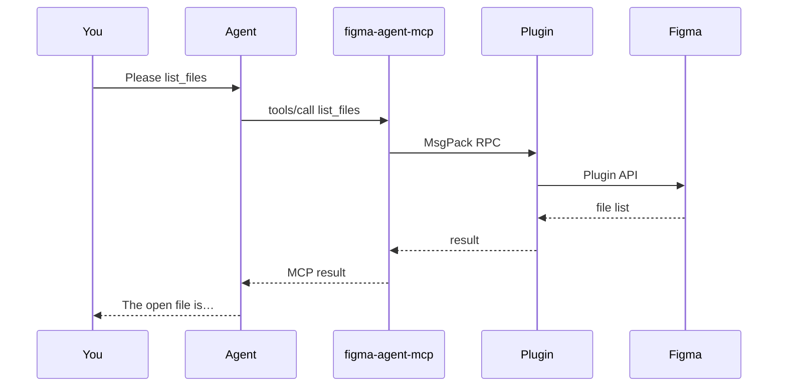

That is the minimum closed loop: **design file in agent context**.

### 7.6 Suggested daily rhythm

| Role | Rhythm |
|------|--------|
| Designer | Edit on Desktop → plugin slices / optional AI layer cleanup when needed |
| Developer | Cursor with MCP on → ask about selection / edit structure / export assets |
| Pairing | Same file; select the target Frame in Figma before the agent reads selection |
| Debugging | Plugin light green → MCP tool count → ports match |

More troubleshooting: [FAQ](https://chinacarlos.github.io/figma-agent-kit/en/guide/faq).

---

## 8. Plugin + MCP + Skill: from “connected” to “1:1 restore”

Earlier sections answer: **how the toolchain reaches the live canvas.**  
In product work another gap shows up—

> Agents can call `get_node` / `save_screenshots`, but without shared discipline: scope creep, whole-page screenshot as a crutch, missing TEXT, baking API copy into PNGs, “1:1” claims before visual check.

This repository therefore ships a **Cursor Agent Skill**—`figma-ui-restore`—that turns **Figma Agent Kit plugin + `figma-agent-mcp`** into a reusable **general UI 1:1 restore playbook** (not tied to one campaign scaffold).

Path after clone:

```text
.cursor/skills/figma-ui-restore/SKILL.md
```

In Cursor: `@figma-ui-restore`, or say “1:1 Figma restore / export slices / acceptance against the mock.”

### 8.1 How the three pieces divide work

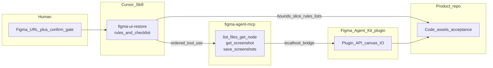

| Layer | Owns | Does not own |
|-------|------|--------------|
| **Plugin** | Reach the open file; export / node I/O | Your React/Vue folder layout |
| **MCP** | Expose capabilities as standard tools | Automatic “1:1 accepted” |
| **Skill** | Scope, TEXT taxonomy, slice tags, chunked review, acceptance wording | Product PRD / API codegen |

One line:

> **Plugin + MCP = capability. Skill = how to use that capability responsibly for restores.**

### 8.2 Main Skill flow (strict by default)

```text
Lock scope → (confirm gate) → list_files → get_node structure → full TEXT taxonomy
  → slice tagging → get_screenshot baseline → save_screenshots ×3 to disk
  → bounds → code → chunked visual check → acceptance checklist before saying “1:1”
```

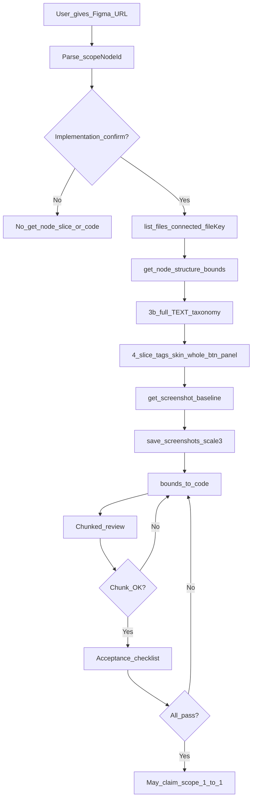

Only with an explicit **fast** request may you compress verbose structure dumps or skip persisting the baseline image; you **must not** skip the TEXT inventory or slice tagging, and you **must not** use a whole-page image as a substitute for structure.

### 8.3 Guardrails that prevent classic failures

| Rule | Meaning |
|------|---------|
| **Single scope** | One URL `node-id` → only that subtree; no casual whole-file crawl |
| **Confirm gate** | No `get_node` / `save_screenshots` / coding before confirm (`list_files` OK) |
| **Connected fileKey** | Always `list_files` first—do not trust URL fileKey alone |
| **Full TEXT list** | Every TEXT → `whole-btn-text` / `dom-fixed` / `dynamic` (etc.); no slices until classified |
| **Slice granularity** | Only `skin` / `whole-btn` / `panel-bg` (incl. `modal-panel-bg`); mutable API copy/images stay out of PNGs |
| **3× + compress** | Delivery via `save_screenshots`, `scale: 3`, `compress: true` |
| **Bounds first** | Under strict, do not fake asymmetric layouts with `flex:1` |
| **Chunked review** | Fail a major chunk → do not start the next |
| **Acceptance wording** | Incomplete checklist → do not claim “1:1 verified” |

These ideas echo strong campaign-restore playbooks in the wild; we **generalized** them into this repo’s Skill so any frontend project can reuse them without binding to one business monorepo.

### 8.4 When to use “MCP chat” vs the Skill

| Intent | Suggestion |
|--------|------------|
| “What is the structure of my selection?” | Agent + MCP tools is enough |
| Tweak copy / export a few images | MCP tools + green plugin light |
| **1:1 page/modal restore with acceptance** | **`figma-ui-restore` Skill**, full checklist |
| Layer rename / grouping only | Other layers skills if you have them—not a substitute for restore |

### 8.5 Using it in your own product repo

1. Install/run **Figma Agent Kit** and configure **`figma-agent-mcp`** (section 7).  
2. Copy `.cursor/skills/figma-ui-restore/` into your app repo’s `.cursor/skills/` (or document a monorepo reference).  
3. Open the product repo in Cursor; paste the Figma URL; state stack and asset folder.  
4. `@figma-ui-restore` or ask for **strict 1:1** per the Skill.  
5. Require the Skill’s output template: TEXT table, slice table, layout parent, chunk review, acceptance verdict.  

Canonical Skill text:  
[`.cursor/skills/figma-ui-restore/SKILL.md`](https://github.com/ChinaCarlos/figma-agent-kit/blob/main/.cursor/skills/figma-ui-restore/SKILL.md)

> Note: a Skill is an **agent behavior spec**, not part of the npm tarball; it evolves with the repo’s docs/engineering assets. Splitting **capability** from **usage discipline** lets the same MCP support casual exploration and serious restores.

---

## 9. Who it is / isn’t for

**Good fit**

- Cursor / Claude restores, component refactors, campaign / marketing pages  
- Agents that should work against **real layers**, not blurry screenshots  
- Local-first / auditable workflows, or validating before buying commercial Figma MCP  
- Designers who want rename hygiene and 3× slice export  

**Examples of useful work**

- Structured read of a Frame with layout risk flags  
- Copy / fill / some layout writes  
- 3× PNG export into the repo  
- Motion timeline / keyframe reads (tools exposed)  

**Not a fit if you expect**

- A full Design System workstation replacement  
- Pure cloud with no Desktop and no local Node  
- Remote control of arbitrary cloud files without the plugin  
- “Totally free vision rename on a closed model”—model cost sits on **your** API key  

---

## 10. Links, docs, acknowledgments

| Resource | Link |
|----------|------|
| Repo (⭐ / Issues / PRs welcome) | https://github.com/ChinaCarlos/figma-agent-kit |
| Docs site (EN / ZH) | https://chinacarlos.github.io/figma-agent-kit/en/ |
| UI restore Skill | https://github.com/ChinaCarlos/figma-agent-kit/blob/main/.cursor/skills/figma-ui-restore/SKILL.md |
| npm: `figma-agent-mcp` | https://www.npmjs.com/package/figma-agent-mcp |
| Plugin ZIP | https://github.com/ChinaCarlos/figma-agent-kit/releases/tag/figma-agent-plugin-v1.0.0 |
| MCP Release | https://github.com/ChinaCarlos/figma-agent-kit/releases/tag/figma-agent-mcp-v1.0.0 |
| Docs Release | https://github.com/ChinaCarlos/figma-agent-kit/releases/tag/docs-v1.0.0 |
| License | MIT |

Preview the docs site locally:

```bash
git clone https://github.com/ChinaCarlos/figma-agent-kit.git
cd figma-agent-kit
pnpm install
pnpm dev:docs
```

One-liner for this repo’s MCP (matching plugin version required):

```bash
npx -y figma-agent-mcp
```

### Acknowledgments (please read)

**Figma Agent Kit stands on prior community work.**  
Many authors, posts, and repos explored local Figma ↔ agent bridges. We studied that problem space, then adapted/reorganized and added docs and release automation for our maintenance goals. If your project inspired this repo—thank you for publishing. If our wording is still imprecise, open an Issue and we will fix it.

We also state clearly:

- We do **not** dunk on official / commercial Figma MCP—compliance and support are often required at work;  
- We do **not** claim this repo is the only or “canonical” local bridge;  
- We do **not** promise feature parity with any specific third-party bridge—trust **this** repo’s docs and version notes.

---

## 11. Closing

If one sentence captures our stance:

> **The next mile of AI coding is not only bigger models—local, auditable, forkable toolchain interfaces matter too. The community paved the road; we resurfaced a stretch that fits how we maintain software, and open-sourced it.**

What we care about day to day: multi-process port handling, screenshot paths, version lock, bilingual docs, reproducible releases, and encoding plugin + MCP into the **`figma-ui-restore` Skill**—not flashy, but real for collaboration.

If this helped:

1. **Star** the repo ⭐ — https://github.com/ChinaCarlos/figma-agent-kit  
2. Run `list_files` → `get_selection` once from the docs  
3. For a page restore, try a full `@figma-ui-restore` pass  
4. File Issues / PRs  

**Links to keep**

- GitHub: https://github.com/ChinaCarlos/figma-agent-kit  
- Docs: https://chinacarlos.github.io/figma-agent-kit/en/  
- Skill: https://github.com/ChinaCarlos/figma-agent-kit/blob/main/.cursor/skills/figma-ui-restore/SKILL.md  
- npm: `npx -y figma-agent-mcp`  
- Chinese article: [tech-share-zh.md](./tech-share-zh.md)  

Feel free to republish with attribution and a link to the repo. For short platforms, ship “background (cost barrier) → community route + our adaptation → value → architecture diagram → setup → Skill restore → links”; keep the full piece on your blog / Dev.to / Medium.

<p align="center">
  
</p>
