# 使用 Figma Agent Kit：插件 + MCP + 还原 Skill，打通本地设计协作

> 面向前端、设计师、设计工程、AI Coding 同学的长文技术分享  
> 项目：**Figma Agent Kit** · 稳定版 **v1.0.0** · MIT  
> 文档站：https://chinacarlos.github.io/figma-agent-kit/  
> 仓库：https://github.com/ChinaCarlos/figma-agent-kit  
> English: [tech-share-en.md](./tech-share-en.md)

> **先说明定位（避免误解）：**  
> 「Desktop 插件 + 本地 MCP 桥」这条技术路线**并非我们首创**。社区里已有多套本地 Figma ↔ Agent 桥接实践；本文介绍的是我们在**参考、学习这些开源方案之后**，按自己的工程目标**改造、重组并开源**的实现——**Figma Agent Kit**。

---

<p align="center">
  
</p>

<p align="center">
  <em>Figma Desktop ↔ 本地 MCP ↔ Cursor / Claude Code / Codex … 实时读写当前画布</em>
</p>

---

## 写在前面：这篇想讲清楚什么

过去一年，「AI 能写代码」已经不再新鲜；真正卡住交付效率的，往往是 **设计和代码之间那一截**：

- Agent 看不到你正在改的 Figma 选区；
- 官方 / 商业 Figma MCP 能力常伴随席位、套餐或用量门槛；
- 截图口述又丢结构、丢 Auto Layout、丢真实节点树。

社区其实已经给出过一条清晰路径：**用 Figma Desktop 插件摸画布，用本地进程把能力暴露成 MCP**，让 Cursor 等 Agent 直接调用。我们不是从零发明这条路，而是在调研现有开源项目后，基于自身需求做了一版可维护、可发版、文档较完整的改造实现——**Figma Agent Kit**（Figma Desktop 插件 + npm 包 `figma-agent-mcp`），把 Cursor / Claude Code / Codex / Qoder / CodeBuddy / Trae 等接到**当前打开的设计稿**。

本文会按这个顺序展开（可收藏跳读）：

1. 背景与行业现状（含 **商业 Figma MCP 的成本门槛**）
2. 构思：参考社区方案后，我们如何选型与改造
3. 能给开发者 / 设计师带来什么收益
4. 本仓库的实现方案与端到端架构
5. 技术实现要点（选举、MsgPack、RPC、双 AI 路径等）
6. 完整使用流程（配图）
7. **插件 + MCP + Cursor Skill：通用 1:1 UI 还原工作流**
8. 适合谁 / 不适合谁
9. 开源地址、文档、致谢与参与方式
10. 写在最后

目标不是「又一篇 README 翻译」，也不是「踩一捧一」，而是：**把改造动机、架构取舍、上手路径，以及「怎么把工具链接到真实还原流程」讲清楚**，方便你复现、对比、提 Issue。

---

## 一、背景：设计与代码之间，还差「最后一公里」

### 1.1 AI Coding 提速了，交付链路却仍断裂

AI Coding 把「写函数、改组件、补测试」提速了很多。但真实业务里，大量时间耗在：

- 对着设计稿猜圆角、间距、字号；
- 活动页 / 运营 H5 改一版文案，设计改完开发再对一次；
- Agent 生成了一版 UI，却和 Figma 里「当前这一帧」对不上。

核心矛盾很简单：

> **模型很强，但缺一个「摸得到当前画布」的标准工具接口。**

### 1.2 常见做法及其代价

| 痛点               | 常见做法               | 代价                          |
| ------------------ | ---------------------- | ----------------------------- |
| Agent 读不懂当前稿 | 粘贴截图 / 口头描述    | 丢精度、难迭代、难回归        |
| Agent 改不动图层   | 只读导出 / 人工改稿    | 闭环断在设计侧                |
| 要结构化节点信息   | Figma REST / 导出 JSON | Token、权限、不是「当前选区」 |
| 要官方 MCP 体验    | Figma 官方 / 商业 MCP  | **要钱**、席位与用量限制      |
| 多窗口同时用 Agent | 各自起进程抢本地端口   | 桥不稳定、难排查              |

我们想要的体验只有一句话：

> **打开 Figma Desktop → 打开 Cursor → 对 Agent 说「看看当前选中的 Frame，把标题改成 xxx」→ 画布立刻变。**

这不是再做一个设计工具，而是：**把你已经在用的 AI 编辑器，接到你正在编辑的那份稿。**

### 1.3 重点：Figma MCP「要钱」，把很多人挡在门外

近一年年 MCP（Model Context Protocol）把「给 Agent 接工具」标准化了。Figma 生态里也迅速出现了官方或商业向的 MCP 能力——体验上很香，但对个人开发者、小团队、学生、侧项目往往有真实门槛：

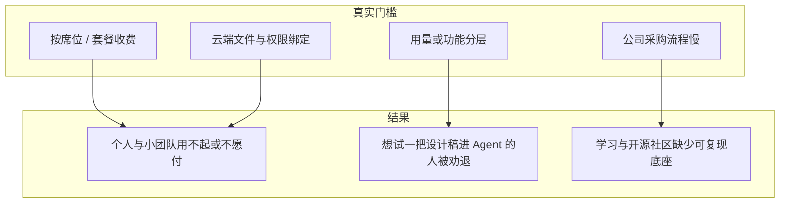

这不是否定官方产品——企业级安全、合规、云协作本来就该有人做。  
问题是：**「我想在本机、对着当前打开的稿、用 Cursor 试一把」** 这件事，不该一上来就被付费墙挡住。

在这样的背景下，**继续采用社区已验证的「本地桥」方向**，对我们更务实：不替代官方商业产品，而是提供一条可自托管、默认可审计的补充路径。

对本仓库，我们把工程目标定成：

| 维度 | 本仓库的取舍                                                         |
| ---- | -------------------------------------------------------------------- |
| 费用 | **MIT**，npm / GitHub 可直接安装                                     |
| 数据 | 桥流量默认 **localhost**；MCP 工具路径不为读写而经 REST 上传整份文档 |
| 能力 | 面向**当前打开稿**的读写工具集（具体以文档工具表为准）               |
| 生态 | 标准 **stdio MCP**，尽量不绑死单一 IDE                               |
| 工程 | 插件与 MCP **同版本发版**、双语文档站、可复现的 CI                   |

一句话（尽量严谨）：

> **商业 Figma MCP 可以很好，也可能伴随成本与采购门槛；社区本地桥路线解决的是另一类需求——先能在本机复现、默认可审计、便于二次改造。我们做的是其中一份开源实现，不是唯一答案。**

---

## 二、构思：参考现有开源，再决定怎么改造

### 2.0 站在社区肩膀上（重要）

「用插件访问画布 + 本地进程暴露给 Agent」在开源社区里已经反复出现。调研阶段我们能明显看到几类共性：

- Desktop（或插件）侧调用 Figma Plugin API；
- 本机 WebSocket / HTTP 做桥；
- 再包一层 MCP（或同类工具协议）给 Cursor 等宿主。

**Figma Agent Kit 不是宣称发明了上述架构。**  
我们做的是：阅读、对比现有开源实践后，按自己的维护目标重写/改造一版，并补齐发版、文档、多客户端说明等「能长期用」的部分。若你正在用其他优秀的本地 Figma MCP / 桥项目，完全可以继续用；本文只介绍 **本仓库** 的取舍，欢迎对照阅读，也欢迎指出我们文档里表述不严谨的地方。


### 2.1 三条技术路线怎么选（对本仓库而言）

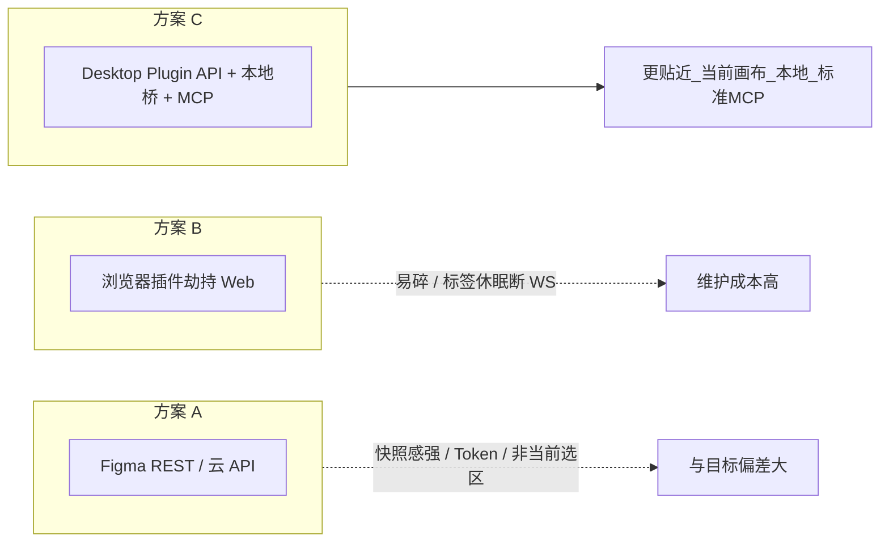

1. **纯 REST / Official API**  
   强依赖云端文件与 Token，模型偏「文档快照」，对「当前打开页、当前选区」往往不友好。

2. **浏览器插件劫持**  
   脆弱、易随 Figma Web 改版失效；标签休眠还可能弄断 WebSocket。

3. **Figma Desktop Plugin API + 本地桥 + MCP（本仓库采用，亦为社区常见方向）**
   - 更贴近实时画布能力；
   - 桥默认留在本机；
   - Agent 侧走标准 MCP，换编辑器时主要换宿主配置。

### 2.2 本仓库如何拆包：插件 + MCP，版本一起发

在社区常见的「两端分离」之上，我们把交付形态固定成：

| 组件                 | 分发                                                                           | 职责                                                          |
| -------------------- | ------------------------------------------------------------------------------ | ------------------------------------------------------------- |
| `figma-agent-plugin` | [GitHub Releases](https://github.com/ChinaCarlos/figma-agent-kit/releases) ZIP | 桥客户端、面板 UI、可选 AI 重命名/分组、3× 切图               |
| `figma-agent-mcp`    | [npm](https://www.npmjs.com/package/figma-agent-mcp)                           | stdio MCP + HTTP/WS 桥（含多进程时的 Leader / Follower 处理） |

> **插件侧负责调用 Figma Plugin API；MCP 侧负责被 Agent 调用；中间用本地 WebSocket（本实现里业务帧为 MessagePack）连接。**  
> 这是本仓库的模块划分，同类开源项目里也常见类似拆分，细节实现并不相同。

<p align="center">
  
</p>

<p align="center"><em>插件面板：绿色「MCP Bridge 已连接」= Agent 侧已经摸得到当前文件</em></p>

---

## 三、能带来什么收益？开发者 × 设计师

这一章专门回答：**「我为什么要装它？」**

### 3.1 给开发者的收益

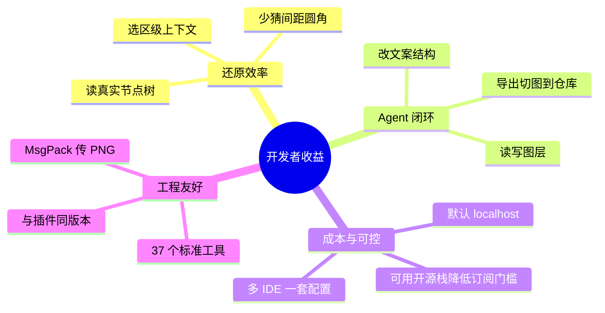

| 收益                  | 具体表现                                                          |
| --------------------- | ----------------------------------------------------------------- |
| **还原更快**          | Agent 直接 `get_selection` / `get_node`，拿到结构而不是糊图       |
| **改稿可闭环**        | 文案、填充、Auto Layout、创建分组等可走写工具，少来回甩锅         |
| **降低商业 MCP 门槛** | 个人 / 小团队可先用开源本地栈跑通工作流（不排斥日后采购官方方案） |
| **隐私默认更好**      | 桥在本机；公司稿不必为了「让 Agent 看看」先同步到第三方           |
| **多编辑器复用**      | Cursor 配一次 MCP，换 Claude Code / Codex 仍是同一套 `npx`        |
| **切图进仓库**        | `save_screenshots` + 压缩，和插件 3× 切图基准对齐                 |

典型 Prompt 例子：

- 「读取当前选中 Frame，用结构化方式描述层级，并标出可疑的绝对定位。」
- 「把标题改成『春季上新』，字号保持设计稿原样。」
- 「把当前选区按 3× PNG 导出到 `./assets/hero`。」

### 3.2 给设计师的收益

设计师不一定写 MCP 配置，但插件本身也能单独创造价值：

| 收益           | 具体表现                                                        |
| -------------- | --------------------------------------------------------------- |
| **图层卫生**   | 可选 AI **视觉重命名**，少 `Rectangle 128`、`Group 99`          |
| **结构整理**   | 可选 **视觉分组**，在副本上整理嵌套，降低给开发的「垃圾层」成本 |
| **切图交付**   | 面板内 1× 预览 + 3× PNG / ZIP，不用另开一堆导出设置             |
| **中英界面**   | 团队里设计偏中文、开发偏英文也能各自切换                        |
| **和开发对齐** | 开发用 Agent 读的就是你正在看的那一帧，减少「你截的不是这一版」 |

<p align="center">
  
</p>

<p align="center"><em>导出切图：1× 预览、文件名、单张下载与 ZIP（3×）</em></p>

<p align="center">
  
</p>

<p align="center"><em>可选：配置 OpenAI 兼容 API，用于插件内重命名 / 分组（与 MCP 桥路径分离）</em></p>

### 3.3 给「设计工程 / 小组」的收益

- **同一份真相**：稿在 Desktop，Agent 读的也是这份，不再「飞书图床 + 过期截图」。
- **流程可复制**：新同学按文档装插件 + `npx`，十分钟级上手。
- **可审计**：MIT，代码在 GitHub，桥协议公开，方便安全评审。
- **和付费方案可并存**：公司买了官方 MCP 也没关系——本地开源桥适合敏感稿、离线演示、个人实验。

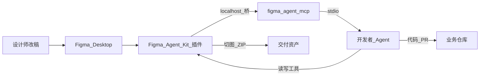

---

## 四、实现方案：本仓库端到端长什么样

> 下列架构与时序描述的是 **Figma Agent Kit 当前实现**。社区其他项目可能端口、编码、选举策略不同——请以各自文档为准，勿默认「所有本地桥都长这样」。

### 4.1 总览

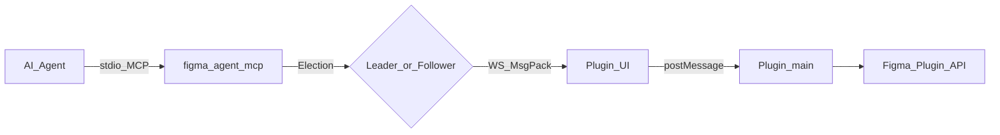

在本仓库中，一次典型调用大致是：

1. Agent 经 **stdio MCP** 连上 `figma-agent-mcp` 进程；
2. 该进程成为 **Leader**（成功绑定 `localhost:PORT`）或 **Follower**（转发到已有 Leader）；
3. 插件 UI 用 **MessagePack** 连接 Leader 的 WebSocket；
4. UI 再 `postMessage` 到插件 main；
5. main 调用 Figma Plugin API，结果原路返回 Agent。

### 4.2 Agent → MCP：标准工具面

`figma-agent-mcp` 是标准 MCP Server。当前稳定版 **37 个工具**，覆盖：

- 文档 / 选区 / 节点读写
- 填充、文本、Auto Layout
- 创建 / 分组 / 删除
- 截图与导出
- Motion（样式、关键帧、时间轴等）

Cursor 配好后，MCP 面板应能看到工具已启用：

<p align="center">
  
</p>

<p align="center"><em>Cursor：figma-agent-mcp · 37 tools enabled</em></p>

### 4.3 MCP → 插件：本地桥

默认端口来自仓库根目录 **`bridge.config.json`（1998）**，构建时同步进：

- MCP 默认端口常量
- 插件 UI 内嵌地址
- `manifest.json` 相关配置

避免「改了一边忘了另一边」这种经典翻车。

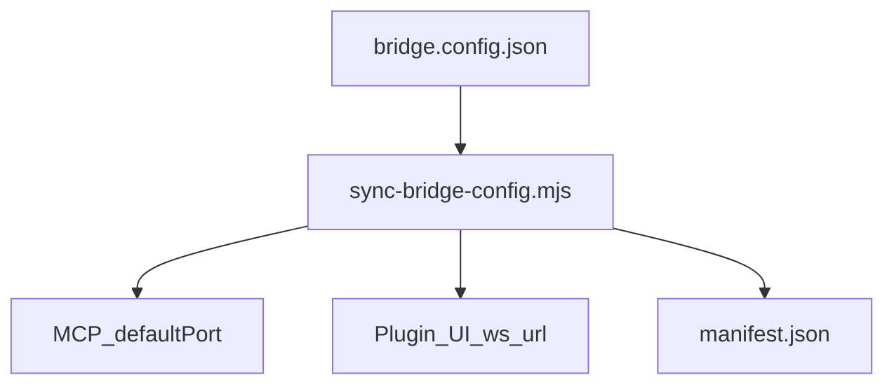

### 4.4 一次真实调用的时序（RPC）

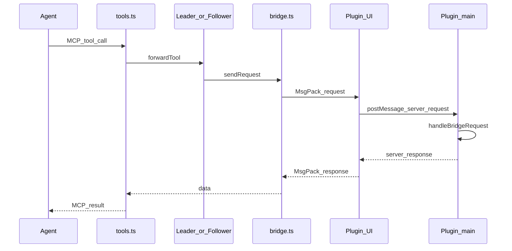

要点：

- stdout 留给 MCP 协议，日志只打 **stderr**；
- 截图在桥上是 **原始 PNG 字节**（MsgPack `bin`），不是 base64；
- Agent 侧 `get_screenshot` 再按需转 base64。

---

## 五、技术实现要点：本仓库里几个关键取舍

> 再次强调：这些是 **工程取舍与实现细节**，用于解释「本仓库为什么这样写」，不是声称「业界第一次这么做」。

### 5.1 Leader / Follower：多窗口下的端口占用

现实：你开 3 个 Cursor 窗口，可能拉起 3 个 MCP 进程；但 **一个本地端口通常只能被一个进程成功 listen**。本仓库用 Leader / Follower 处理这一约束（具体策略见源码与架构文档）。

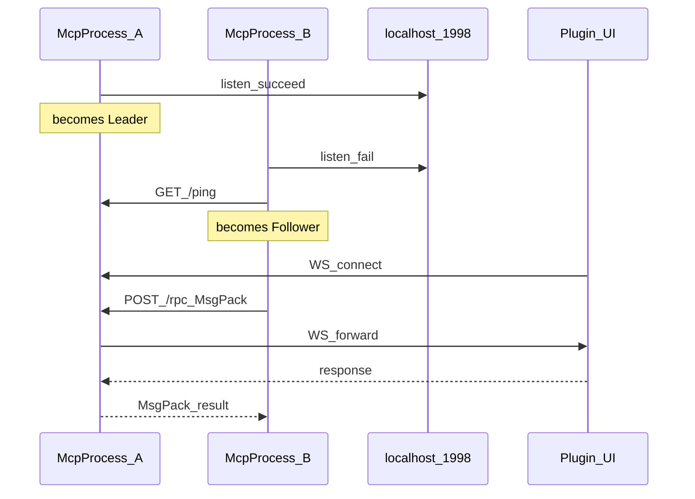

| 角色     | 职责                                                   |
| -------- | ------------------------------------------------------ |
| Leader   | 绑端口、接插件 WS、提供 `/ping` `/files` `/rpc`        |
| Follower | 工具调用 → Leader `POST /rpc`；发现文件 → `GET /files` |
| 故障     | 健康轮询约 3–5s；Leader 挂了 Follower 可再竞选         |

对需要多窗口同时开 Agent 的场景，这类机制比「假定永远只有一个 MCP 进程」更贴近日常使用；其他开源实现也可能用别的方式解决同一问题。

### 5.2 本实现为何在业务帧上使用 MessagePack？

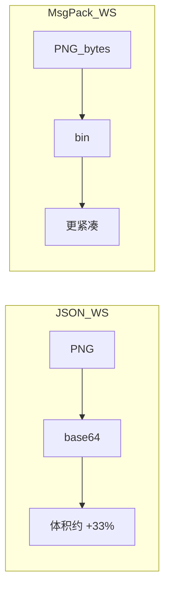

在本仓库中，桥业务帧与 Leader↔Follower 的 `POST /rpc` 使用 **MessagePack**（`msgpackr`，`useRecords: false`）——这是我们基于体积与截图传输需求做的选择，并非「本地桥只能用 MsgPack」：

- 截图可走 **bin**，相对 base64 更省；
- 较大节点树通常更紧凑；
- 逻辑消息形状仍可与 JSON 方案对照理解。

健康检查仍用 JSON（`GET /ping`、`GET /files`），方便人眼和脚本探活。

### 5.3 截图与切图两条出口

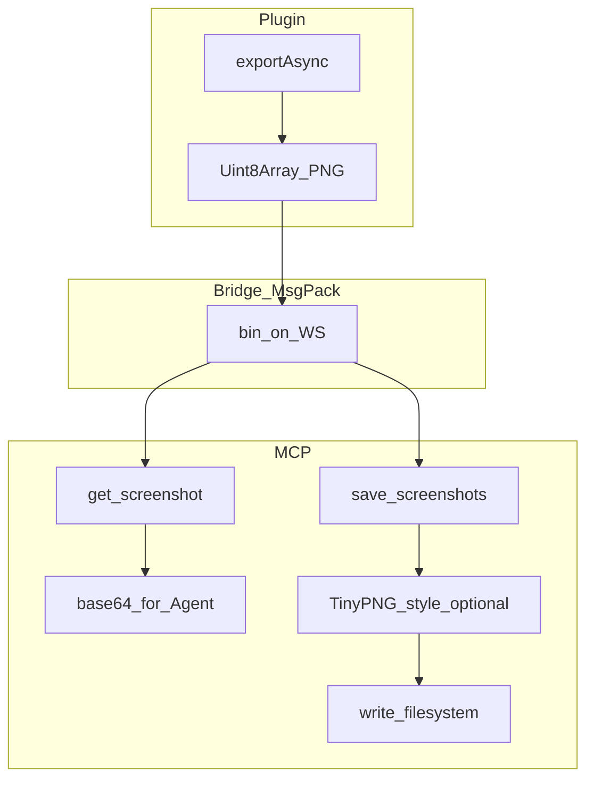

| 工具               | 压缩       | 典型用途                        |
| ------------------ | ---------- | ------------------------------- |
| `get_screenshot`   | 无         | 给 Agent 看（默认 scale=2）     |
| `save_screenshots` | PNG 默认开 | 交付切图；`scale=3` 对齐插件 UI |

### 5.4 两条 AI 路径：别混为一谈

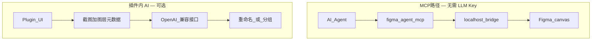

- **MCP 桥工具**：不需要你在 MCP 里配 LLM Key；读写画布走本地插件。
- **插件内 AI 重命名 / 分组**：可选；会把截图 + 元数据发到你配置的 API；密钥在 Figma `clientStorage`。

<p align="center">
  
</p>

<p align="center"><em>可编辑重命名 / 分组系统提示词（含占位符）</em></p>

对外沟通时建议拆开讲，避免被理解成「凡是本地桥，任何 AI 功能都保证不出网」——**本仓库也不做这种绝对承诺**；请以隐私说明与源码路径为准。

### 5.5 工程：版本锁与发版流水线（本仓库实践）

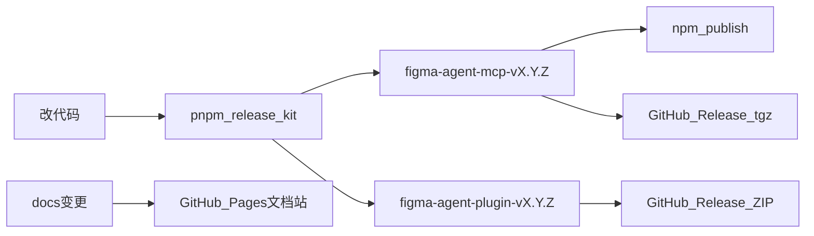

我们要求 MCP 与插件 **尽量同版本使用**。`pnpm release:kit:*` 一次 bump、打两个 tag、走两套 CI，减少「npm 升了、插件还停在上周」的错配——这是维护策略，不是架构发明。

---

## 六、项目架构（开箱可读）

### 6.1 仓库布局

```text
figma-agent-kit/
├── bridge.config.json           # 默认端口唯一真相源
├── packages/
│   ├── figma-agent-mcp/         # npm：stdio MCP + 桥 Leader/Follower
│   └── figma-agent-plugin/      # Figma 插件：桥客户端 + AI + 切图
├── docs/ + docs/zh/             # 源文档（中英）
├── docs-site/                   # Rspress → GitHub Pages
├── articles/                    # 技术分享等长文
└── scripts/                     # sync-bridge / sync-docs / release-kit
```

### 6.2 模块职责（MCP）

| 模块                     | 职责                                 |
| ------------------------ | ------------------------------------ |
| `index.ts`               | CLI、选举、MCP stdio                 |
| `election.ts`            | Leader listen / Follower 挂接 / 接管 |
| `leader.ts`              | HTTP `/ping` `/files` `/rpc` + WS    |
| `follower.ts`            | 向 Leader 转发                       |
| `bridge.ts`              | 按 fileKey 的 WS 表、心跳、超时      |
| `codec.ts`               | MsgPack                              |
| `tools.ts` / `schema.ts` | 37 工具 + Zod                        |
| `compress-png.ts`        | `save_screenshots` 压缩              |

### 6.3 模块职责（插件）

| 模块                   | 职责                          |
| ---------------------- | ----------------------------- |
| `bridge/handlers.ts`   | 工具实现（含 Motion、写操作） |
| `bridge/serializer.ts` | 节点树序列化                  |
| `ui/ui.html`           | WS 客户端、设置、i18n、切图   |
| `rename/*` · `group/*` | 可选 AI 重命名 / 分组         |
| `export/slices.ts`     | 1× 预览 / 3× PNG              |

### 6.4 技术栈一览

| 层   | 技术                                                               |
| ---- | ------------------------------------------------------------------ |
| MCP  | TypeScript ESM、`@modelcontextprotocol/sdk`、`ws`、`msgpackr`、Zod |
| 插件 | TypeScript、Rsbuild、esbuild 注入、Figma Plugin API                |
| 文档 | Rspress 双语、GitHub Actions → Pages                               |
| CI   | build / pack / tag 发版 / Docs                                     |

架构细节与协议字段，见文档站：[架构说明](https://chinacarlos.github.io/figma-agent-kit/reference/architecture) · [桥接协议](https://chinacarlos.github.io/figma-agent-kit/reference/bridge-protocol)。

---

## 七、使用流程：从 0 到第一次成功调用（配图版）

### 7.1 总流程

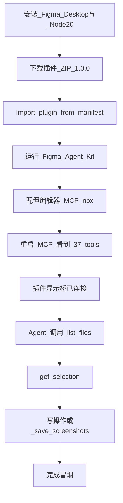

### 7.2 环境要求

- [Figma Desktop](https://www.figma.com/downloads/)（强烈推荐；浏览器标签可能休眠断 WS）
- Node.js ≥ 20
- 任意支持 stdio MCP 的 Agent（Cursor / Claude Code / Codex / Qoder / CodeBuddy / Trae …）

### 7.3 Step 1 — 安装插件

1. 打开 [Releases](https://github.com/ChinaCarlos/figma-agent-kit/releases)
2. 下载 **与 MCP 同版本**的 `figma-agent-plugin-v1.0.0.zip`
3. 解压
4. Figma Desktop → **Plugins → Development → Import plugin from manifest…**
5. 选择目录里的 `manifest.json`
6. 运行 **Figma Agent Kit**

<p align="center">
  
</p>

需要专注看选区时，可进 Mini 模式：

<p align="center">
  
</p>

<p align="center"><em>Mini：桥状态 + 当前选区</em></p>

齿轮菜单可切换语言、进模型 / 提示词设置、检查更新：

<p align="center">
  
</p>

### 7.4 Step 2 — 配置 MCP（Cursor 示例）

编辑 `~/.cursor/mcp.json`（或项目级 `.cursor/mcp.json`）：

```json
{
  "mcpServers": {
    "figma-agent-mcp": {
      "command": "npx",
      "args": ["-y", "figma-agent-mcp"]
    }
  }
}
```

自定义端口（必须与插件构建一致）：

```json
"env": { "FIGMA_AGENT_MCP_PORT": "1998" }
```

<p align="center">
  
</p>

<p align="center"><em>Cursor mcp.json 接入 figma-agent-mcp</em></p>

其他编辑器的复制粘贴配置（Claude Code / Codex / Qoder / CodeBuddy / Trae）见：  
https://chinacarlos.github.io/figma-agent-kit/guide/agent-setup

### 7.5 Step 3 — 冒烟测试

保证：Figma 里插件已开、桥为绿色、MCP 显示 37 tools。然后让 Agent：

1. 调用 `list_files` — 应看到当前文件；
2. 在 Figma 里选中一个 Frame，调用 `get_selection`；
3. 再试一个轻量写操作，或 `save_screenshots`。

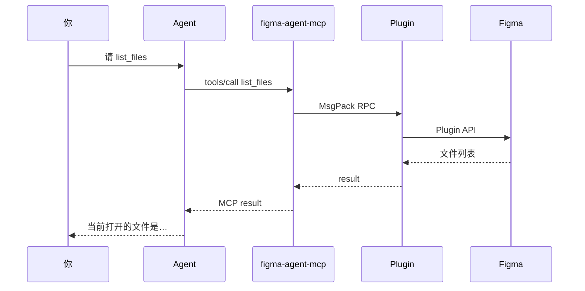

通了，你就已经完成「设计稿进 Agent 上下文」的最小闭环。

### 7.6 日常推荐工作流

| 角色     | 建议节奏                                                     |
| -------- | ------------------------------------------------------------ |
| 设计师   | Desktop 改稿 → 需要时用插件切图 / AI 整理图层                |
| 开发     | Cursor 开着 MCP → 对选区提问 / 改结构 / 导出资产             |
| 双人协作 | 同一文件；开发读选区前先在 Figma 点一下目标 Frame            |
| 排障     | 先看插件灯是否绿 → 再看 MCP 是否 37 tools → 再看端口是否一致 |

更多排障见文档站 [FAQ](https://chinacarlos.github.io/figma-agent-kit/guide/faq)。

---

## 八、插件 + MCP + Skill：把「能连上」升级成「能 1:1 还原」

前面几章解决的是：**工具链如何连上当前画布**。  
真正接到业务时，还有一道常见鸿沟——

> Agent 会调 `get_node` / `save_screenshots`，但缺少统一纪律：scope 乱扩、整页一图硬顶、TEXT 漏字、切图烤死接口文案、验收口号先于对照。

因此本仓库额外提供一份 **Cursor Agent Skill**：`figma-ui-restore`，把 **Figma Agent Kit 插件 + `figma-agent-mcp`** 编成可复用的 **通用 UI 1:1 还原流程**（不绑定某一活动脚手架）。

路径（克隆仓库后）：

```text
.cursor/skills/figma-ui-restore/SKILL.md
```

在 Cursor 中可 `@figma-ui-restore`，或在对话里说「按 Figma 1:1 还原 / 切图落盘 / 对照验收」触发同类意图。

### 8.1 三件套怎么分工

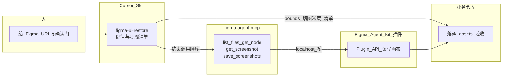

| 层级      | 职责                                                | 不负责                        |
| --------- | --------------------------------------------------- | ----------------------------- |
| **插件**  | 摸得到当前文件；执行导出 / 节点读写                 | 不规定你的 React/Vue 目录结构 |
| **MCP**   | 把能力变成标准工具，给 Agent 调用                   | 不自动保证「1:1 验收通过」    |
| **Skill** | 规定 scope、TEXT 归类、切图打标、分块对照、验收措辞 | 不替代业务 PRD / 接口 codegen |

一句话：

> **插件 + MCP = 能力；Skill = 怎么负责任地用这些能力做还原。**

### 8.2 Skill 规定的主流程（strict 默认）

```text
锁 scope →（确认门）→ list_files → get_node 读结构 → TEXT 全量归类
  → 切图打标 → get_screenshot 基准图 → save_screenshots×3 落盘
  → bounds 落码 → 分块对照 → 验收清单勾完才能说「1:1」
```

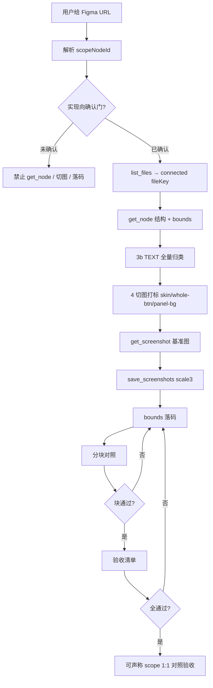

仅当用户明文 **fast** 时可压缩部分读结构表述、可省略基准图落盘；**不得**跳过 TEXT 清单与切图粒度，**不得**整页一图兜底。

### 8.3 几个「专门防翻车」的纪律

| 纪律                  | 含义                                                                                     |
| --------------------- | ---------------------------------------------------------------------------------------- |
| **单 scope**          | URL 一个 `node-id` → 只还原该子树；禁止顺手扫整文件                                      |
| **确认门**            | 未确认前禁止 `get_node` / `save_screenshots` / 落码（允许 `list_files`）                 |
| **connected fileKey** | 先 `list_files`，勿只用 URL 里的 fileKey                                                 |
| **TEXT 全量清单**     | 每条 TEXT 归入 `whole-btn-text` / `dom-fixed` / `dynamic` 等；未归类不得切图             |
| **切图粒度**          | 只导 `skin` / `whole-btn` / `panel-bg`（含 `modal-panel-bg`）；接口会变的文案/图不进 PNG |
| **3× + 压缩**         | 交付切图用 `save_screenshots`，`scale: 3`，`compress: true`                              |
| **bounds 优先**       | strict 下非对称布局禁止用 `flex:1` 糊弄                                                  |
| **分块对照**          | 一大块不过关，不得进入下一块                                                             |
| **验收措辞**          | 清单未全过，禁止写「已 1:1 对照验收」                                                    |

这些条目与社区里优秀的活动还原规范同源思路；我们将其**通用化**后写进本仓库 Skill，方便任意前端项目复用，而不是绑死某一业务仓。

### 8.4 和「只连上 MCP」的日常用法怎么选

| 你想做的事                           | 建议                                               |
| ------------------------------------ | -------------------------------------------------- |
| 问一句「当前选区是什么结构」         | 直接 Agent + MCP 工具即可                          |
| 改个文案 / 导出几张图                | MCP 工具 + 插件绿灯                                |
| **按画板做页面/弹窗 1:1 还原并验收** | **启用 `figma-ui-restore` Skill**，走完整清单      |
| 只整理图层命名 / 分组                | 可用其它 layers 类 Skill（若有）；不替代还原 Skill |

### 8.5 在你自己的项目里怎么用

1. 安装并运行 **Figma Agent Kit** 插件，配置 **`figma-agent-mcp`**（见上文第七章）。
2. 把本仓库的 `.cursor/skills/figma-ui-restore/` **复制到你的业务仓库** `.cursor/skills/`（或在 monorepo 里用 submodule / 文档约定引用）。
3. 打开业务仓库，用 Cursor 给出 Figma 链接，说明技术栈与资源目录。
4. `@figma-ui-restore` 或明确「按 Skill 做 strict 1:1 还原」。
5. 要求 Agent 按 Skill 模板输出：TEXT 清单、切图清单、参照父、分块对照、验收结论。

Skill 正文请以仓库内文件为准：  
[`.cursor/skills/figma-ui-restore/SKILL.md`](https://github.com/ChinaCarlos/figma-agent-kit/blob/main/.cursor/skills/figma-ui-restore/SKILL.md)

> 说明：Skill 是 **Agent 行为规范**，不是 npm 包的一部分；发版 kit 时它随仓库文档/工程资产一起演进。把「能力」和「用法纪律」拆开，是为了让同一套 MCP 既能聊天探稿，也能扛严肃还原。

---

## 九、适合谁 / 不适合谁

**适合**

- 用 Cursor / Claude 做还原、组件改造、活动页、运营 H5
- 希望 Agent **对着真图层**工作，而不是对着模糊截图猜
- 在意默认本地、可审计，或希望在采购商业 Figma MCP 之前先跑通工作流
- 设计师想顺手整理图层名、导出 3× 切图

**可以做的事（举例）**

- 结构化解读当前 Frame，标出风险布局
- 改文案 / 填充 / 部分布局属性
- 导出 3× PNG 到仓库目录
- 读 Motion 时间轴 / 关键帧（工具已暴露）

**不适合期待的事**

- 替代完整 Design System 工作台
- 无 Desktop、无本地 Node 的纯云端方案
- 不装插件就远程操控任意云文件
- 「完全免费还调用闭源大模型做视觉重命名」——模型费用在你自己的 API Key 上

---

## 十、开源地址、文档、致谢

| 资源                           | 链接                                                                                              |
| ------------------------------ | ------------------------------------------------------------------------------------------------- |
| 本仓库（欢迎 ⭐ / Issue / PR） | https://github.com/ChinaCarlos/figma-agent-kit                                                    |
| 文档站（中英）                 | https://chinacarlos.github.io/figma-agent-kit/                                                    |
| UI 还原 Skill                  | https://github.com/ChinaCarlos/figma-agent-kit/blob/main/.cursor/skills/figma-ui-restore/SKILL.md |
| npm：`figma-agent-mcp`         | https://www.npmjs.com/package/figma-agent-mcp                                                     |
| 插件 ZIP                       | https://github.com/ChinaCarlos/figma-agent-kit/releases/tag/figma-agent-plugin-v1.0.0             |
| MCP Release                    | https://github.com/ChinaCarlos/figma-agent-kit/releases/tag/figma-agent-mcp-v1.0.0                |
| Docs Release                   | https://github.com/ChinaCarlos/figma-agent-kit/releases/tag/docs-v1.0.0                           |
| 协议                           | MIT                                                                                               |

本地跑文档站：

```bash
git clone https://github.com/ChinaCarlos/figma-agent-kit.git
cd figma-agent-kit
pnpm install
pnpm dev:docs
```

一行拉起本仓库的 MCP（需已安装/导入对应版本插件）：

```bash
npx -y figma-agent-mcp
```

### 致谢（请读）

**Figma Agent Kit 站在社区已有工作之上。**  
「本地 Figma ↔ Agent 桥接」方向由众多开源作者、文章与仓库共同探索；我们从中学习路线与问题域，再按自己的维护目标改造、重组并补充文档与发版流程。若你的项目曾直接或间接启发本仓库，致谢你们的公开分享——若文中仍有表述不够严谨之处，欢迎开 Issue 指正，我们会改。

我们也明确：

- **不贬低**官方 / 商业 Figma MCP：企业场景下的合规、协作与支持往往是刚需；
- **不声称**本仓库是唯一或「正统」本地桥；
- **不保证**与某一特定第三方开源桥功能一一对等——请以本仓库文档与版本说明为准。

---

## 十一、写在最后

如果用一句话收束本文的立场，会是：

> **AI Coding 的下一公里，不全是更强的模型；本地、可审计、可改造的工具链接口同样重要。社区已经铺过路，我们只是又修了一段更适合自己维护的路基，并把它开源出来。**

对本仓库而言，我们更在意这些「能天天用」的部分：多进程下的端口处理、截图链路、版本锁、双语文档、可复现发版，以及把插件 + MCP 编成 **`figma-ui-restore` Skill** 的还原纪律——它们不一定炫技，但对真实协作很关键。

若文章对你有用，欢迎：

1. 给仓库点个 **Star** ⭐ — https://github.com/ChinaCarlos/figma-agent-kit
2. 按文档跑通一次 `list_files` → `get_selection`
3. 需要做页面还原时，试一次 `@figma-ui-restore` 全流程
4. 把坑与建议提到 Issue；有能力也欢迎 PR

**收藏链接**

- GitHub：https://github.com/ChinaCarlos/figma-agent-kit
- Docs：https://chinacarlos.github.io/figma-agent-kit/
- Skill：https://github.com/ChinaCarlos/figma-agent-kit/blob/main/.cursor/skills/figma-ui-restore/SKILL.md
- npm：`npx -y figma-agent-mcp`
- English：[tech-share-en.md](./tech-share-en.md)

—— 欢迎转载，注明出处与仓库链接即可。

<p align="center">
  
</p>
