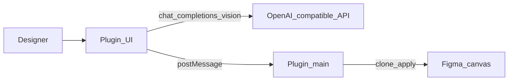

# AI features

**English** | [简体中文](./zh/ai-features.md)

Optional **AI layer rename** and **visual grouping** live in the **plugin UI**. They call any **OpenAI-compatible** chat API with vision support.

These features are **independent of MCP**. Bridge tools never need an LLM API key.



## Setup

1. Open the plugin → **⚙** → choose UI language (**中文** / **English**) if needed
2. **⚙ → Model settings** → set **API base URL** (default `https://api.openai.com/v1`)
3. Set **Model** (default `gpt-4o`; `gpt-4o-mini` also works)
4. Paste your **API key**
5. Click **Test connection**, then **Save**


Credentials and language preference are stored in Figma **`clientStorage`** on your machine only. UI strings live in [`packages/figma-agent-plugin/src/ui/locales.json`](../packages/figma-agent-plugin/src/ui/locales.json).

### Prompt templates

**⚙ → Prompt settings** — edit system prompts for rename and group separately.


- Defaults: [`packages/figma-agent-plugin/src/prompts/*.prompt.txt`](../packages/figma-agent-plugin/src/prompts/)
- Placeholders: `{{candidates}}`, `{{suggestedClusters}}` (group)
- **Restore defaults** reloads repo templates; **Save** writes overrides to `clientStorage`

### Custom AI providers

Figma plugins must declare allowed domains in `manifest.json`. This repo already allowlists common hosts, including:

| Provider | Host examples |
|----------|----------------|
| OpenAI | `https://api.openai.com` |
| DashScope / Bailian | `https://dashscope.aliyuncs.com`, `https://dashscope-intl.aliyuncs.com` |
| DeepSeek | `https://api.deepseek.com` |
| Moonshot | `https://api.moonshot.cn` |
| SiliconFlow | `https://api.siliconflow.cn` |
| Zhipu | `https://open.bigmodel.cn` |
| Volcengine Ark | `https://ark.cn-beijing.volces.com` |
| OpenRouter / Groq / Together | `https://openrouter.ai`, `https://api.groq.com`, `https://api.together.xyz` |
| Local proxy | `http://localhost` |
| Version check | `https://raw.githubusercontent.com` |

For Azure OpenAI or other custom hosts: add the host to `networkAccess.allowedDomains` in [`manifest.json`](../packages/figma-agent-plugin/manifest.json), rebuild, and re-import the plugin.

## AI rename

1. Select a single **Frame** or **Group**
2. Open the **Rename** tab → **Start rename**
3. The plugin clones the selection to the right, exports a 1× PNG, and sends layer candidates + image to your API
4. Returned names are applied on the **clone** (original is untouched)

Skipped: `TEXT` nodes and very small layers (&lt; 2px).

## AI visual grouping

1. Select a single **Frame**, **Group**, or **Section**
2. Open the **Group** tab → **Start group**
3. Review/edit the JSON plan in the editor
4. Click **Apply groups** to create nested groups on the clone (**depth-first**)

The collector also suggests simple row-based proximity clusters as a hint to the model.

## Version updates

The plugin fetches:

```text
https://raw.githubusercontent.com/ChinaCarlos/figma-agent-kit/main/releases/version.json
```

See [Plugin release](./plugin-release.md) for how `version.json` is updated.
