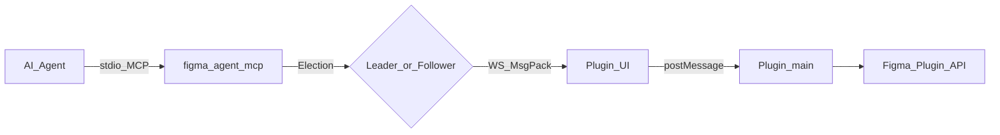
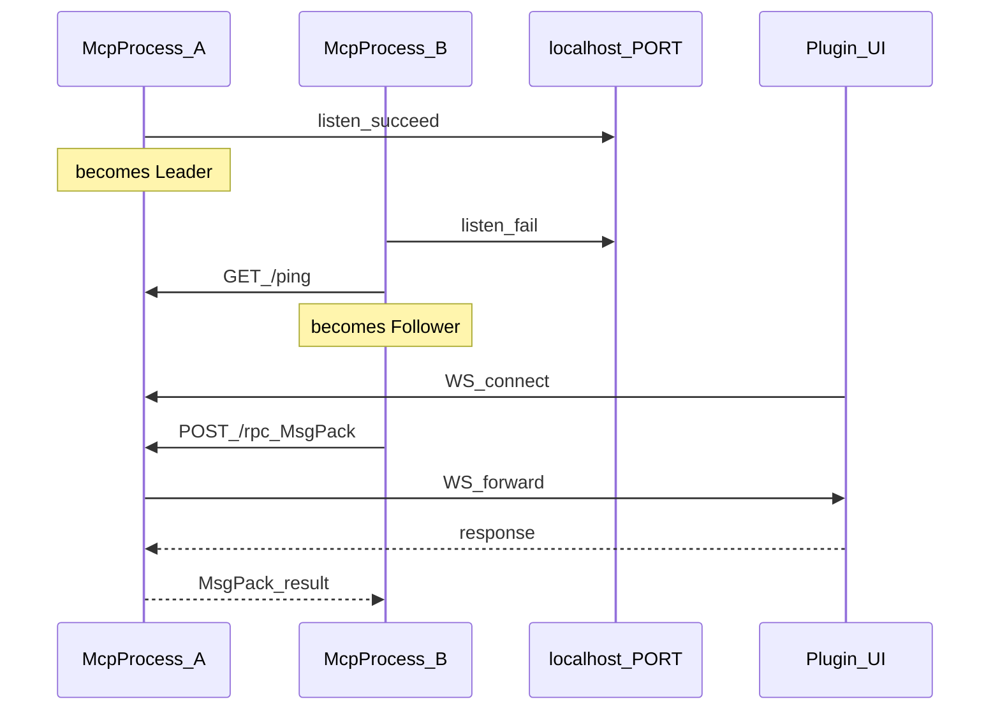
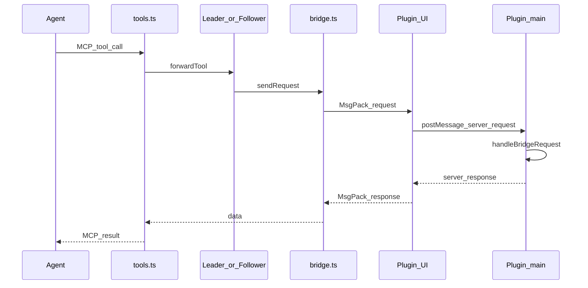
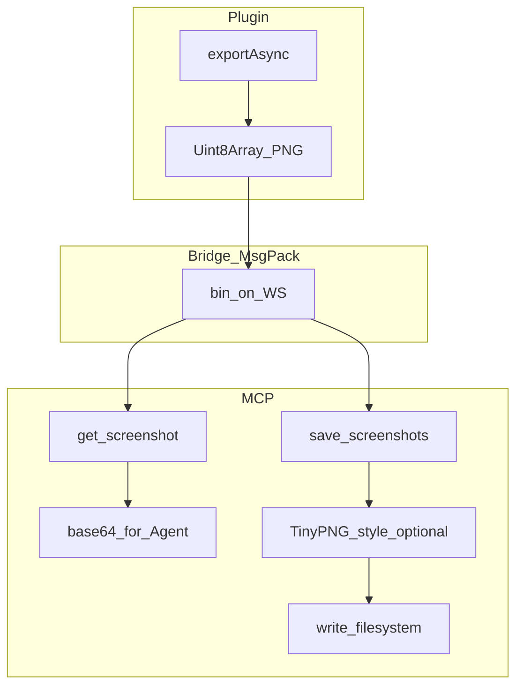
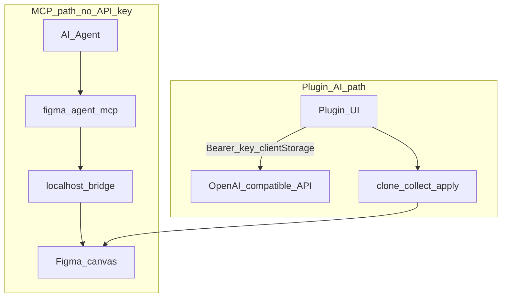

# Architecture

**English** | [简体中文](./zh/architecture.md)

This document explains how **Figma Agent Kit** is structured: packages, runtime roles, data paths, and design principles.

## Goals

- Let AI agents (Cursor, Claude Code, Codex, …) **read and write** the Figma file currently open in **Figma Desktop**
- Keep canvas traffic **on localhost** — no Figma REST upload of the document for bridge tools
- Support **multiple MCP clients** at once via Leader / Follower election on a single bridge port
- Ship an optional **in-plugin AI** path (rename / group) that is independent of MCP credentials

## Monorepo layout

```text
figma-agent-kit/
├── bridge.config.json          # Single source of truth for default WS port (1998)
├── packages/
│   ├── figma-agent-mcp/        # npm: stdio MCP + HTTP/WS bridge server
│   └── figma-agent-plugin/     # Figma Desktop plugin (bridge client + AI + slice export)
├── scripts/
│   ├── sync-bridge-config.mjs  # Sync port → MCP + plugin + manifest
│   └── release-kit.mjs         # Co-release MCP + plugin at the same version
└── docs/                       # This documentation set
```

| Package | Distributed as | Role |
|---------|----------------|------|
| [`figma-agent-mcp`](https://www.npmjs.com/package/figma-agent-mcp) | npm / GitHub Packages | MCP server + bridge leader/follower |
| `figma-agent-plugin` | GitHub Release ZIP | Figma UI + Plugin API handlers |

Versions are kept in lockstep (`0.1.x`). Prefer `pnpm release:kit:*` over releasing only one side.

## System overview



End-to-end:

1. The agent talks MCP over **stdio** to a `figma-agent-mcp` process.
2. That process is either the **Leader** (binds `localhost:PORT`) or a **Follower** (forwards to the Leader).
3. The plugin **UI iframe** opens a WebSocket to the Leader and speaks **MessagePack**.
4. The UI forwards RPC to the plugin **main** thread, which calls the Figma Plugin API (`documentAccess: dynamic-page`).

## Tech stack

| Layer | Technologies |
|-------|----------------|
| MCP | TypeScript (ESM), `@modelcontextprotocol/sdk`, `ws`, `msgpackr`, `zod`, `pngjs` / `upng-js` |
| Plugin | TypeScript, Rsbuild (main bundle), esbuild (MsgPack codec + JSZip inject), Figma Plugin API |
| Monorepo | pnpm workspaces, shared `bridge.config.json` |
| CI | GitHub Actions — build, pack, tag releases → npm / GitHub Releases / GitHub Packages |

## Module map (MCP)

| Module | Responsibility |
|--------|----------------|
| `index.ts` | CLI entry, election, MCP stdio server |
| `election.ts` | Leader listen / follower attach / failover poll |
| `leader.ts` | HTTP `/ping`, `/files`, `/rpc` + WS upgrade |
| `follower.ts` | HTTP client to leader |
| `bridge.ts` | Per-`fileKey` WebSocket table, heartbeats, RPC timeout |
| `codec.ts` | MsgPack encode/decode (`useRecords: false`) |
| `tools.ts` / `schema.ts` | 37 tools + Zod schemas |
| `compress-png.ts` | TinyPNG-style compression for `save_screenshots` |

## Module map (plugin)

| Module | Responsibility |
|--------|----------------|
| `bridge/handlers.ts` | Tool implementations (`getNodeByIdAsync`, motion, writes) |
| `bridge/serializer.ts` | Node tree serialization for agents |
| `ui/ui.html` | WS client, settings, i18n, slice export UI |
| `ui/codec.ts` | MsgPack codec bundled into the UI |
| `rename/*`, `group/*` | AI rename / visual group on clones |
| `export/slices.ts` | 1× preview / 3× PNG export helpers |

## Leader / Follower election

Multiple agent windows often spawn multiple MCP processes. Only one process may bind the bridge port.



- Leader: binds port, accepts plugin sockets, serves discovery + RPC.
- Follower: every tool call → `POST /rpc` (MsgPack) on the Leader; `list_files` → `GET /files`.
- Health poll (~3–5s): if Leader dies, a Follower retries election and may take over.

## RPC path (tool call)



Important details:

- Wire tool name may appear as `type` or `tool`.
- Screenshot `data` is raw PNG **bytes** on the bridge (MsgPack `bin`), not base64.
- Logs go to **stderr** only — stdout is reserved for MCP stdio.

## Screenshot & slice export paths



| Tool | Compression | Typical use |
|------|-------------|-------------|
| `get_screenshot` | None | Agent vision / preview (default `scale=2`) |
| `save_screenshots` | PNG default **on** | Delivery slices; use **`scale=3`** to match plugin UI export |

## Two AI paths

MCP bridge tools never need an LLM API key. Optional rename/group AI runs only inside the plugin UI.



## Port configuration

1. Edit root [`bridge.config.json`](../bridge.config.json) (`defaultPort`).
2. Run `pnpm sync:bridge` (also runs on `predev` / `prebuild`).
3. Rebuild the plugin and restart MCP.

Runtime override for MCP only: `FIGMA_AGENT_MCP_PORT` — **must** match the port baked into the plugin manifest / UI.

## Principles

1. **Local-first** — bridge traffic stays on `localhost`; design data is not uploaded for MCP tools.
2. **MsgPack on the hot path** — WS + follower RPC; small discovery endpoints stay JSON.
3. **Stdout purity** — never print diagnostics on stdout in the MCP process.
4. **Async node lookup** — `dynamic-page` plugins use `figma.getNodeByIdAsync`.
5. **Co-versioned releases** — upgrade plugin + MCP together after protocol changes.
6. **Capability honesty** — Motion tools require a Figma build that exposes motion APIs; otherwise return a clear error.

## Further reading

- [Bridge protocol](./bridge-protocol.md) — wire formats and endpoints
- [MCP tools](./tools.md) — full tool catalog
- [Getting started](./getting-started.md) — install and connect
- [FAQ](./faq.md) — common failure modes
