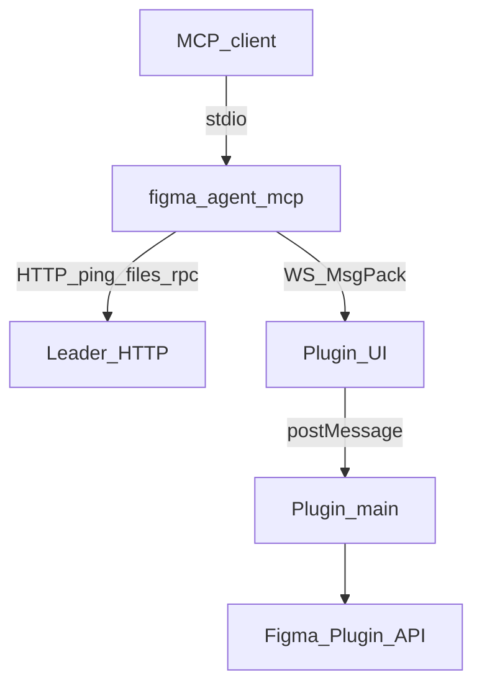
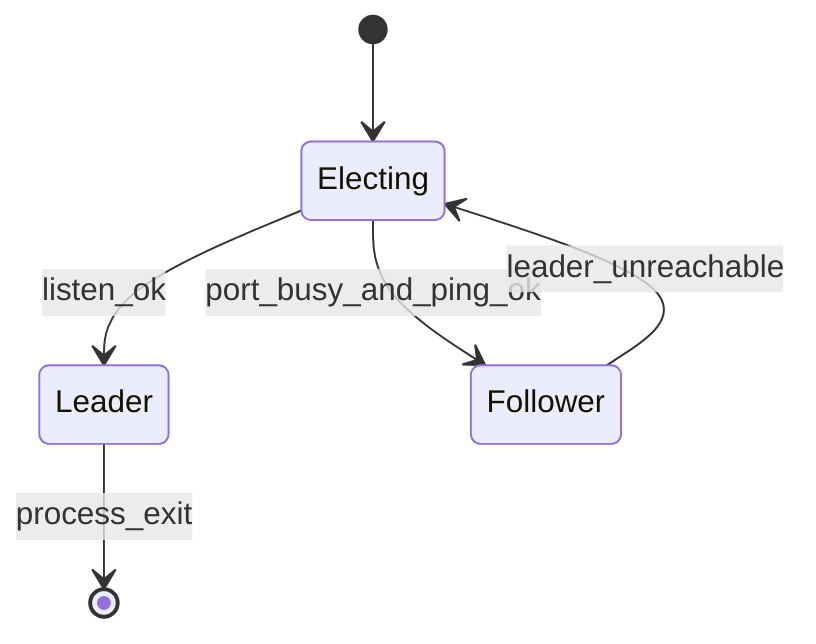

# Bridge protocol

**English** | [简体中文](./zh/bridge-protocol.md)

How **figma-agent-mcp** talks to **figma-agent-plugin**. All bridge traffic is on **localhost**.

For the big picture and Mermaid diagrams, see [Architecture](./architecture.md).

## Overview



Default port comes from repo-root **`bridge.config.json`** (`defaultPort`, synced into MCP + plugin UI + `manifest.json` on build).

Optional MCP-only override: `FIGMA_AGENT_MCP_PORT` (must match the port baked into the plugin).

## Serialization (MessagePack)

Bridge **WebSocket** frames and leader↔follower **`POST /rpc`** bodies use **MessagePack** (`application/msgpack`) via [`msgpackr`](https://github.com/kriszyp/msgpackr) with `useRecords: false`.

| Channel | Encoding |
|---------|----------|
| `WS /ws` | Binary WebSocket frames (MsgPack) |
| `POST /rpc` | `Content-Type: application/msgpack` |
| `GET /ping`, `GET /files` | JSON (health / discovery) |

### Why MsgPack

- PNG screenshots travel as **MsgPack `bin`** (`Uint8Array` / `Buffer`) — no base64 (~33% size tax)
- Large node trees pack denser than JSON
- Same logical message shapes; only the wire format is binary

### Screenshot payload

Plugin → MCP:

```js
{
  images: [
    { nodeId: "1:2", format: "png", data: Uint8Array /* raw PNG bytes */ }
  ]
}
```

- `save_screenshots` writes `data` buffers directly to disk (optional compression)
- `get_screenshot` converts `data` to **base64** for agent-facing text output

## Roles



| Role | Responsibility |
|------|----------------|
| Leader | Binds the port, accepts plugin WebSockets, serves `/ping`, `/files`, `/rpc` |
| Follower | Forwards tool calls via `POST /rpc` (MsgPack); lists files via `GET /files` |

If the leader dies, a follower attempts takeover.

## Plugin WebSocket

### Connect

```text
ws://localhost:1998/ws?fileKey=<FILE_KEY>&fileName=<ENCODED_NAME>
```

- `fileKey` is required (`figma.fileKey`, or a local fallback for unsaved files).
- One active socket per `fileKey` (new connection replaces the old one).
- Clients must set `binaryType = "arraybuffer"`.

### Heartbeat

Leader sends a MsgPack control object roughly every **30s**:

```js
{ type: "ping" }
```

Plugin replies:

```js
{ type: "pong" }
```

These frames have **no `requestId`** and must not be treated as tool RPC.  
Missing two heartbeat rounds → leader closes with `4002 heartbeat timeout`.

Close codes of interest: `4000` missing `fileKey`, `4001` replaced by newer connection, `4002` heartbeat timeout.

### Request (MCP → plugin)

```js
{
  type: "get_selection",  // or tool: "get_selection"
  requestId: "unique-id",
  nodeIds: ["1:2"],
  params: {}
}
```

The UI forwards this to the main thread as `server-request`.

### Response (plugin → MCP)

```js
{ requestId: "unique-id", ok: true, data: { /* may contain Uint8Array bins */ } }
```

Failure:

```js
{ requestId: "unique-id", ok: false, error: "message" }
```

Requests time out after **180 seconds** on the MCP side.

## HTTP (followers / health)

### `GET /ping`

```json
{ "ok": true, "role": "leader" }
```

### `GET /files`

```json
{
  "ok": true,
  "files": [{ "fileKey": "…", "fileName": "…" }]
}
```

### `POST /rpc`

```http
Content-Type: application/msgpack
Accept: application/msgpack
```

Body (MsgPack of):

```js
{
  tool: "get_node",
  nodeIds: ["1:2"],
  params: {},
  fileKey: "optional-when-multiple-files"
}
```

Response: MsgPack of `{ ok: true, data }` or `{ ok: false, error }`.

## File routing

When several Figma files have the plugin connected, pass `fileKey` in tool arguments so the leader picks the correct WebSocket. `list_files` returns the current map.

## Stability notes

- Do not log MCP protocol traffic to **stdout** (reserved for stdio MCP).
- Prefer Figma Desktop; browser tabs may sleep and drop the socket.
- Save the file when possible so `fileKey` stays stable.
- Upgrade **plugin and MCP together** — MsgPack binary is required on the bridge path.
