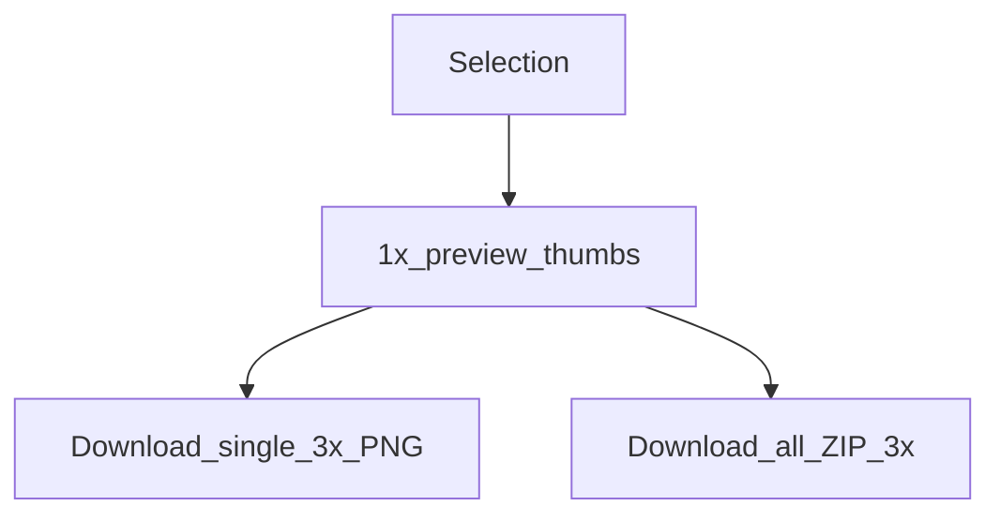

# Exporting slices

**English** | [简体中文](./zh/exporting-slices.md)

The plugin UI can export selected layers as **PNG slices** (and ZIP), separate from MCP `save_screenshots`.

## When to use which

| Path | Scale | Compression | Best for |
|------|-------|-------------|----------|
| Plugin **Export** tab | Preview **1×**, download **3×** | Browser download / ZIP | Designers exporting by hand |
| MCP `save_screenshots` | Default **2**, use **`scale=3`** for parity | TinyPNG-style on by default for PNG | Agents / automation |



## Plugin workflow

1. Select one or more exportable nodes (max **50**)
2. Open the **Export** tab — 1× previews generate automatically
3. Click a thumbnail to preview larger
4. Download one PNG or **download all** as a ZIP (JSZip in the UI)


Naming is sanitized for the filesystem. Non-exportable node types are skipped with a clear message.

## MCP parity

```json
{
  "nodeIds": ["2009:2"],
  "scale": 3,
  "format": "PNG",
  "compress": true,
  "path": "./screenshots"
}
```

See [tools.md](./tools.md) for full `save_screenshots` options (`clip`, SVG/JPG/PDF, etc.).

## Implementation notes

- Logic: [`packages/figma-agent-plugin/src/export/slices.ts`](../packages/figma-agent-plugin/src/export/slices.ts)
- UI: Export view inside [`ui.html`](../packages/figma-agent-plugin/src/ui/ui.html)
- MCP compression: [`packages/figma-agent-mcp/src/compress-png.ts`](../packages/figma-agent-mcp/src/compress-png.ts)
