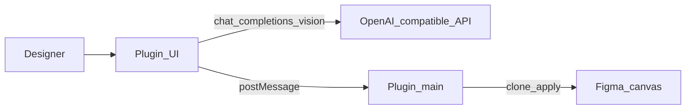

# AI 機能

[English](../ai-features.md) | **日本語**

オプションの **AI レイヤー命名** と **視覚的グループ化** は **プラグイン UI** にあります。これらは、Vision をサポートする任意の **OpenAI 互換**チャット API を呼び出します。

これらの機能は **MCP とは独立**しています。ブリッジツールに LLM API キーは不要です。



## セットアップ

1. プラグインを開き、**⚙** から必要に応じて UI 言語（**中文** / **English**）を選択します
2. **⚙ → Model settings** で **API base URL**（既定値は `https://api.openai.com/v1`）を設定します
3. **Model** を設定します（既定値は `gpt-4o`。`gpt-4o-mini` も利用できます）
4. **API key** を貼り付けます
5. **Test connection** をクリックしてから、**Save** をクリックします


認証情報と言語設定は、お使いのマシン上の Figma **`clientStorage`** にのみ保存されます。UI 文字列は [`packages/figma-agent-plugin/src/ui/locales.json`](../packages/figma-agent-plugin/src/ui/locales.json) にあります。

### プロンプトテンプレート

**⚙ → Prompt settings** で、rename と group のシステムプロンプトを個別に編集します。


- 既定値：[`packages/figma-agent-plugin/src/prompts/*.prompt.txt`](../packages/figma-agent-plugin/src/prompts/)
- プレースホルダー：`{{candidates}}`、`{{suggestedClusters}}`（group）
- **Restore defaults** はリポジトリのテンプレートを再読み込みし、**Save** はオーバーライドを `clientStorage` に書き込みます

### カスタム AI プロバイダー

Figma プラグインでは、許可するドメインを `manifest.json` に宣言する必要があります。このリポジトリでは、次を含む一般的なホストをすでに allowlist に登録しています。

| プロバイダー | ホストの例 |
|----------|----------------|
| OpenAI | `https://api.openai.com` |
| DashScope / Bailian | `https://dashscope.aliyuncs.com`, `https://dashscope-intl.aliyuncs.com` |
| DeepSeek | `https://api.deepseek.com` |
| Moonshot | `https://api.moonshot.cn` |
| SiliconFlow | `https://api.siliconflow.cn` |
| Zhipu | `https://open.bigmodel.cn` |
| Volcengine Ark | `https://ark.cn-beijing.volces.com` |
| OpenRouter / Groq / Together | `https://openrouter.ai`, `https://api.groq.com`, `https://api.together.xyz` |
| ローカルプロキシ | `http://localhost` |
| バージョン確認 | `https://raw.githubusercontent.com` |

Azure OpenAI などのカスタムホストでは、[`manifest.json`](../packages/figma-agent-plugin/manifest.json) の `networkAccess.allowedDomains` にホストを追加し、ビルドしてプラグインを再インポートしてください。

## AI 命名

1. **Frame** または **Group** を 1 つ選択します
2. **Rename** タブを開き、**Start rename** を選択します
3. プラグインは選択範囲を右側に複製し、1× PNG を書き出して、レイヤー候補と画像を API に送信します
4. 返された名前は **複製** に適用されます（元の要素は変更されません）

対象外：`TEXT` ノードおよび非常に小さいレイヤー（&lt; 2px）。

## AI 視覚的グループ化

1. **Frame**、**Group**、または **Section** を 1 つ選択します
2. **Group** タブを開き、**Start group** を選択します
3. エディターで JSON プランを確認・編集します
4. **Apply groups** をクリックすると、複製にネストしたグループを作成します（**深さ優先**）

コレクターは、モデルへのヒントとして単純な行ベースの近接クラスタも提案します。

## バージョンアップデート

プラグインは次を取得します。

```text
https://raw.githubusercontent.com/ChinaCarlos/figma-agent-kit/main/releases/version.json
```

`version.json` の更新方法については [プラグインリリース](./plugin-release.md) を参照してください。
