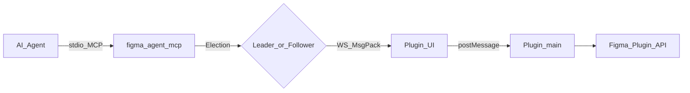
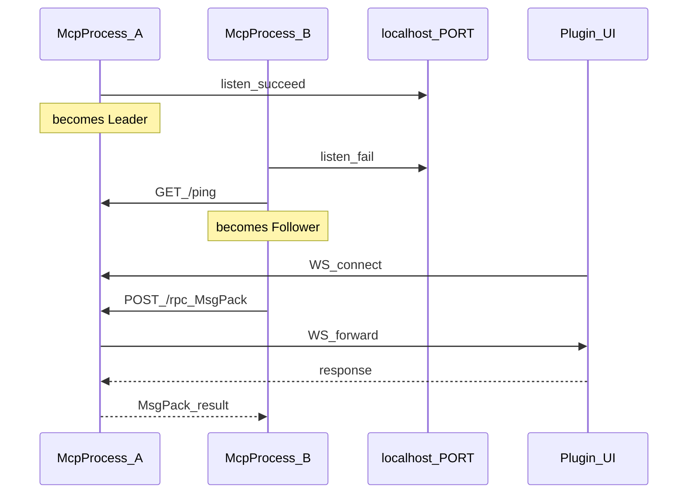
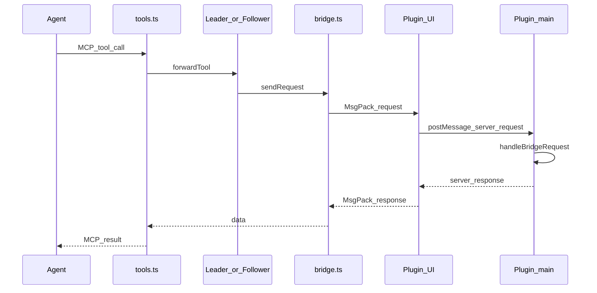
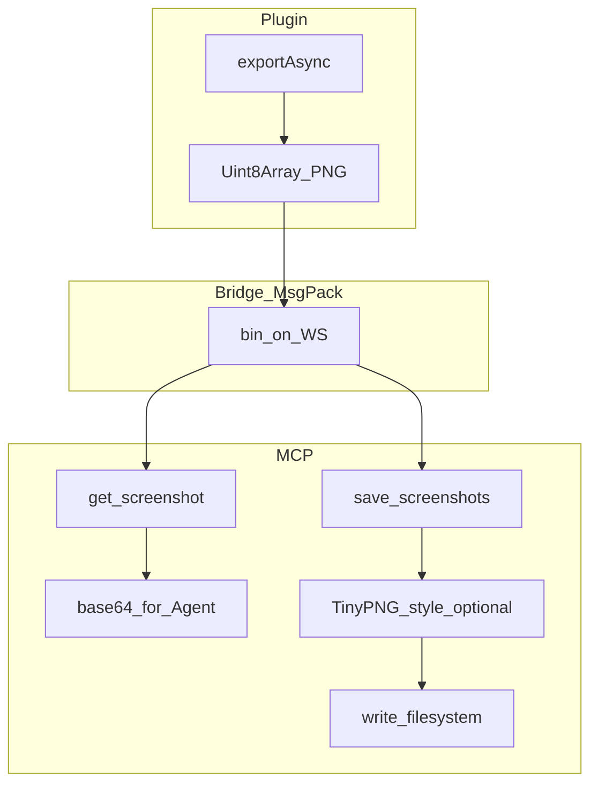
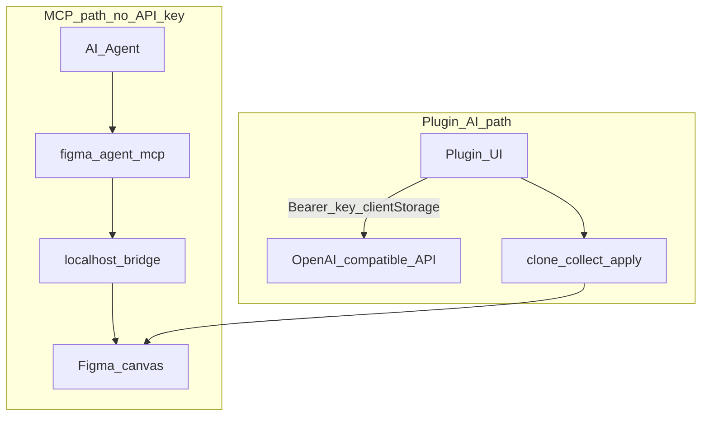

# アーキテクチャ

[English](../architecture.md) | **日本語**

このドキュメントでは、**Figma Agent Kit** の構成（パッケージ、実行時ロール、データ経路、設計原則）を説明します。

## 目標

- AI Agent（Cursor、Claude Code、Codex、…）が、**Figma Desktop** で現在開いている Figma ファイルを**読み書き**できるようにする
- canvas のトラフィックを **localhost** に保つ。ブリッジツールでは Figma REST によるドキュメントアップロードを行わない
- 単一のブリッジポートで Leader / Follower election を行い、**複数の MCP クライアント**を同時にサポートする
- MCP の認証情報とは独立した、任意の**プラグイン内 AI**パス（rename / group）を提供する

## モノレポのレイアウト

```text
figma-agent-kit/
├── bridge.config.json          # Single source of truth for default WS port (1998)
├── packages/
│   ├── figma-agent-mcp/        # npm: stdio MCP + HTTP/WS bridge server
│   └── figma-agent-plugin/     # Figma Desktop plugin (bridge client + AI + slice export)
├── scripts/
│   ├── sync-bridge-config.mjs  # Sync port → MCP + plugin + manifest
│   └── release-kit.mjs         # Co-release MCP + plugin at the same version
└── docs/                       # This documentation set
```

| パッケージ | 配布形態 | ロール |
|---------|----------------|------|
| [`figma-agent-mcp`](https://www.npmjs.com/package/figma-agent-mcp) | npm / GitHub Packages | MCP server + bridge leader/follower |
| `figma-agent-plugin` | GitHub Release ZIP | Figma UI + Plugin API handlers |

バージョンは同期して維持されます（`0.1.x`）。片方だけをリリースするのではなく、`pnpm release:kit:*` を推奨します。

## システム概要



エンドツーエンドの流れ：

1. Agent は **stdio** を介して `figma-agent-mcp` プロセスと MCP 通信します。
2. プロセスは **Leader**（`localhost:PORT` を bind）または **Follower**（Leader に転送）のどちらかです。
3. プラグインの **UI iframe** は Leader に WebSocket を開き、**MessagePack** で通信します。
4. UI は RPC をプラグインの **main** thread に転送し、main thread は Figma Plugin API（`documentAccess: dynamic-page`）を呼び出します。

## 技術スタック

| レイヤー | 技術 |
|-------|----------------|
| MCP | TypeScript (ESM), `@modelcontextprotocol/sdk`, `ws`, `msgpackr`, `zod`, `pngjs` / `upng-js` |
| Plugin | TypeScript, Rsbuild (main bundle), esbuild (MsgPack codec + JSZip inject), Figma Plugin API |
| Monorepo | pnpm workspaces, shared `bridge.config.json` |
| CI | GitHub Actions — build, pack, tag releases → npm / GitHub Releases / GitHub Packages |

## モジュールマップ（MCP）

| モジュール | 責務 |
|--------|----------------|
| `index.ts` | CLI entry、election、MCP stdio server |
| `election.ts` | Leader listen / follower attach / failover poll |
| `leader.ts` | HTTP `/ping`、`/files`、`/rpc` + WS upgrade |
| `follower.ts` | Leader 用 HTTP client |
| `bridge.ts` | `fileKey` ごとの WebSocket table、heartbeats、RPC timeout |
| `codec.ts` | MsgPack encode/decode（`useRecords: false`） |
| `tools.ts` / `schema.ts` | 37 tools + Zod schemas |
| `compress-png.ts` | `save_screenshots` 用 TinyPNG-style compression |

## モジュールマップ（plugin）

| モジュール | 責務 |
|--------|----------------|
| `bridge/handlers.ts` | Tool implementations（`getNodeByIdAsync`、motion、writes） |
| `bridge/serializer.ts` | Agent 用 node tree serialization |
| `ui/ui.html` | WS client、settings、i18n、slice export UI |
| `ui/codec.ts` | UI にバンドルされる MsgPack codec |
| `rename/*`、`group/*` | clones 上の AI rename / visual group |
| `export/slices.ts` | 1× preview / 3× PNG export helpers |

## Leader / Follower election

複数の Agent window は複数の MCP process を起動することがよくあります。ブリッジポートを bind できる process は 1 つだけです。



- Leader：ポートを bind し、プラグイン socket を受け付け、discovery + RPC を提供します。
- Follower：各 tool call を Leader へ `POST /rpc`（MsgPack）し、`list_files` を `GET /files` します。
- Health poll（約 3–5s）：Leader が停止すると、Follower は election を再試行して引き継ぐことがあります。

## RPC path（tool call）



重要な詳細：

- wire tool name は `type` または `tool` として現れます。
- screenshot の `data` はブリッジ上では生の PNG **bytes**（MsgPack `bin`）であり、base64 ではありません。
- logs は **stderr** のみに出力します。stdout は MCP stdio 用に予約されています。

## Screenshot と slice export の経路



| ツール | 圧縮 | 一般的な用途 |
|------|-------------|-------------|
| `get_screenshot` | なし | Agent vision / preview（既定の `scale=2`） |
| `save_screenshots` | PNG では既定で **on** | 配信用 slices。プラグイン UI の export に合わせるには **`scale=3`** を使用 |

## 2 つの AI パス

MCP ブリッジツールに LLM API キーは不要です。任意の rename/group AI はプラグイン UI 内でのみ実行されます。



## ポート設定

1. root の [`bridge.config.json`](../bridge.config.json)（`defaultPort`）を編集します。
2. `pnpm sync:bridge` を実行します（`predev` / `prebuild` でも実行されます）。
3. プラグインを再ビルドし、MCP を再起動します。

MCP 専用の実行時オーバーライド：`FIGMA_AGENT_MCP_PORT` — プラグイン manifest / UI に組み込まれたポートと**一致**させる必要があります。

## 原則

1. **Local-first** — ブリッジトラフィックは `localhost` に留まり、MCP ツールで design data はアップロードされません。
2. **MsgPack on the hot path** — WS + follower RPC。小さな discovery endpoint は JSON のままです。
3. **Stdout purity** — MCP process の stdout に diagnostics を出力しません。
4. **Async node lookup** — `dynamic-page` plugins は `figma.getNodeByIdAsync` を使用します。
5. **Co-versioned releases** — protocol changes 後は plugin + MCP を一緒にアップグレードします。
6. **Capability honesty** — Motion tools には motion APIs を公開する Figma build が必要で、なければ明確な error を返します。

## さらに読む

- [ブリッジプロトコル](./bridge-protocol.md) — wire formats と endpoints
- [MCP ツール](./tools.md) — 完全なツールカタログ
- [はじめに](./getting-started.md) — インストールと接続
- [FAQ](./faq.md) — よくある失敗モード
