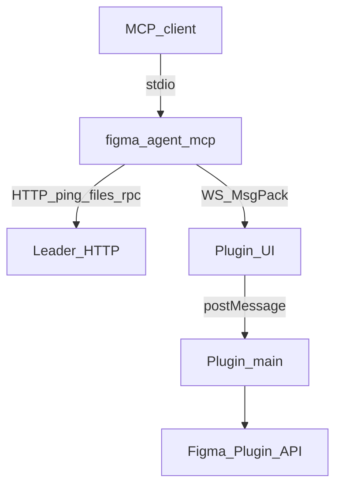
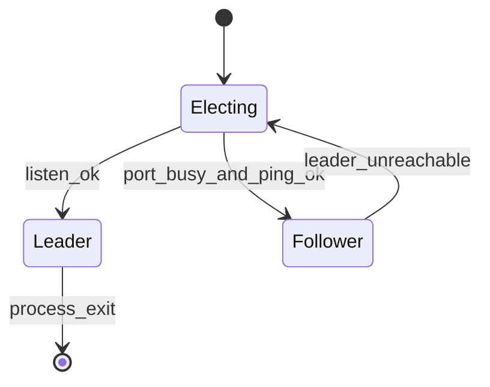

# ブリッジプロトコル

[English](../bridge-protocol.md) | **日本語**

**figma-agent-mcp** が **figma-agent-plugin** と通信する方法です。すべてのブリッジトラフィックは **localhost** 上で行われます。

全体像と Mermaid 図は [アーキテクチャ](./architecture.md) を参照してください。

## 概要



既定ポートはリポジトリルートの **`bridge.config.json`**（`defaultPort`）から取得されます（ビルド時に MCP + plugin UI + `manifest.json` へ同期）。

任意の MCP 専用オーバーライド：`FIGMA_AGENT_MCP_PORT`（プラグインに組み込まれたポートと一致させる必要があります）。

## シリアライズ（MessagePack）

ブリッジの **WebSocket** フレームと Leader↔Follower の **`POST /rpc`** 本文は、`useRecords: false` を指定した [`msgpackr`](https://github.com/kriszyp/msgpackr) による **MessagePack**（`application/msgpack`）を使用します。

| チャネル | エンコード |
|---------|----------|
| `WS /ws` | バイナリ WebSocket フレーム（MsgPack） |
| `POST /rpc` | `Content-Type: application/msgpack` |
| `GET /ping`、`GET /files` | JSON（health / discovery） |

### MsgPack を使う理由

- PNG スクリーンショットは **MsgPack `bin`**（`Uint8Array` / `Buffer`）として転送されます。base64 は不要です（約 33% のサイズ増加を回避）
- 大きなノードツリーを JSON より密にパックできます
- 論理的なメッセージ形状は同じで、wire format のみがバイナリです

### スクリーンショットのペイロード

プラグイン → MCP：

```js
{
  images: [
    { nodeId: "1:2", format: "png", data: Uint8Array /* raw PNG bytes */ }
  ]
}
```

- `save_screenshots` は `data` buffer を直接ディスクへ書き込みます（圧縮は任意）
- `get_screenshot` は Agent 向けテキスト出力のために `data` を **base64** へ変換します

## ロール



| ロール | 担当 |
|------|----------------|
| Leader | ポートを bind し、プラグイン WebSocket を受け付け、`/ping`、`/files`、`/rpc` を提供 |
| Follower | `POST /rpc`（MsgPack）でツール呼び出しを転送し、`GET /files` でファイルを一覧表示 |

Leader が停止すると、Follower が引き継ぎを試みます。

## プラグイン WebSocket

### 接続

```text
ws://localhost:1998/ws?fileKey=<FILE_KEY>&fileName=<ENCODED_NAME>
```

- `fileKey` は必須です（`figma.fileKey`、または未保存ファイル用のローカルフォールバック）。
- `fileKey` ごとに 1 つのアクティブソケットです（新しい接続が古い接続を置き換えます）。
- クライアントは `binaryType = "arraybuffer"` を設定する必要があります。

### Heartbeat

Leader は約 **30s** ごとに MsgPack control object を送信します。

```js
{ type: "ping" }
```

プラグインは次を返します。

```js
{ type: "pong" }
```

これらのフレームには **`requestId` がなく**、ツール RPC として扱ってはいけません。  
2 回の heartbeat を逃すと、Leader は `4002 heartbeat timeout` で切断します。

重要な close code：`4000` は `fileKey` 不足、`4001` は新しい接続による置換、`4002` は heartbeat timeout です。

### リクエスト（MCP → plugin）

```js
{
  type: "get_selection",  // or tool: "get_selection"
  requestId: "unique-id",
  nodeIds: ["1:2"],
  params: {}
}
```

UI はこれを `server-request` として main thread に転送します。

### レスポンス（plugin → MCP）

```js
{ requestId: "unique-id", ok: true, data: { /* may contain Uint8Array bins */ } }
```

失敗時：

```js
{ requestId: "unique-id", ok: false, error: "message" }
```

MCP 側ではリクエストは **180 seconds** 後にタイムアウトします。

## HTTP（followers / health）

### `GET /ping`

```json
{ "ok": true, "role": "leader" }
```

### `GET /files`

```json
{
  "ok": true,
  "files": [{ "fileKey": "…", "fileName": "…" }]
}
```

### `POST /rpc`

```http
Content-Type: application/msgpack
Accept: application/msgpack
```

本文（以下を MsgPack 化）：

```js
{
  tool: "get_node",
  nodeIds: ["1:2"],
  params: {},
  fileKey: "optional-when-multiple-files"
}
```

レスポンス：`{ ok: true, data }` または `{ ok: false, error }` を MsgPack 化したものです。

## ファイルルーティング

複数の Figma ファイルでプラグインが接続している場合、Leader が正しい WebSocket を選べるよう、ツール引数に `fileKey` を渡します。`list_files` は現在の map を返します。

## 安定性に関する注意

- MCP プロトコルトラフィックを **stdout** にログ出力しないでください（stdio MCP 用に予約されています）。
- Figma Desktop を推奨します。ブラウザタブはスリープしてソケットが切断されることがあります。
- 可能であればファイルを保存し、`fileKey` を安定させてください。
- **plugin と MCP は一緒にアップグレード**してください。ブリッジパスには MsgPack バイナリが必要です。
