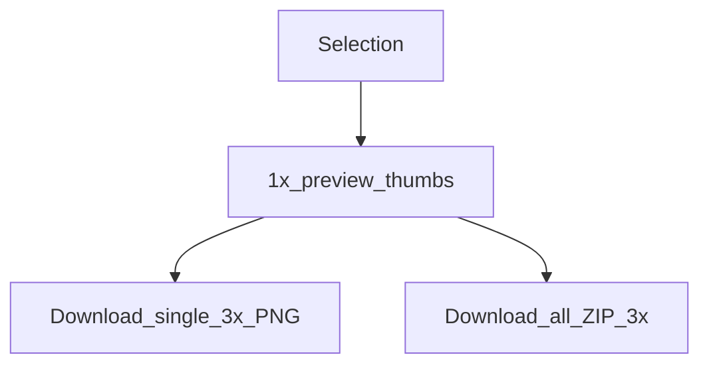

# スライスを書き出す

[English](../exporting-slices.md) | **日本語**

プラグイン UI では、MCP の `save_screenshots` とは別に、選択したレイヤーを **PNG スライス**（および ZIP）として書き出せます。

## 用途別の使い分け

| 経路 | スケール | 圧縮 | 最適な用途 |
|------|-------|-------------|----------|
| プラグインの **Export** タブ | プレビューは **1×**、ダウンロードは **3×** | ブラウザのダウンロード / ZIP | デザイナーによる手動の書き出し |
| MCP の `save_screenshots` | 既定は **2**、同等の出力には **`scale=3`** を使用 | PNG では TinyPNG 風の圧縮が既定で有効 | Agent / 自動化 |



## プラグインのワークフロー

1. 書き出し可能なノードを 1 つ以上選択します（最大 **50**）
2. **Export** タブを開きます。1× プレビューは自動で生成されます
3. サムネイルをクリックして拡大プレビューします
4. PNG を 1 枚ダウンロードするか、**download all** で ZIP としてダウンロードします（UI の JSZip）


ファイル名はファイルシステム用にサニタイズされます。書き出しできないノード型は、明確なメッセージとともにスキップされます。

## MCP との同等性

```json
{
  "nodeIds": ["2009:2"],
  "scale": 3,
  "format": "PNG",
  "compress": true,
  "path": "./screenshots"
}
```

`save_screenshots` の全オプション（`clip`、SVG/JPG/PDF など）は [tools.md](./tools.md) を参照してください。

## 実装メモ

- ロジック：[`packages/figma-agent-plugin/src/export/slices.ts`](../packages/figma-agent-plugin/src/export/slices.ts)
- UI：[`ui.html`](../packages/figma-agent-plugin/src/ui/ui.html) 内の Export ビュー
- MCP 圧縮：[`packages/figma-agent-mcp/src/compress-png.ts`](../packages/figma-agent-mcp/src/compress-png.ts)
