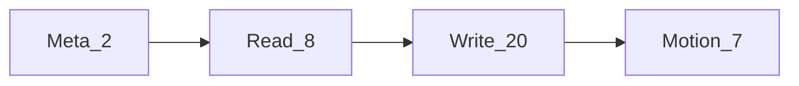
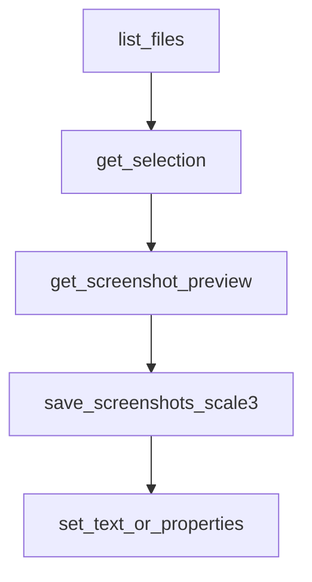

# MCP ツール

[English](../tools.md) | **日本語**

**figma-agent-mcp** が公開するツール（合計 37 個）です。注記がない限り、呼び出しはブリッジ経由で開いている Figma プラグインに転送されます。

## 規約

| 規約 | 詳細 |
|------------|--------|
| `fileKey` | ほぼすべてのツールで任意です。使用する接続済みファイルを選択します |
| フラット形式と `properties` | 多くの書き込みツールは、フラットなフィールド（`name`、`x` など）またはネストした `properties` オブジェクト（プラグイン側でマージ）を受け取ります |
| 選択範囲へのフォールバック | スクリーンショット / metadata / design context / zoom で `nodeIds` を省略すると、プラグインは**現在の選択範囲**を使用します |
| Motion | Motion API を公開する Figma ビルドが必要です。未対応の場合は明確な capability error が返されます |

## Meta（MCP ローカル）

| ツール | 説明 |
|------|-------------|
| `list_files` | 現在ブリッジに接続している Figma ファイルを一覧表示します（Leader ではローカル、Follower では `/files` 経由） |
| `save_screenshots` | ノードをディスクに書き出します。PNG は既定で TinyPNG 風の圧縮（`compress=true`）を使用します。`scale` の既定値は **2** です。プラグイン UI の書き出しと一致するスライスアセットには **`scale=3`** を使用してください。`format` は PNG / SVG / JPG / PDF、任意で `clip`、`path` に対応します |

## 読み取り

| ツール | 説明 |
|------|-------------|
| `get_document` | 現在のページツリーの概要（任意の `depth`、0–20） |
| `get_selection` | 現在の選択範囲 |
| `get_node` | id でノードをシリアライズします（`nodeIds` は必須、`depth` は任意） |
| `get_styles` | ローカルの paint / text / effect スタイル |
| `get_metadata` | 軽量な id / name / type / size |
| `get_design_context` | Agent コンテキスト用にシリアライズされたノード |
| `get_variable_defs` | ローカルの変数コレクションと変数 |
| `get_screenshot` | ラスター / ベクター書き出し。wire では生バイト（MsgPack bin）、Agent の結果では base64 です。既定は `format=PNG`、`scale=2`。**圧縮なし**のため、圧縮したスライスには `save_screenshots` を推奨します |

## 書き込み / 変更

| ツール | 説明 |
|------|-------------|
| `set_node_visibility` | 表示 / 非表示（`visible`） |
| `set_text_content` | テキスト文字列（`text`）を設定 |
| `set_text_properties` | フォントサイズ / ファミリー / スタイル / 配置 / 間隔 |
| `set_node_properties` | 名前、位置、サイズ、不透明度、回転 |
| `set_solid_fill` | 単色 paint（`color: {r,g,b,a?}`、0–1 または 0–255） |
| `set_gradient_fill` | グラデーション fill（`gradientStops`、任意の `gradientType`） |
| `set_effects` | シャドウ / ぼかし（`effects` 配列） |
| `set_stroke_properties` | 線の太さ / 配置 / 色 |
| `set_auto_layout` | フレームの Auto Layout |
| `create_frame` | フレームを作成 |
| `create_text` | テキストノードを作成 |
| `create_shape` | `RECTANGLE` / `ELLIPSE` / `LINE` / `POLYGON` / `STAR` を作成 |
| `create_image` | base64 の `imageData` を画像 fill として持つ長方形を作成 |
| `duplicate_nodes` | 複製 |
| `reparent_nodes` | 階層内で移動（`parentId`、任意の `index`） |
| `group_nodes` | グループ化 |
| `ungroup_node` | グループ解除 |
| `set_selection` | 選択範囲を変更 |
| `scroll_and_zoom_into_view` | ビューポートにフォーカス |
| `delete_nodes` | ノードを削除 |

## Motion（Figma Motion API beta）

| ツール | 説明 |
|------|-------------|
| `get_motion_styles` | 利用可能なアニメーションスタイル / プリセットを一覧表示 |
| `get_node_motion` | アニメーションスタイル、キーフレーム、タイムラインを読み取り |
| `apply_animation_style` | スタイルを適用（`styleId`、任意の `animationStyleData`）。組み込みプリセットには `animationStyleData.type: "FIGMA"` を使用 |
| `remove_animation_style` | 1 つのスタイルまたはすべてを削除（`animationStyleId` は任意） |
| `apply_manual_keyframe_track` | 手動キーフレームトラックを書き込み（`field`、`track`） |
| `remove_manual_keyframe_track` | 手動キーフレームトラックを削除（`field`） |
| `set_timeline_duration` | タイムラインの長さを設定（`timelineId`、`duration`） |

## Agent フローの例

1. `list_files`
2. `get_selection` / `get_node`
3. クイックプレビューに `get_screenshot`
4. 配信用スライスには、`scale: 3`、`compress: true` を指定して `save_screenshots`
5. 編集を適用するには `set_text_content` / `set_node_properties`（または Motion ツール）

## スキーマのソース

正規の Zod スキーマは [`packages/figma-agent-mcp/src/schema.ts`](../packages/figma-agent-mcp/src/schema.ts) にあります。ツール登録は [`tools.ts`](../packages/figma-agent-mcp/src/tools.ts) にあります。
