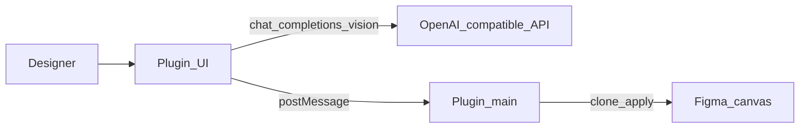

# AI 기능

**한국어** | [English](../ai-features.md)

선택 사항인 **AI 레이어 이름 변경** 및 **시각적 그룹화** 기능은 **플러그인 UI**에 있습니다. 비전 기능을 지원하는 모든 **OpenAI 호환** 채팅 API를 호출합니다.

이 기능은 **MCP와 독립적**입니다. 브리지 도구에는 LLM API 키가 필요하지 않습니다.



## 설정

1. 플러그인을 열고 → **⚙** → 필요하면 UI 언어(**中文** / **English**)를 선택합니다
2. **⚙ → Model settings** → **API base URL**(기본값 `https://api.openai.com/v1`)을 설정합니다
3. **Model**(기본값 `gpt-4o`, `gpt-4o-mini`도 사용 가능)을 설정합니다
4. **API key**를 붙여 넣습니다
5. **Test connection**을 클릭한 후 **Save**를 클릭합니다


자격 증명과 언어 환경설정은 사용자 컴퓨터의 Figma **`clientStorage`**에만 저장됩니다. UI 문자열은 [`packages/figma-agent-plugin/src/ui/locales.json`](../packages/figma-agent-plugin/src/ui/locales.json)에 있습니다.

### 프롬프트 템플릿

**⚙ → Prompt settings** — 이름 변경과 그룹화용 시스템 프롬프트를 각각 편집합니다.


- 기본값: [`packages/figma-agent-plugin/src/prompts/*.prompt.txt`](../packages/figma-agent-plugin/src/prompts/)
- 플레이스홀더: `{{candidates}}`, `{{suggestedClusters}}`(그룹)
- **Restore defaults**는 저장소 템플릿을 다시 로드하며, **Save**는 재정의를 `clientStorage`에 기록합니다

### 사용자 지정 AI 제공업체

Figma 플러그인은 `manifest.json`에 허용된 도메인을 선언해야 합니다. 이 저장소는 다음의 일반적인 호스트를 이미 허용 목록에 포함합니다.

| 제공업체 | 호스트 예시 |
|----------|----------------|
| OpenAI | `https://api.openai.com` |
| DashScope / Bailian | `https://dashscope.aliyuncs.com`, `https://dashscope-intl.aliyuncs.com` |
| DeepSeek | `https://api.deepseek.com` |
| Moonshot | `https://api.moonshot.cn` |
| SiliconFlow | `https://api.siliconflow.cn` |
| Zhipu | `https://open.bigmodel.cn` |
| Volcengine Ark | `https://ark.cn-beijing.volces.com` |
| OpenRouter / Groq / Together | `https://openrouter.ai`, `https://api.groq.com`, `https://api.together.xyz` |
| 로컬 프록시 | `http://localhost` |
| 버전 확인 | `https://raw.githubusercontent.com` |

Azure OpenAI 또는 다른 사용자 지정 호스트의 경우 [`manifest.json`](../packages/figma-agent-plugin/manifest.json)의 `networkAccess.allowedDomains`에 호스트를 추가하고, 플러그인을 다시 빌드하여 다시 가져옵니다.

## AI 이름 변경

1. 단일 **Frame** 또는 **Group**을 선택합니다
2. **Rename** 탭을 열고 → **Start rename**을 클릭합니다
3. 플러그인이 선택 항목을 오른쪽으로 복제하고 1× PNG를 내보낸 다음, 레이어 후보와 이미지를 API로 보냅니다
4. 반환된 이름은 **복제본**에 적용됩니다(원본은 변경되지 않음)

제외 대상: `TEXT` 노드 및 매우 작은 레이어(&lt; 2px).

## AI 시각적 그룹화

1. 단일 **Frame**, **Group** 또는 **Section**을 선택합니다
2. **Group** 탭을 열고 → **Start group**을 클릭합니다
3. 편집기에서 JSON 계획을 검토/편집합니다
4. **Apply groups**를 클릭해 복제본에 중첩 그룹을 만듭니다(**depth-first**)

수집기는 모델에 대한 힌트로 단순한 행 기반 근접 클러스터도 제안합니다.

## 버전 업데이트

플러그인은 다음을 가져옵니다.

```text
https://raw.githubusercontent.com/ChinaCarlos/figma-agent-kit/main/releases/version.json
```

`version.json`을 업데이트하는 방법은 [플러그인 릴리스](./plugin-release.md)를 참조하세요.
