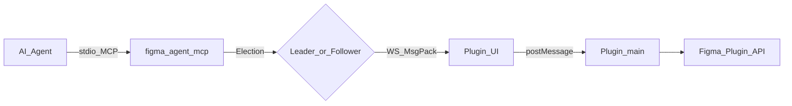
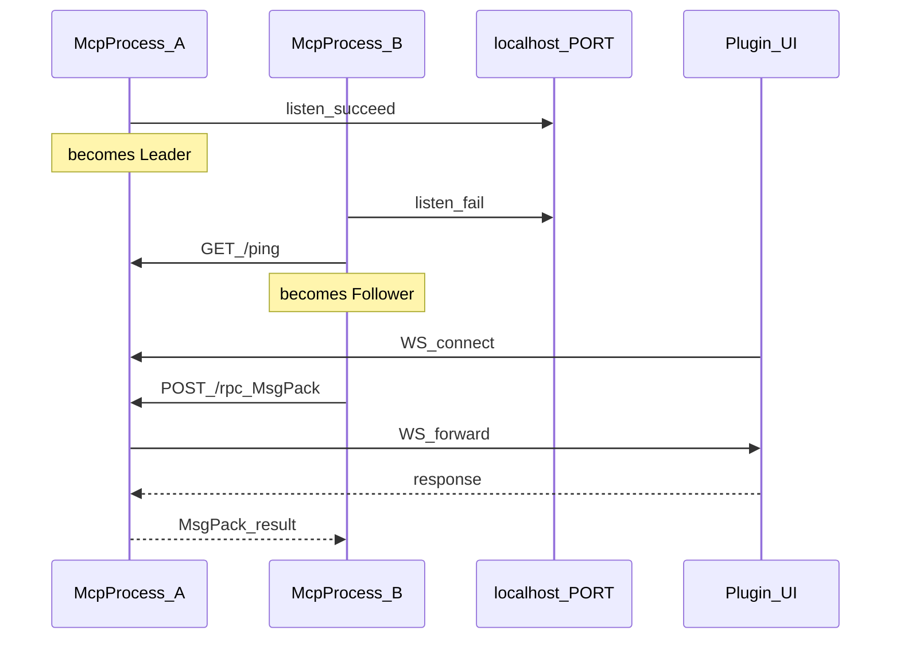
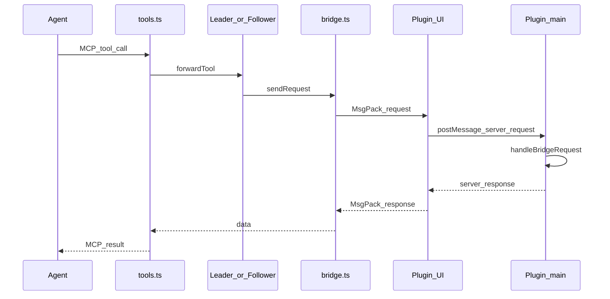
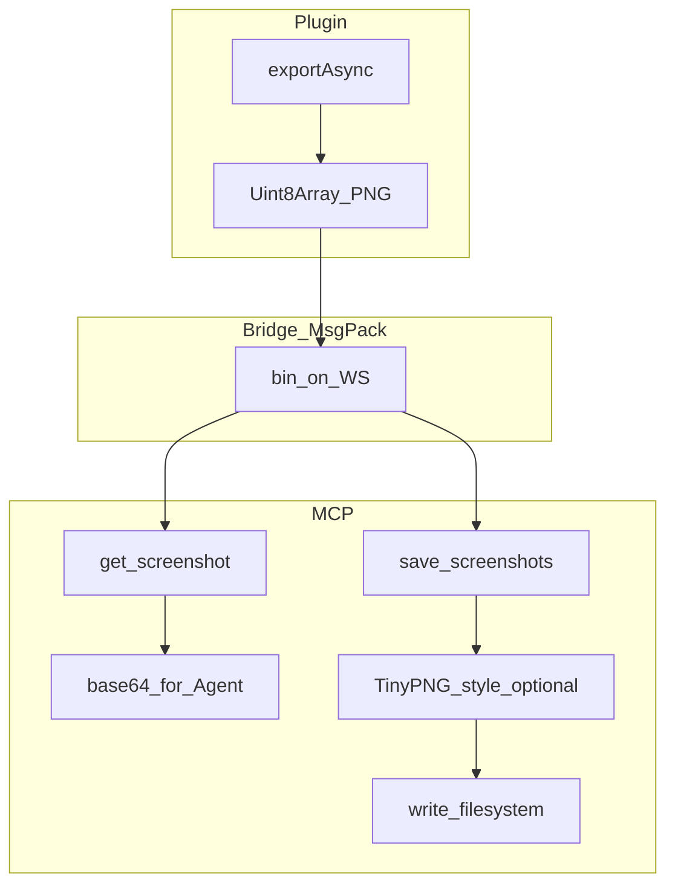
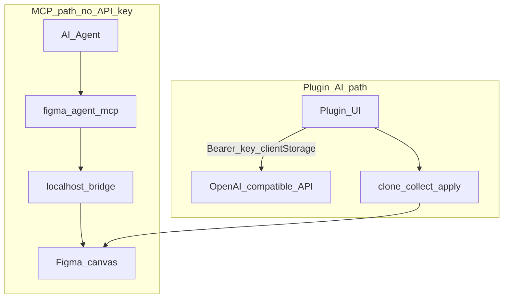

# 아키텍처

**한국어** | [English](../architecture.md)

이 문서는 **Figma Agent Kit**의 구조(패키지, 런타임 역할, 데이터 경로, 설계 원칙)를 설명합니다.

## 목표

- AI 에이전트(Cursor, Claude Code, Codex, …)가 **Figma Desktop**에서 현재 열린 Figma 파일을 **읽고 쓸 수 있게** 합니다
- 캔버스 트래픽을 **localhost**에 유지합니다 — 브리지 도구는 Figma REST로 문서를 업로드하지 않습니다
- 단일 브리지 포트에서 Leader / Follower 선출을 통해 **여러 MCP 클라이언트**를 동시에 지원합니다
- MCP 자격 증명과 독립적인 선택 사항의 **플러그인 내 AI** 경로(이름 변경 / 그룹화)를 제공합니다

## 모노레포 구조

```text
figma-agent-kit/
├── bridge.config.json          # Single source of truth for default WS port (1998)
├── packages/
│   ├── figma-agent-mcp/        # npm: stdio MCP + HTTP/WS bridge server
│   └── figma-agent-plugin/     # Figma Desktop plugin (bridge client + AI + slice export)
├── scripts/
│   ├── sync-bridge-config.mjs  # Sync port → MCP + plugin + manifest
│   └── release-kit.mjs         # Co-release MCP + plugin at the same version
└── docs/                       # This documentation set
```

| 패키지 | 배포 형식 | 역할 |
|---------|----------------|------|
| [`figma-agent-mcp`](https://www.npmjs.com/package/figma-agent-mcp) | npm / GitHub Packages | MCP 서버 + 브리지 leader/follower |
| `figma-agent-plugin` | GitHub Release ZIP | Figma UI + Plugin API 핸들러 |

버전은 함께 관리됩니다(`0.1.x`). 한쪽만 릴리스하는 대신 `pnpm release:kit:*` 사용을 권장합니다.

## 시스템 개요



종단 간 흐름:

1. 에이전트가 **stdio**를 통해 `figma-agent-mcp` 프로세스와 MCP로 통신합니다.
2. 이 프로세스는 **Leader**(`localhost:PORT` 바인딩) 또는 **Follower**(Leader로 전달)입니다.
3. 플러그인 **UI iframe**은 Leader에 WebSocket을 열고 **MessagePack**으로 통신합니다.
4. UI는 RPC를 플러그인 **main** 스레드로 전달하고, 이 스레드는 Figma Plugin API(`documentAccess: dynamic-page`)를 호출합니다.

## 기술 스택

| 계층 | 기술 |
|-------|----------------|
| MCP | TypeScript (ESM), `@modelcontextprotocol/sdk`, `ws`, `msgpackr`, `zod`, `pngjs` / `upng-js` |
| 플러그인 | TypeScript, Rsbuild (main bundle), esbuild (MsgPack codec + JSZip inject), Figma Plugin API |
| 모노레포 | pnpm workspaces, 공유 `bridge.config.json` |
| CI | GitHub Actions — build, pack, tag releases → npm / GitHub Releases / GitHub Packages |

## 모듈 맵(MCP)

| 모듈 | 책임 |
|--------|----------------|
| `index.ts` | CLI 진입점, 선출, MCP stdio 서버 |
| `election.ts` | Leader 수신 / follower 연결 / 장애 조치 폴링 |
| `leader.ts` | HTTP `/ping`, `/files`, `/rpc` + WS 업그레이드 |
| `follower.ts` | Leader용 HTTP 클라이언트 |
| `bridge.ts` | `fileKey`별 WebSocket 테이블, 하트비트, RPC 타임아웃 |
| `codec.ts` | MsgPack 인코딩/디코딩(`useRecords: false`) |
| `tools.ts` / `schema.ts` | 37개 도구 + Zod 스키마 |
| `compress-png.ts` | `save_screenshots`용 TinyPNG 방식 압축 |

## 모듈 맵(플러그인)

| 모듈 | 책임 |
|--------|----------------|
| `bridge/handlers.ts` | 도구 구현(`getNodeByIdAsync`, motion, 쓰기) |
| `bridge/serializer.ts` | 에이전트용 노드 트리 직렬화 |
| `ui/ui.html` | WS 클라이언트, 설정, i18n, 슬라이스 내보내기 UI |
| `ui/codec.ts` | UI에 번들된 MsgPack 코덱 |
| `rename/*`, `group/*` | 복제본에 적용하는 AI 이름 변경 / 시각적 그룹화 |
| `export/slices.ts` | 1× 미리 보기 / 3× PNG 내보내기 도우미 |

## Leader / Follower 선출

여러 에이전트 창은 종종 여러 MCP 프로세스를 실행합니다. 브리지 포트는 하나의 프로세스만 바인딩할 수 있습니다.



- Leader: 포트를 바인딩하고 플러그인 소켓을 수락하며 탐색 + RPC를 처리합니다.
- Follower: 모든 도구 호출을 Leader의 `POST /rpc`(MsgPack)로 전달하고, `list_files`는 `GET /files`로 처리합니다.
- 상태 폴링(~3–5초): Leader가 종료되면 Follower가 선출을 재시도하여 인계할 수 있습니다.

## RPC 경로(도구 호출)



주요 세부 사항:

- 와이어 도구 이름은 `type` 또는 `tool`로 표시될 수 있습니다.
- 스크린샷 `data`는 브리지에서 base64가 아닌 원본 PNG **바이트**(MsgPack `bin`)입니다.
- 로그는 **stderr**로만 출력합니다. stdout은 MCP stdio용으로 예약됩니다.

## 스크린샷 및 슬라이스 내보내기 경로



| 도구 | 압축 | 일반적인 용도 |
|------|-------------|-------------|
| `get_screenshot` | 없음 | 에이전트 비전 / 미리 보기(기본 `scale=2`) |
| `save_screenshots` | PNG 기본값 **사용** | 전달용 슬라이스. 플러그인 UI 내보내기와 맞추려면 **`scale=3`** 사용 |

## 두 가지 AI 경로

MCP 브리지 도구에는 LLM API 키가 필요하지 않습니다. 선택 사항인 이름 변경/그룹화 AI는 플러그인 UI 내부에서만 실행됩니다.



## 포트 구성

1. 루트 [`bridge.config.json`](../bridge.config.json)의 `defaultPort`를 편집합니다.
2. `pnpm sync:bridge`를 실행합니다(`predev` / `prebuild`에서도 실행됨).
3. 플러그인을 다시 빌드하고 MCP를 다시 시작합니다.

MCP 전용 런타임 재정의인 `FIGMA_AGENT_MCP_PORT`는 플러그인 manifest / UI에 포함된 포트와 **일치해야 합니다**.

## 원칙

1. **Local-first** — 브리지 트래픽은 `localhost`에 머무르며, MCP 도구용 디자인 데이터는 업로드되지 않습니다.
2. **핫 패스의 MsgPack** — WS + follower RPC에는 MsgPack을 사용하며, 작은 탐색 엔드포인트는 JSON을 유지합니다.
3. **Stdout 순수성** — MCP 프로세스에서 stdout에 진단 정보를 출력하지 않습니다.
4. **비동기 노드 조회** — `dynamic-page` 플러그인은 `figma.getNodeByIdAsync`를 사용합니다.
5. **버전 동시 릴리스** — 프로토콜 변경 후 플러그인과 MCP를 함께 업그레이드합니다.
6. **기능 정직성** — Motion 도구에는 motion API를 노출하는 Figma 빌드가 필요하며, 그렇지 않으면 명확한 오류를 반환합니다.

## 추가 읽을거리

- [브리지 프로토콜](./bridge-protocol.md) — 와이어 형식 및 엔드포인트
- [MCP 도구](./tools.md) — 전체 도구 카탈로그
- [시작하기](./getting-started.md) — 설치 및 연결
- [FAQ](./faq.md) — 일반적인 실패 모드
