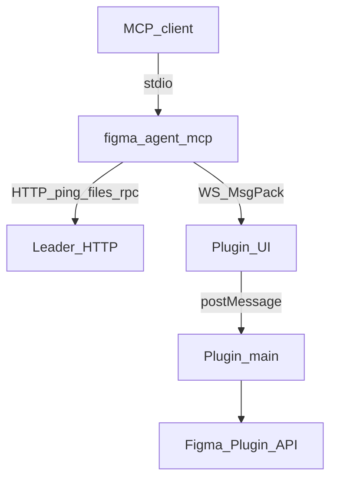
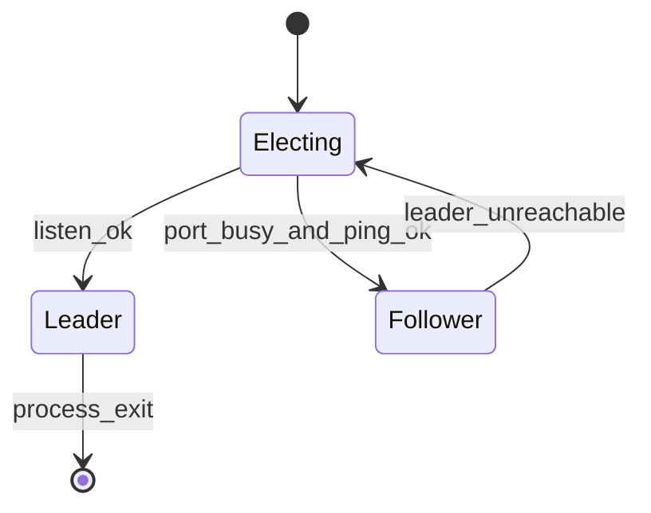

# 브리지 프로토콜

**한국어** | [English](../bridge-protocol.md)

**figma-agent-mcp**가 **figma-agent-plugin**과 통신하는 방법입니다. 모든 브리지 트래픽은 **localhost**에서 이루어집니다.

전체 그림과 Mermaid 다이어그램은 [아키텍처](./architecture.md)를 참조하세요.

## 개요



기본 포트는 저장소 루트의 **`bridge.config.json`**에서 가져옵니다(`defaultPort`, 빌드 시 MCP + 플러그인 UI + `manifest.json`에 동기화됨).

선택 사항인 MCP 전용 재정의: `FIGMA_AGENT_MCP_PORT`(플러그인에 포함된 포트와 일치해야 함).

## 직렬화(MessagePack)

브리지 **WebSocket** 프레임과 leader↔follower **`POST /rpc`** 본문은 `useRecords: false`가 적용된 [`msgpackr`](https://github.com/kriszyp/msgpackr)의 **MessagePack**(`application/msgpack`)을 사용합니다.

| 채널 | 인코딩 |
|---------|----------|
| `WS /ws` | 바이너리 WebSocket 프레임(MsgPack) |
| `POST /rpc` | `Content-Type: application/msgpack` |
| `GET /ping`, `GET /files` | JSON(상태 확인 / 탐색) |

### MsgPack을 사용하는 이유

- PNG 스크린샷은 **MsgPack `bin`**(`Uint8Array` / `Buffer`)으로 이동합니다 — base64의 약 33% 크기 증가가 없습니다
- 큰 노드 트리는 JSON보다 더 조밀하게 패킹됩니다
- 논리적 메시지 형식은 같고, 와이어 형식만 바이너리입니다

### 스크린샷 페이로드

플러그인 → MCP:

```js
{
  images: [
    { nodeId: "1:2", format: "png", data: Uint8Array /* raw PNG bytes */ }
  ]
}
```

- `save_screenshots`는 `data` 버퍼를 디스크에 직접 기록합니다(선택 사항인 압축)
- `get_screenshot`은 에이전트용 텍스트 출력에서 `data`를 **base64**로 변환합니다

## 역할



| 역할 | 책임 |
|------|----------------|
| Leader | 포트를 바인딩하고 플러그인 WebSocket을 수락하며 `/ping`, `/files`, `/rpc`를 처리 |
| Follower | `POST /rpc`(MsgPack)로 도구 호출을 전달하고 `GET /files`로 파일 나열 |

leader가 종료되면 follower가 인계를 시도합니다.

## 플러그인 WebSocket

### 연결

```text
ws://localhost:1998/ws?fileKey=<FILE_KEY>&fileName=<ENCODED_NAME>
```

- `fileKey`는 필수입니다(`figma.fileKey` 또는 저장되지 않은 파일의 로컬 대체 값).
- `fileKey`당 하나의 활성 소켓만 허용됩니다(새 연결이 이전 연결을 교체).
- 클라이언트는 `binaryType = "arraybuffer"`를 설정해야 합니다.

### 하트비트

Leader는 약 **30초**마다 MsgPack 제어 객체를 전송합니다.

```js
{ type: "ping" }
```

플러그인 응답:

```js
{ type: "pong" }
```

이 프레임에는 **`requestId`가 없으며**, 도구 RPC로 처리해서는 안 됩니다.  
하트비트 2회를 놓치면 leader가 `4002 heartbeat timeout`으로 연결을 닫습니다.

주요 종료 코드: `4000` missing `fileKey`, `4001` replaced by newer connection, `4002` heartbeat timeout.

### 요청(MCP → 플러그인)

```js
{
  type: "get_selection",  // or tool: "get_selection"
  requestId: "unique-id",
  nodeIds: ["1:2"],
  params: {}
}
```

UI는 이를 `server-request`로 main 스레드에 전달합니다.

### 응답(플러그인 → MCP)

```js
{ requestId: "unique-id", ok: true, data: { /* may contain Uint8Array bins */ } }
```

실패:

```js
{ requestId: "unique-id", ok: false, error: "message" }
```

MCP 측에서 요청은 **180초** 후 시간 초과됩니다.

## HTTP(follower / 상태 확인)

### `GET /ping`

```json
{ "ok": true, "role": "leader" }
```

### `GET /files`

```json
{
  "ok": true,
  "files": [{ "fileKey": "…", "fileName": "…" }]
}
```

### `POST /rpc`

```http
Content-Type: application/msgpack
Accept: application/msgpack
```

본문(MsgPack 대상):

```js
{
  tool: "get_node",
  nodeIds: ["1:2"],
  params: {},
  fileKey: "optional-when-multiple-files"
}
```

응답: MsgPack의 `{ ok: true, data }` 또는 `{ ok: false, error }`.

## 파일 라우팅

여러 Figma 파일에 플러그인이 연결된 경우 leader가 올바른 WebSocket을 선택할 수 있도록 도구 인수에 `fileKey`를 전달합니다. `list_files`는 현재 맵을 반환합니다.

## 안정성 참고

- MCP 프로토콜 트래픽을 **stdout**에 기록하지 마세요(stdio MCP용으로 예약됨).
- Figma Desktop을 권장합니다. 브라우저 탭은 절전 상태가 되어 소켓이 끊어질 수 있습니다.
- 가능하면 파일을 저장해 `fileKey`를 안정적으로 유지하세요.
- **플러그인과 MCP를 함께 업그레이드**하세요 — 브리지 경로에는 MsgPack 바이너리가 필요합니다.
