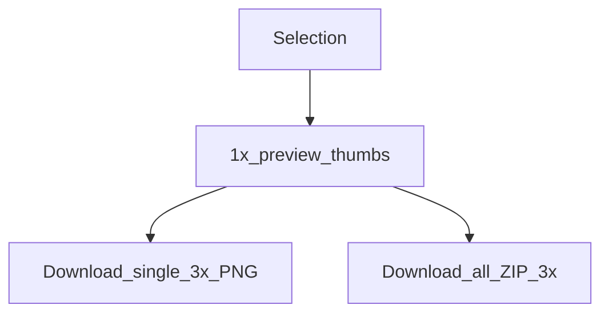

# 슬라이스 내보내기

**한국어** | [English](../exporting-slices.md)

플러그인 UI는 MCP `save_screenshots`와 별개로 선택한 레이어를 **PNG 슬라이스**(및 ZIP)로 내보낼 수 있습니다.

## 용도별 선택

| 경로 | 배율 | 압축 | 적합한 용도 |
|------|-------|-------------|----------|
| 플러그인 **Export** 탭 | 미리 보기 **1×**, 다운로드 **3×** | 브라우저 다운로드 / ZIP | 디자이너 수동 내보내기 |
| MCP `save_screenshots` | 기본 **2**, 동일하게 하려면 **`scale=3`** 사용 | PNG는 기본적으로 TinyPNG 방식 적용 | 에이전트 / 자동화 |



## 플러그인 워크플로

1. 내보낼 수 있는 노드를 하나 이상 선택합니다(최대 **50**개)
2. **Export** 탭을 엽니다 — 1× 미리 보기가 자동으로 생성됩니다
3. 썸네일을 클릭하여 크게 미리 봅니다
4. PNG 하나를 다운로드하거나 **download all**로 ZIP을 다운로드합니다(UI의 JSZip)


파일 시스템에 맞게 이름이 정리됩니다. 내보낼 수 없는 노드 유형은 명확한 메시지와 함께 건너뜁니다.

## MCP 동등 설정

```json
{
  "nodeIds": ["2009:2"],
  "scale": 3,
  "format": "PNG",
  "compress": true,
  "path": "./screenshots"
}
```

전체 `save_screenshots` 옵션(`clip`, SVG/JPG/PDF 등)은 [tools.md](./tools.md)를 참조하세요.

## 구현 참고

- 로직: [`packages/figma-agent-plugin/src/export/slices.ts`](../packages/figma-agent-plugin/src/export/slices.ts)
- UI: [`ui.html`](../packages/figma-agent-plugin/src/ui/ui.html) 내부의 Export 뷰
- MCP 압축: [`packages/figma-agent-mcp/src/compress-png.ts`](../packages/figma-agent-mcp/src/compress-png.ts)
