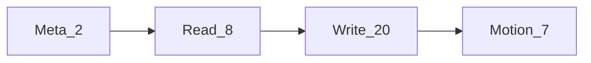
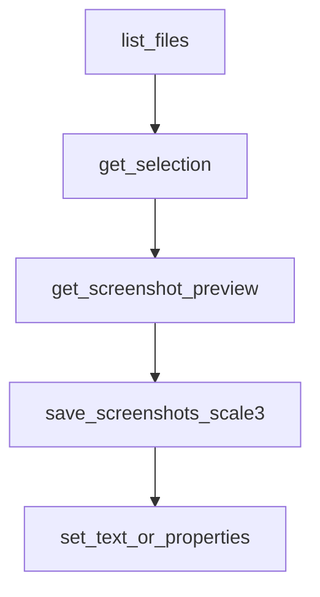

# MCP 도구

**한국어** | [English](../tools.md)

**figma-agent-mcp**가 제공하는 도구(총 37개)입니다. 별도 표기가 없는 한, 호출은 브리지를 통해 열려 있는 Figma 플러그인으로 전달됩니다.

## 규칙

| 규칙 | 세부 정보 |
|------------|--------|
| `fileKey` | 거의 모든 도구에서 선택 사항 — 사용할 연결된 파일을 지정 |
| Flat vs `properties` | 많은 쓰기 도구는 플랫 필드(`name`, `x`, …) 또는 중첩된 `properties` 객체를 허용합니다(플러그인 측에서 병합) |
| 선택 항목 대체 | 스크린샷 / 메타데이터 / 디자인 컨텍스트 / 확대의 `nodeIds`를 생략하면 플러그인은 **현재 선택 항목**을 사용 |
| Motion | motion API를 노출하는 Figma 빌드가 필요하며, 그렇지 않으면 명확한 capability error 반환 |

## Meta(MCP 로컬)

| 도구 | 설명 |
|------|-------------|
| `list_files` | 현재 브리지에 연결된 Figma 파일을 나열합니다(leader 로컬 / follower는 `/files` 사용) |
| `save_screenshots` | 노드를 디스크로 내보냅니다. PNG는 기본적으로 TinyPNG 방식 압축을 사용합니다(`compress=true`). `scale` 기본값은 **2**이며, 플러그인 UI 내보내기와 같은 슬라이스 에셋에는 **`scale=3`**을 사용합니다. `format` 지원: PNG / SVG / JPG / PDF, 선택 사항: `clip`, `path` |

## 읽기

| 도구 | 설명 |
|------|-------------|
| `get_document` | 현재 페이지 트리 개요(`depth` 선택 사항, 0–20) |
| `get_selection` | 현재 선택 항목 |
| `get_node` | ID로 노드를 직렬화합니다(`nodeIds` 필수, `depth` 선택 사항) |
| `get_styles` | 로컬 paint / text / effect 스타일 |
| `get_metadata` | 간단한 id / name / type / size |
| `get_design_context` | 에이전트 컨텍스트용 직렬화된 노드 |
| `get_variable_defs` | 로컬 변수 컬렉션 및 변수 |
| `get_screenshot` | 래스터/벡터 내보내기. 와이어는 원시 바이트(MsgPack bin)를 사용하며 에이전트 결과는 base64입니다. 기본 `format=PNG`, `scale=2`. **압축하지 않음** — 압축된 슬라이스는 `save_screenshots` 권장 |

## 쓰기 / 변경

| 도구 | 설명 |
|------|-------------|
| `set_node_visibility` | 표시 / 숨김(`visible`) |
| `set_text_content` | 텍스트 문자(`text`) 설정 |
| `set_text_properties` | 글꼴 크기 / family / style / align / spacing |
| `set_node_properties` | 이름, 위치, 크기, 불투명도, 회전 |
| `set_solid_fill` | 단색 paint(`color: {r,g,b,a?}`, 0–1 또는 0–255) |
| `set_gradient_fill` | 그라데이션 fill(`gradientStops`, 선택 사항 `gradientType`) |
| `set_effects` | 그림자 / blur(`effects` 배열) |
| `set_stroke_properties` | stroke 두께 / align / color |
| `set_auto_layout` | frame에 Auto-layout 설정 |
| `create_frame` | frame 생성 |
| `create_text` | text 노드 생성 |
| `create_shape` | `RECTANGLE` / `ELLIPSE` / `LINE` / `POLYGON` / `STAR` 생성 |
| `create_image` | base64 `imageData`의 이미지 fill을 가진 rectangle 생성 |
| `duplicate_nodes` | 복제 |
| `reparent_nodes` | 계층 내 이동(`parentId`, 선택 사항 `index`) |
| `group_nodes` | 그룹화 |
| `ungroup_node` | 그룹 해제 |
| `set_selection` | 선택 항목 변경 |
| `scroll_and_zoom_into_view` | 뷰포트 포커스 |
| `delete_nodes` | 노드 삭제 |

## Motion(Figma Motion API beta)

| 도구 | 설명 |
|------|-------------|
| `get_motion_styles` | 사용 가능한 animation 스타일 / preset 나열 |
| `get_node_motion` | animation 스타일, keyframe, timeline 읽기 |
| `apply_animation_style` | 스타일 적용(`styleId`, 선택 사항 `animationStyleData`) — 내장 preset에는 `animationStyleData.type: "FIGMA"` 사용 |
| `remove_animation_style` | 하나의 스타일 또는 전체 제거(`animationStyleId` 선택 사항) |
| `apply_manual_keyframe_track` | 수동 keyframe track 작성(`field`, `track`) |
| `remove_manual_keyframe_track` | 수동 keyframe track 제거(`field`) |
| `set_timeline_duration` | timeline 지속 시간 설정(`timelineId`, `duration`) |

## 에이전트 흐름 예시

1. `list_files`
2. `get_selection` / `get_node`
3. 빠른 미리 보기를 위한 `get_screenshot`
4. 전달용 슬라이스에 `scale: 3`, `compress: true`를 사용한 `save_screenshots`
5. 편집 적용을 위한 `set_text_content` / `set_node_properties`(또는 motion 도구)

## 스키마 소스

신뢰할 수 있는 Zod 스키마는 [`packages/figma-agent-mcp/src/schema.ts`](../packages/figma-agent-mcp/src/schema.ts)에 있습니다. 도구 등록은 [`tools.ts`](../packages/figma-agent-mcp/src/tools.ts)에 있습니다.
