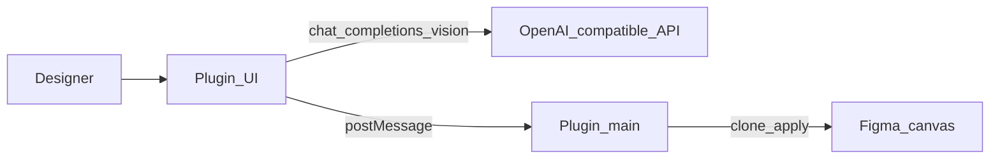

# Возможности ИИ

**Русский** | [简体中文](../zh/ai-features.md) | [English](../ai-features.md)

Дополнительные возможности **переименования ИИ слоёв** и **визуальной группировки** доступны в **интерфейсе плагина**. Они вызывают любой совместимый с **OpenAI** чат-API с поддержкой зрения.

Эти возможности **не зависят от MCP**. Инструментам моста никогда не нужен API-ключ LLM.



## Настройка

1. Откройте плагин → **⚙** → при необходимости выберите язык UI (**中文** / **English**)
2. **⚙ → Model settings** → задайте **API base URL** (по умолчанию `https://api.openai.com/v1`)
3. Задайте **Model** (по умолчанию `gpt-4o`; также работает `gpt-4o-mini`)
4. Вставьте свой **API key**
5. Нажмите **Test connection**, затем **Save**


Учётные данные и настройка языка хранятся только на вашей машине в Figma **`clientStorage`**. Строки UI находятся в [`packages/figma-agent-plugin/src/ui/locales.json`](../packages/figma-agent-plugin/src/ui/locales.json).

### Шаблоны промптов

**⚙ → Prompt settings** — редактируйте системные промпты для переименования и группировки отдельно.


- Значения по умолчанию: [`packages/figma-agent-plugin/src/prompts/*.prompt.txt`](../packages/figma-agent-plugin/src/prompts/)
- Заполнители: `{{candidates}}`, `{{suggestedClusters}}` (группировка)
- **Restore defaults** повторно загружает шаблоны из репозитория; **Save** записывает переопределения в `clientStorage`

### Пользовательские ИИ-провайдеры

Плагины Figma должны объявлять разрешённые домены в `manifest.json`. Этот репозиторий уже включает в список разрешённых распространённые хосты:

| Провайдер | Примеры хостов |
|----------|----------------|
| OpenAI | `https://api.openai.com` |
| DashScope / Bailian | `https://dashscope.aliyuncs.com`, `https://dashscope-intl.aliyuncs.com` |
| DeepSeek | `https://api.deepseek.com` |
| Moonshot | `https://api.moonshot.cn` |
| SiliconFlow | `https://api.siliconflow.cn` |
| Zhipu | `https://open.bigmodel.cn` |
| Volcengine Ark | `https://ark.cn-beijing.volces.com` |
| OpenRouter / Groq / Together | `https://openrouter.ai`, `https://api.groq.com`, `https://api.together.xyz` |
| Локальный прокси | `http://localhost` |
| Проверка версии | `https://raw.githubusercontent.com` |

Для Azure OpenAI или других пользовательских хостов: добавьте хост в `networkAccess.allowedDomains` в [`manifest.json`](../packages/figma-agent-plugin/manifest.json), пересоберите и повторно импортируйте плагин.

## Переименование ИИ

1. Выберите один **Frame** или **Group**
2. Откройте вкладку **Rename** → **Start rename**
3. Плагин клонирует выделение справа, экспортирует PNG 1× и отправляет кандидаты слоёв + изображение в ваш API
4. Возвращённые названия применяются к **клону** (исходный объект не изменяется)

Пропускаются: узлы `TEXT` и очень маленькие слои (&lt; 2px).

## Визуальная группировка ИИ

1. Выберите один **Frame**, **Group** или **Section**
2. Откройте вкладку **Group** → **Start group**
3. Просмотрите/отредактируйте JSON-план в редакторе
4. Нажмите **Apply groups**, чтобы создать вложенные группы в клоне (**сначала в глубину**)

Сборщик также предлагает простые кластеры близости по строкам как подсказку модели.

## Обновления версий

Плагин запрашивает:

```text
https://raw.githubusercontent.com/ChinaCarlos/figma-agent-kit/main/releases/version.json
```

О том, как обновляется `version.json`, см. [Выпуск плагина](./plugin-release.md).
