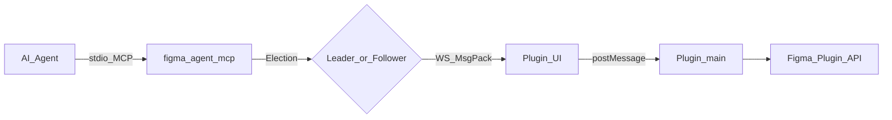
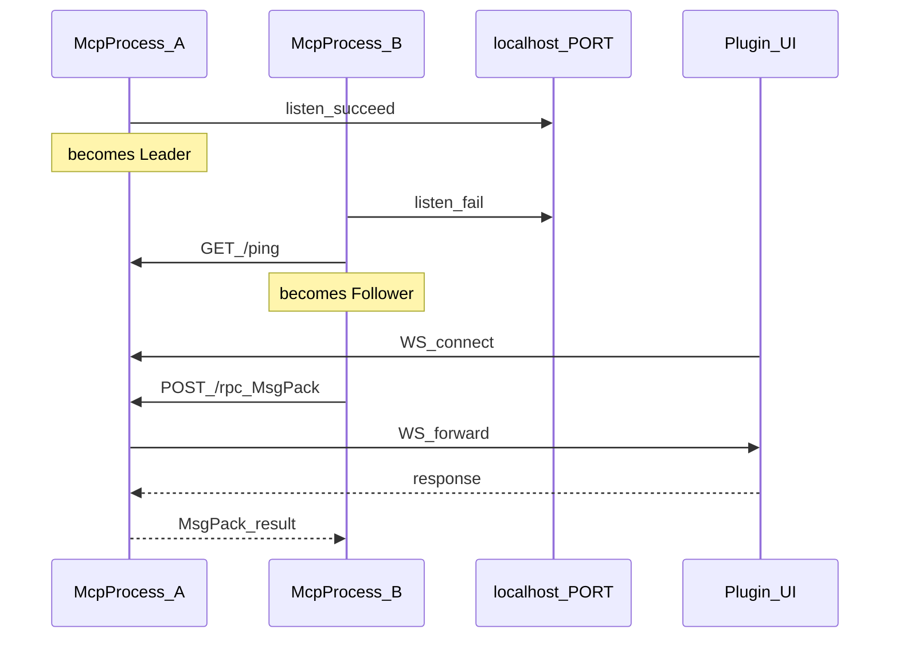
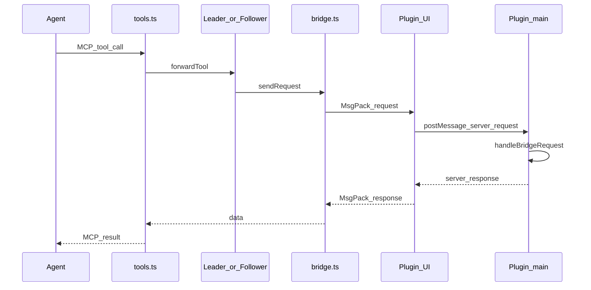
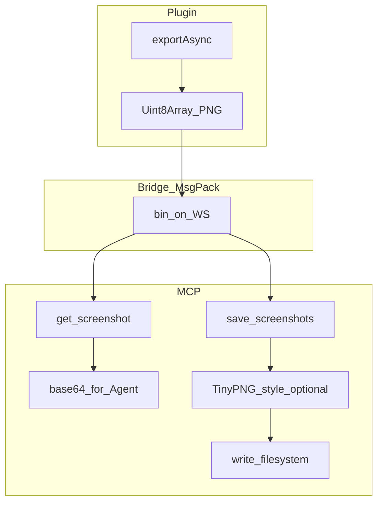
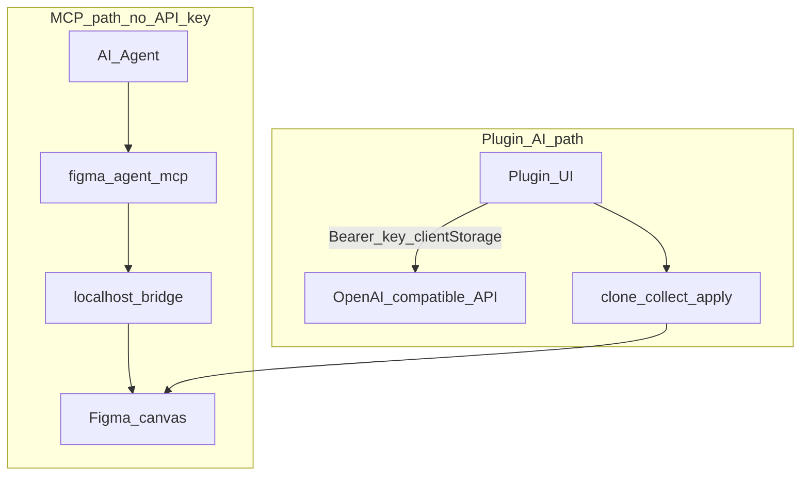

# Архитектура

**Русский** | [简体中文](../zh/architecture.md) | [English](../architecture.md)

В этом документе описано устройство **Figma Agent Kit**: пакеты, роли во время выполнения, потоки данных и принципы проектирования.

## Цели

- Позволить ИИ-агентам (Cursor, Claude Code, Codex, …) **читать и записывать** файл Figma, открытый в **Figma Desktop**
- Сохранять трафик холста **на localhost** — инструменты моста не загружают документ через Figma REST
- Поддерживать **несколько MCP-клиентов** одновременно с выбором Leader / Follower на одном порту моста
- Предоставлять необязательный путь **ИИ внутри плагина** (переименование / группировка), независимый от учётных данных MCP

## Структура монорепозитория

```text
figma-agent-kit/
├── bridge.config.json          # Single source of truth for default WS port (1998)
├── packages/
│   ├── figma-agent-mcp/        # npm: stdio MCP + HTTP/WS bridge server
│   └── figma-agent-plugin/     # Figma Desktop plugin (bridge client + AI + slice export)
├── scripts/
│   ├── sync-bridge-config.mjs  # Sync port → MCP + plugin + manifest
│   └── release-kit.mjs         # Co-release MCP + plugin at the same version
└── docs/                       # This documentation set
```

| Пакет | Распространяется как | Роль |
|---------|----------------|------|
| [`figma-agent-mcp`](https://www.npmjs.com/package/figma-agent-mcp) | npm / GitHub Packages | MCP-сервер + leader/follower моста |
| `figma-agent-plugin` | ZIP в GitHub Release | UI Figma + обработчики Plugin API |

Версии синхронизированы (`0.1.x`). Предпочтите `pnpm release:kit:*` выпуску только одной стороны.

## Обзор системы



Полный путь:

1. Агент общается по MCP через **stdio** с процессом `figma-agent-mcp`.
2. Этот процесс — либо **Leader** (привязывает `localhost:PORT`), либо **Follower** (перенаправляет к Leader).
3. **UI iframe** плагина открывает WebSocket к Leader и использует **MessagePack**.
4. UI перенаправляет RPC в главный поток плагина **main**, который вызывает Figma Plugin API (`documentAccess: dynamic-page`).

## Технологический стек

| Слой | Технологии |
|-------|----------------|
| MCP | TypeScript (ESM), `@modelcontextprotocol/sdk`, `ws`, `msgpackr`, `zod`, `pngjs` / `upng-js` |
| Плагин | TypeScript, Rsbuild (основной бандл), esbuild (инъекция codec MsgPack + JSZip), Figma Plugin API |
| Монорепозиторий | pnpm workspaces, общий `bridge.config.json` |
| CI | GitHub Actions — сборка, упаковка, теги релизов → npm / GitHub Releases / GitHub Packages |

## Карта модулей (MCP)

| Модуль | Ответственность |
|--------|----------------|
| `index.ts` | Точка входа CLI, выбор роли, stdio-сервер MCP |
| `election.ts` | Прослушивание Leader / подключение follower / опрос failover |
| `leader.ts` | HTTP `/ping`, `/files`, `/rpc` + обновление WS |
| `follower.ts` | HTTP-клиент для leader |
| `bridge.ts` | Таблица WebSocket по `fileKey`, heartbeats, тайм-аут RPC |
| `codec.ts` | Кодирование/декодирование MsgPack (`useRecords: false`) |
| `tools.ts` / `schema.ts` | 37 инструментов + схемы Zod |
| `compress-png.ts` | Сжатие в стиле TinyPNG для `save_screenshots` |

## Карта модулей (плагин)

| Модуль | Ответственность |
|--------|----------------|
| `bridge/handlers.ts` | Реализации инструментов (`getNodeByIdAsync`, motion, запись) |
| `bridge/serializer.ts` | Сериализация дерева узлов для агентов |
| `ui/ui.html` | WS-клиент, настройки, i18n, UI экспорта срезов |
| `ui/codec.ts` | Кодек MsgPack, включённый в UI |
| `rename/*`, `group/*` | ИИ-переименование / визуальная группировка клонов |
| `export/slices.ts` | Вспомогательные функции предпросмотра 1× / экспорта PNG 3× |

## Выбор Leader / Follower

Несколько окон агента часто запускают несколько процессов MCP. Только один процесс может привязать порт моста.



- Leader: привязывает порт, принимает сокеты плагина, обслуживает обнаружение + RPC.
- Follower: каждый вызов инструмента → `POST /rpc` (MsgPack) к Leader; `list_files` → `GET /files`.
- Опрос здоровья (~3–5 с): если Leader завершится, Follower повторит выбор и может занять его место.

## Путь RPC (вызов инструмента)



Важные детали:

- Имя инструмента в протоколе может быть представлено как `type` или `tool`.
- Данные скриншота `data` — это необработанные **байты** PNG в мосте (MsgPack `bin`), а не base64.
- Логи выводятся только в **stderr** — stdout зарезервирован для MCP stdio.

## Пути скриншотов и экспорта срезов



| Инструмент | Сжатие | Типичное использование |
|------|-------------|-------------|
| `get_screenshot` | Нет | Зрение агента / предпросмотр (по умолчанию `scale=2`) |
| `save_screenshots` | PNG по умолчанию **включено** | Срезы для передачи; используйте **`scale=3`**, чтобы соответствовать экспорту UI плагина |

## Два пути ИИ

Инструментам MCP-моста никогда не нужен API-ключ LLM. Необязательный ИИ для переименования/группировки работает только в UI плагина.



## Настройка порта

1. Отредактируйте корневой [`bridge.config.json`](../bridge.config.json) (`defaultPort`).
2. Выполните `pnpm sync:bridge` (также запускается на `predev` / `prebuild`).
3. Пересоберите плагин и перезапустите MCP.

Переопределение во время выполнения только для MCP: `FIGMA_AGENT_MCP_PORT` — **должно** совпадать с портом, встроенным в manifest / UI плагина.

## Принципы

1. **Local-first** — трафик моста остаётся на `localhost`; данные дизайна не загружаются для инструментов MCP.
2. **MsgPack на горячем пути** — WS + RPC follower; небольшие конечные точки обнаружения остаются JSON.
3. **Чистый stdout** — никогда не выводите диагностику в stdout процесса MCP.
4. **Асинхронный поиск узлов** — плагины `dynamic-page` используют `figma.getNodeByIdAsync`.
5. **Совместно версионируемые релизы** — после изменения протокола обновляйте плагин + MCP вместе.
6. **Честность возможностей** — для инструментов Motion нужна сборка Figma с Motion API; иначе возвращайте понятную ошибку.

## Дополнительные материалы

- [Протокол моста](./bridge-protocol.md) — форматы обмена и конечные точки
- [Инструменты MCP](./tools.md) — полный каталог инструментов
- [Начало работы](./getting-started.md) — установка и подключение
- [FAQ](./faq.md) — распространённые режимы отказа
