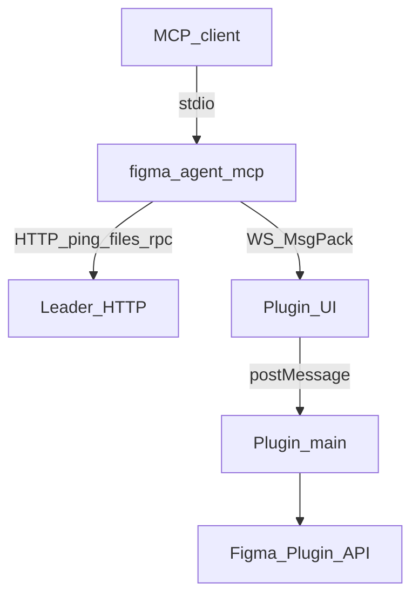
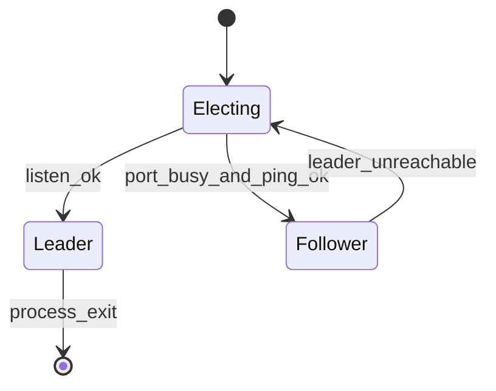

# Протокол моста

**Русский** | [简体中文](../zh/bridge-protocol.md) | [English](../bridge-protocol.md)

Как **figma-agent-mcp** взаимодействует с **figma-agent-plugin**. Весь трафик моста проходит через **localhost**.

Общую картину и диаграммы Mermaid см. в разделе [Архитектура](./architecture.md).

## Обзор



Стандартный порт берётся из **`bridge.config.json`** в корне репозитория (`defaultPort`, синхронизируется с MCP + UI плагина + `manifest.json` при сборке).

Необязательное переопределение только для MCP: `FIGMA_AGENT_MCP_PORT` (должно совпадать с портом, встроенным в плагин).

## Сериализация (MessagePack)

Кадры **WebSocket** моста и тела leader↔follower **`POST /rpc`** используют **MessagePack** (`application/msgpack`) через [`msgpackr`](https://github.com/kriszyp/msgpackr) с `useRecords: false`.

| Канал | Кодирование |
|---------|----------|
| `WS /ws` | Бинарные кадры WebSocket (MsgPack) |
| `POST /rpc` | `Content-Type: application/msgpack` |
| `GET /ping`, `GET /files` | JSON (проверка здоровья / обнаружение) |

### Почему MsgPack

- Скриншоты PNG передаются как **MsgPack `bin`** (`Uint8Array` / `Buffer`) — без base64 (~33% накладных расходов на размер)
- Большие деревья узлов упаковываются плотнее, чем JSON
- Те же логические формы сообщений; бинарным является только формат обмена

### Полезная нагрузка скриншота

Плагин → MCP:

```js
{
  images: [
    { nodeId: "1:2", format: "png", data: Uint8Array /* raw PNG bytes */ }
  ]
}
```

- `save_screenshots` напрямую записывает буферы `data` на диск (с необязательным сжатием)
- `get_screenshot` преобразует `data` в **base64** для текстового вывода, доступного агенту

## Роли



| Роль | Ответственность |
|------|----------------|
| Leader | Привязывает порт, принимает WebSocket плагина, обслуживает `/ping`, `/files`, `/rpc` |
| Follower | Перенаправляет вызовы инструментов через `POST /rpc` (MsgPack); выводит список файлов через `GET /files` |

Если leader завершается, follower пытается его заменить.

## WebSocket плагина

### Подключение

```text
ws://localhost:1998/ws?fileKey=<FILE_KEY>&fileName=<ENCODED_NAME>
```

- `fileKey` обязателен (`figma.fileKey` или локальный резервный вариант для несохранённых файлов).
- Один активный сокет для каждого `fileKey` (новое подключение заменяет старое).
- Клиенты должны задавать `binaryType = "arraybuffer"`.

### Heartbeat

Leader примерно каждые **30 с** отправляет управляющий объект MsgPack:

```js
{ type: "ping" }
```

Плагин отвечает:

```js
{ type: "pong" }
```

В этих кадрах **нет `requestId`**, и их нельзя обрабатывать как RPC инструмента.  
Пропуск двух циклов heartbeat → leader закрывает соединение с `4002 heartbeat timeout`.

Интересующие коды закрытия: `4000` отсутствует `fileKey`, `4001` заменено более новым соединением, `4002` тайм-аут heartbeat.

### Запрос (MCP → плагин)

```js
{
  type: "get_selection",  // or tool: "get_selection"
  requestId: "unique-id",
  nodeIds: ["1:2"],
  params: {}
}
```

UI передаёт его в главный поток как `server-request`.

### Ответ (плагин → MCP)

```js
{ requestId: "unique-id", ok: true, data: { /* may contain Uint8Array bins */ } }
```

Ошибка:

```js
{ requestId: "unique-id", ok: false, error: "message" }
```

На стороне MCP тайм-аут запросов составляет **180 секунд**.

## HTTP (followers / здоровье)

### `GET /ping`

```json
{ "ok": true, "role": "leader" }
```

### `GET /files`

```json
{
  "ok": true,
  "files": [{ "fileKey": "…", "fileName": "…" }]
}
```

### `POST /rpc`

```http
Content-Type: application/msgpack
Accept: application/msgpack
```

Тело (MsgPack от):

```js
{
  tool: "get_node",
  nodeIds: ["1:2"],
  params: {},
  fileKey: "optional-when-multiple-files"
}
```

Ответ: MsgPack от `{ ok: true, data }` или `{ ok: false, error }`.

## Маршрутизация файлов

Когда подключены плагины нескольких файлов Figma, передавайте `fileKey` в аргументах инструмента, чтобы leader выбрал правильный WebSocket. `list_files` возвращает текущую карту.

## Примечания по стабильности

- Не записывайте трафик протокола MCP в **stdout** (он зарезервирован для stdio MCP).
- Предпочтите Figma Desktop; вкладки браузера могут перейти в сон и разорвать сокет.
- По возможности сохраните файл, чтобы `fileKey` оставался стабильным.
- Обновляйте **плагин и MCP вместе** — в пути моста необходим бинарный MsgPack.
