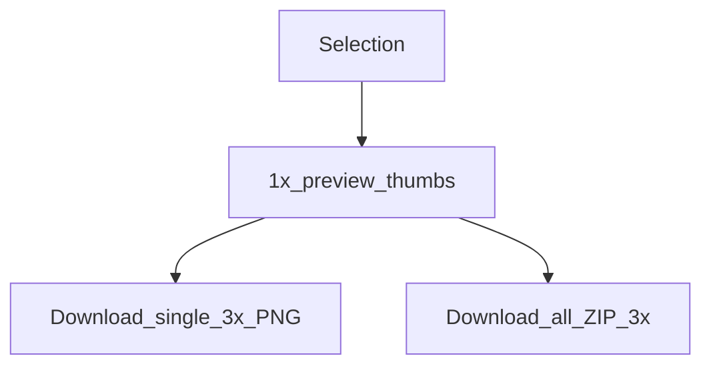

# Экспорт срезов

**Русский** | [简体中文](../zh/exporting-slices.md) | [English](../exporting-slices.md)

Интерфейс плагина может экспортировать выбранные слои как **PNG-срезы** (и ZIP), отдельно от MCP `save_screenshots`.

## Когда что использовать

| Способ | Масштаб | Сжатие | Лучше всего подходит для |
|------|-------|-------------|----------|
| Вкладка **Export** плагина | Предпросмотр **1×**, скачивание **3×** | Скачивание браузером / ZIP | Дизайнеров, экспортирующих вручную |
| MCP `save_screenshots` | По умолчанию **2**, используйте **`scale=3`** для соответствия | В стиле TinyPNG включено по умолчанию для PNG | Агентов / автоматизации |



## Рабочий процесс плагина

1. Выберите один или несколько экспортируемых узлов (максимум **50**)
2. Откройте вкладку **Export** — предпросмотры 1× генерируются автоматически
3. Нажмите миниатюру, чтобы увидеть увеличенный предпросмотр
4. Скачайте один PNG или **download all** как ZIP (JSZip в UI)


Имена очищаются для файловой системы. Неэкспортируемые типы узлов пропускаются с понятным сообщением.

## Эквивалент MCP

```json
{
  "nodeIds": ["2009:2"],
  "scale": 3,
  "format": "PNG",
  "compress": true,
  "path": "./screenshots"
}
```

Полный список параметров `save_screenshots` (`clip`, SVG/JPG/PDF и т. д.) см. в [tools.md](./tools.md).

## Примечания по реализации

- Логика: [`packages/figma-agent-plugin/src/export/slices.ts`](../packages/figma-agent-plugin/src/export/slices.ts)
- UI: представление Export в [`ui.html`](../packages/figma-agent-plugin/src/ui/ui.html)
- Сжатие MCP: [`packages/figma-agent-mcp/src/compress-png.ts`](../packages/figma-agent-mcp/src/compress-png.ts)
