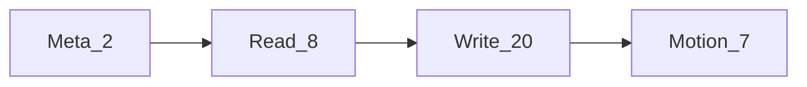
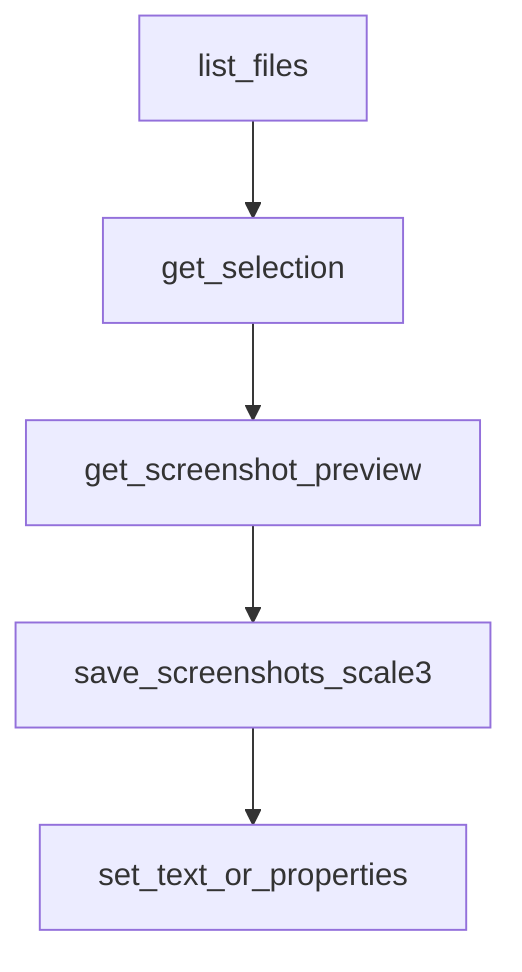

# Инструменты MCP

**Русский** | [简体中文](../zh/tools.md) | [English](../tools.md)

Инструменты, предоставляемые **figma-agent-mcp** (всего 37). Если не указано иное, вызовы перенаправляются открытому плагину Figma через мост.

## Соглашения

| Соглашение | Детали |
|------------|--------|
| `fileKey` | Необязателен почти для всех инструментов — выбирает подключённый файл |
| Плоский формат или `properties` | Многие инструменты записи принимают плоские поля (`name`, `x`, …) **или** вложенный объект `properties` (объединяется на стороне плагина) |
| Резервный вариант выделения | Если `nodeIds` не указан для скриншота / метаданных / контекста дизайна / масштаба, плагин использует **текущее выделение** |
| Motion | Требуется сборка Figma с Motion API; иначе возвращается понятная ошибка возможности |

## Meta (локально в MCP)

| Инструмент | Описание |
|------|-------------|
| `list_files` | Список файлов Figma, сейчас подключённых к мосту (локально в leader / у follower через `/files`) |
| `save_screenshots` | Экспортирует узлы на диск. Для PNG по умолчанию используется сжатие в стиле TinyPNG (`compress=true`). По умолчанию `scale` — **2**; используйте **`scale=3`** для срезов, соответствующих экспорту UI плагина. Поддерживает `format`: PNG / SVG / JPG / PDF, необязательные `clip`, `path` |

## Чтение

| Инструмент | Описание |
|------|-------------|
| `get_document` | Обзор дерева текущей страницы (`depth` необязателен, 0–20) |
| `get_selection` | Текущее выделение |
| `get_node` | Сериализует узлы по id (`nodeIds` обязателен, `depth` необязателен) |
| `get_styles` | Локальные стили paint / text / effect |
| `get_metadata` | Облегчённые id / имя / тип / размер |
| `get_design_context` | Сериализованные узлы для контекста агента |
| `get_variable_defs` | Локальные коллекции переменных и переменные |
| `get_screenshot` | Растровый/векторный экспорт; протокол использует необработанные байты (MsgPack bin), результат агента — base64. По умолчанию `format=PNG`, `scale=2`. **Без сжатия** — для сжатых срезов предпочтите `save_screenshots` |

## Запись / изменение

| Инструмент | Описание |
|------|-------------|
| `set_node_visibility` | Показать / скрыть (`visible`) |
| `set_text_content` | Задать текстовые символы (`text`) |
| `set_text_properties` | Размер / семейство / стиль шрифта, выравнивание / интервалы |
| `set_node_properties` | Имя, позиция, размер, непрозрачность, поворот |
| `set_solid_fill` | Сплошная заливка (`color: {r,g,b,a?}`, 0–1 или 0–255) |
| `set_gradient_fill` | Градиентная заливка (`gradientStops`, необязательный `gradientType`) |
| `set_effects` | Тени / размытия (массив `effects`) |
| `set_stroke_properties` | Толщина / выравнивание / цвет обводки |
| `set_auto_layout` | Auto-layout на фреймах |
| `create_frame` | Создать фрейм |
| `create_text` | Создать текстовый узел |
| `create_shape` | Создать `RECTANGLE` / `ELLIPSE` / `LINE` / `POLYGON` / `STAR` |
| `create_image` | Прямоугольник с заливкой изображения из base64 `imageData` |
| `duplicate_nodes` | Дублировать |
| `reparent_nodes` | Переместить в иерархии (`parentId`, необязательный `index`) |
| `group_nodes` | Сгруппировать |
| `ungroup_node` | Разгруппировать |
| `set_selection` | Изменить выделение |
| `scroll_and_zoom_into_view` | Сфокусировать область просмотра |
| `delete_nodes` | Удалить узлы |

## Motion (бета-версия Figma Motion API)

| Инструмент | Описание |
|------|-------------|
| `get_motion_styles` | Список доступных стилей / пресетов анимации |
| `get_node_motion` | Читает стили анимации, ключевые кадры, таймлайны |
| `apply_animation_style` | Применяет стиль (`styleId`, необязательный `animationStyleData`) — для встроенных пресетов используйте `animationStyleData.type: "FIGMA"` |
| `remove_animation_style` | Удаляет один стиль или все (`animationStyleId` необязателен) |
| `apply_manual_keyframe_track` | Записывает ручную дорожку ключевых кадров (`field`, `track`) |
| `remove_manual_keyframe_track` | Удаляет ручную дорожку ключевых кадров (`field`) |
| `set_timeline_duration` | Задаёт продолжительность таймлайна (`timelineId`, `duration`) |

## Пример потока агента

1. `list_files`
2. `get_selection` / `get_node`
3. `get_screenshot` для быстрого предпросмотра
4. `save_screenshots` с `scale: 3`, `compress: true` для срезов поставки
5. `set_text_content` / `set_node_properties` (или инструменты Motion) для применения правок

## Источник схем

Авторитетные схемы Zod находятся в [`packages/figma-agent-mcp/src/schema.ts`](../packages/figma-agent-mcp/src/schema.ts). Регистрация инструментов — в [`tools.ts`](../packages/figma-agent-mcp/src/tools.ts).
