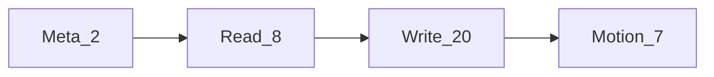
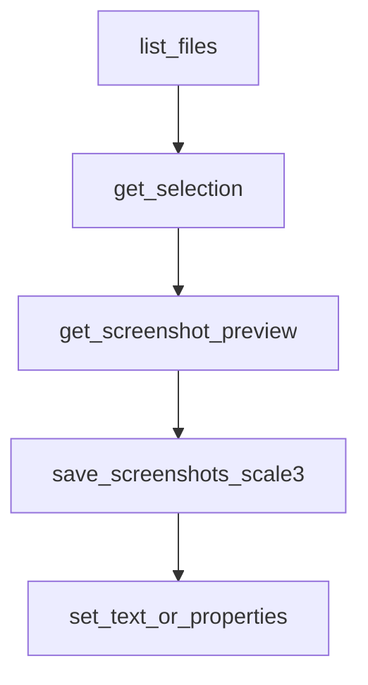

# MCP tools

**English** | [简体中文](./zh/tools.md)

Tools exposed by **figma-agent-mcp** (37 total). Unless noted, calls are forwarded to the open Figma plugin over the bridge.

## Conventions

| Convention | Detail |
|------------|--------|
| `fileKey` | Optional on almost all tools — select which connected file to use |
| Flat vs `properties` | Many write tools accept flat fields (`name`, `x`, …) **or** a nested `properties` object (merged on the plugin side) |
| Selection fallback | When `nodeIds` is omitted for screenshot / metadata / design context / zoom, the plugin uses the **current selection** |
| Motion | Requires a Figma build that exposes motion APIs; otherwise a clear capability error is returned |

## Meta (MCP-local)

| Tool | Description |
|------|-------------|
| `list_files` | List Figma files currently connected to the bridge (leader local / follower via `/files`) |
| `save_screenshots` | Export nodes to disk. PNG defaults to TinyPNG-style compression (`compress=true`). `scale` default **2**; use **`scale=3`** for slice assets matching the plugin UI export. Supports `format`: PNG / SVG / JPG / PDF, optional `clip`, `path` |

## Read

| Tool | Description |
|------|-------------|
| `get_document` | Current page tree overview (`depth` optional, 0–20) |
| `get_selection` | Current selection |
| `get_node` | Serialize node(s) by id (`nodeIds` required, `depth` optional) |
| `get_styles` | Local paint / text / effect styles |
| `get_metadata` | Lightweight id / name / type / size |
| `get_design_context` | Serialized nodes for agent context |
| `get_variable_defs` | Local variable collections and variables |
| `get_screenshot` | Raster/vector export; wire uses raw bytes (MsgPack bin), agent result is base64. Default `format=PNG`, `scale=2`. **Uncompressed** — prefer `save_screenshots` for compressed slices |

## Write / mutate

| Tool | Description |
|------|-------------|
| `set_node_visibility` | Show / hide (`visible`) |
| `set_text_content` | Set text characters (`text`) |
| `set_text_properties` | Font size / family / style / align / spacing |
| `set_node_properties` | Name, position, size, opacity, rotation |
| `set_solid_fill` | Solid paint (`color: {r,g,b,a?}`, 0–1 or 0–255) |
| `set_gradient_fill` | Gradient fill (`gradientStops`, optional `gradientType`) |
| `set_effects` | Shadows / blurs (`effects` array) |
| `set_stroke_properties` | Stroke weight / align / color |
| `set_auto_layout` | Auto-layout on frames |
| `create_frame` | Create a frame |
| `create_text` | Create a text node |
| `create_shape` | Create `RECTANGLE` / `ELLIPSE` / `LINE` / `POLYGON` / `STAR` |
| `create_image` | Rectangle with image fill from base64 `imageData` |
| `duplicate_nodes` | Duplicate |
| `reparent_nodes` | Move in hierarchy (`parentId`, optional `index`) |
| `group_nodes` | Group |
| `ungroup_node` | Ungroup |
| `set_selection` | Change selection |
| `scroll_and_zoom_into_view` | Focus viewport |
| `delete_nodes` | Delete nodes |

## Motion (Figma Motion API beta)

| Tool | Description |
|------|-------------|
| `get_motion_styles` | List available animation styles / presets |
| `get_node_motion` | Read animation styles, keyframes, timelines |
| `apply_animation_style` | Apply style (`styleId`, optional `animationStyleData`) — use `animationStyleData.type: "FIGMA"` for built-in presets |
| `remove_animation_style` | Remove one style or all (`animationStyleId` optional) |
| `apply_manual_keyframe_track` | Write a manual keyframe track (`field`, `track`) |
| `remove_manual_keyframe_track` | Remove a manual keyframe track (`field`) |
| `set_timeline_duration` | Set timeline duration (`timelineId`, `duration`) |

## Example agent flow

1. `list_files`
2. `get_selection` / `get_node`
3. `get_screenshot` for a quick preview
4. `save_screenshots` with `scale: 3`, `compress: true` for delivery slices
5. `set_text_content` / `set_node_properties` (or motion tools) to apply edits

## Schema source

Authoritative Zod schemas live in [`packages/figma-agent-mcp/src/schema.ts`](../packages/figma-agent-mcp/src/schema.ts). Tool registration is in [`tools.ts`](../packages/figma-agent-mcp/src/tools.ts).
