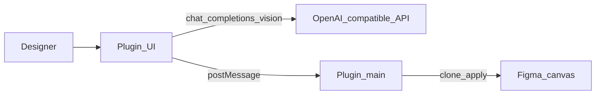

# AI 功能

[English](../ai-features.md) | **简体中文**

可选的 **AI 图层重命名** 与 **视觉分组** 位于**插件 UI**，调用任意支持视觉的 **OpenAI 兼容** Chat API。

与 MCP **相互独立**：桥工具从不需要 LLM API Key。



## 配置

1. 打开插件 → **⚙** → 如需切换界面语言（**中文** / **English**）
2. **⚙ → 模型设置** → 填写 **API base URL**（默认 `https://api.openai.com/v1`）
3. 填写 **Model**（默认 `gpt-4o`；`gpt-4o-mini` 也可用）
4. 粘贴 **API key**
5. 点击 **测试连接**，再 **保存**


凭证与语言偏好仅保存在本机 Figma **`clientStorage`**。文案见 [`locales.json`](../../packages/figma-agent-plugin/src/ui/locales.json)。

### 提示词模板

**⚙ → 提示词设置** — 分别编辑重命名 / 分组系统提示词。


- 默认：[`packages/figma-agent-plugin/src/prompts/*.prompt.txt`](../../packages/figma-agent-plugin/src/prompts/)
- 占位符：`{{candidates}}`、`{{suggestedClusters}}`（分组）
- **恢复默认** 载入仓库模板；**保存** 写入 `clientStorage` 覆盖项

### 自定义 AI 供应商

插件须在 `manifest.json` 声明允许的域名。仓库已内置常见主机，包括：

| 供应商 | 示例 Host |
|--------|-----------|
| OpenAI | `https://api.openai.com` |
| 通义 / 百炼 | `https://dashscope.aliyuncs.com`、`https://dashscope-intl.aliyuncs.com` |
| DeepSeek | `https://api.deepseek.com` |
| Moonshot | `https://api.moonshot.cn` |
| SiliconFlow | `https://api.siliconflow.cn` |
| 智谱 | `https://open.bigmodel.cn` |
| 火山方舟 | `https://ark.cn-beijing.volces.com` |
| OpenRouter / Groq / Together | `https://openrouter.ai` 等 |
| 本地代理 | `http://localhost` |
| 版本检查 | `https://raw.githubusercontent.com` |

Azure OpenAI 等自定义域名：加入 [`manifest.json`](../../packages/figma-agent-plugin/manifest.json) 的 `networkAccess.allowedDomains`，重建并重新 Import。

## AI 重命名

1. 选中单个 **Frame** 或 **Group**
2. 打开 **图层重命名** → **开始重命名**
3. 插件在右侧克隆选区，导出 1× PNG，连同候选图层发给 API
4. 返回名称应用到**副本**（原图层不动）

跳过：`TEXT` 与极小图层（&lt; 2px）。

## AI 视觉分组

1. 选中单个 **Frame** / **Group** / **Section**
2. 打开 **视觉分组** → **开始分组**
3. 在编辑器中审阅/修改 JSON 计划
4. **应用分组** — 在副本上深度优先建组

收集器还会给出简单行邻近聚类作为模型提示。

## 版本更新

插件拉取：

```text
https://raw.githubusercontent.com/ChinaCarlos/figma-agent-kit/main/releases/version.json
```

见 [插件发版](./plugin-release.md)。
