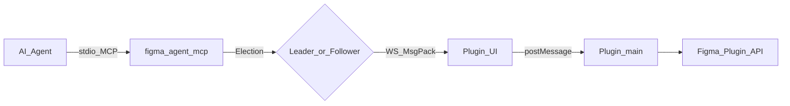
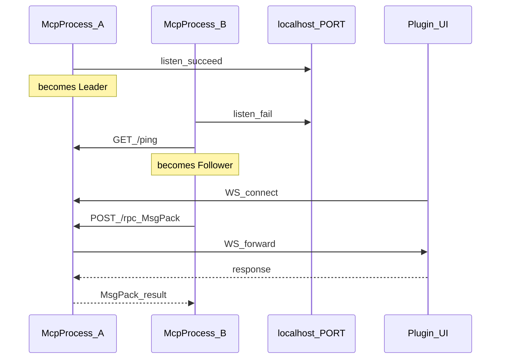
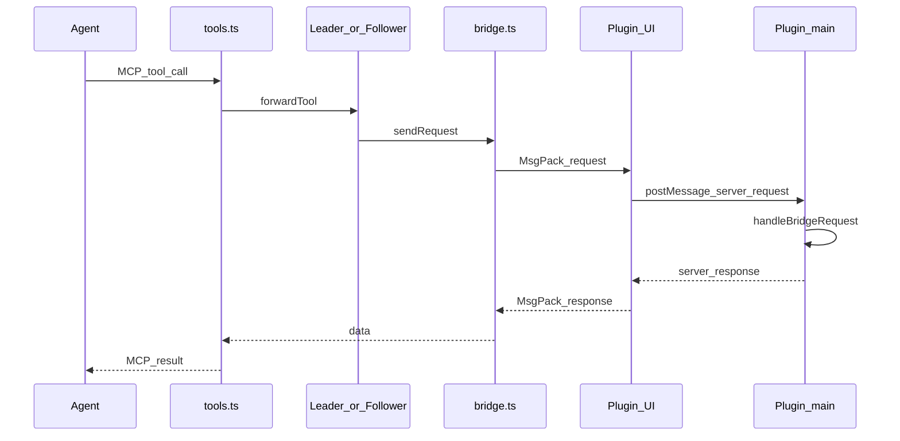
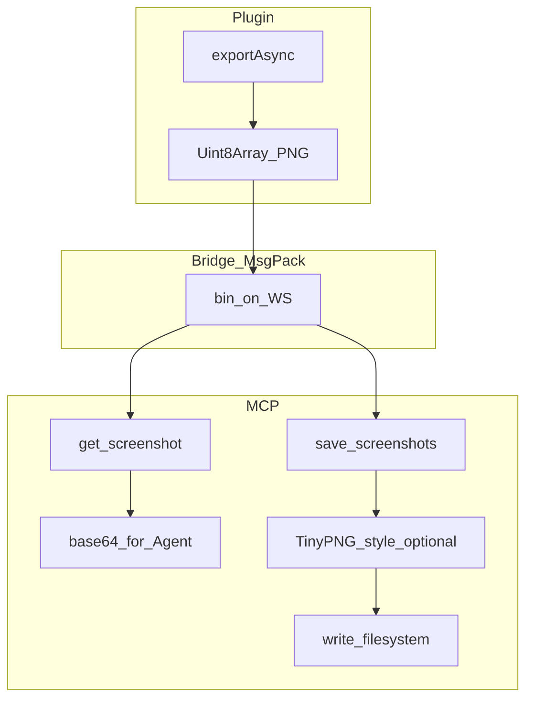
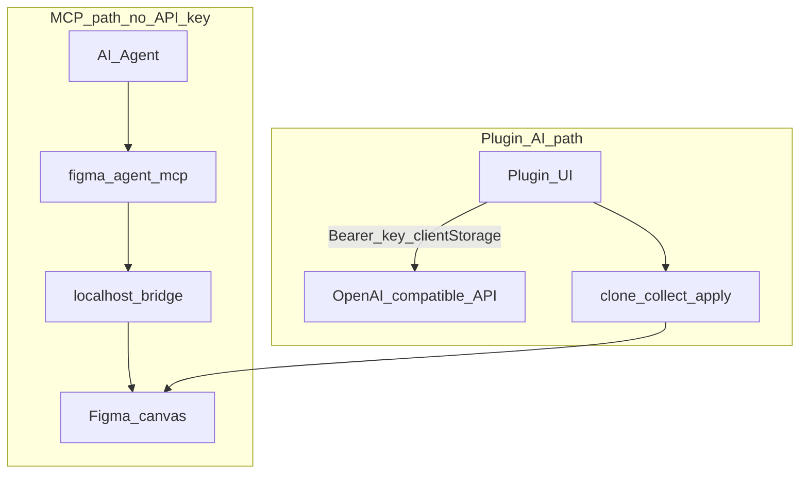

# 架构说明

[English](../architecture.md) | **简体中文**

说明 **Figma Agent Kit** 的包结构、运行时角色、数据路径与设计原则。

## 目标

- 让 AI Agent（Cursor、Claude Code、Codex 等）**读写**当前在 **Figma Desktop** 打开的文件
- 画布流量保持在 **localhost** — 桥工具不经 Figma REST 上传文档
- 通过单端口 Leader / Follower 选举支持**多个 MCP 客户端**
- 提供与 MCP 凭证无关的可选**插件内 AI**路径（重命名 / 分组）

## Monorepo 布局

```text
figma-agent-kit/
├── bridge.config.json          # 默认 WS 端口唯一真相源（1998）
├── packages/
│   ├── figma-agent-mcp/        # npm：stdio MCP + HTTP/WS 桥服务端
│   └── figma-agent-plugin/     # Figma Desktop 插件（桥客户端 + AI + 切图）
├── scripts/
│   ├── sync-bridge-config.mjs  # 同步端口 → MCP + 插件 + manifest
│   └── release-kit.mjs         # MCP 与插件同版本共发
└── docs/                       # 文档（英文默认，中文在 docs/zh）
```

| 包 | 分发 | 角色 |
|----|------|------|
| [`figma-agent-mcp`](https://www.npmjs.com/package/figma-agent-mcp) | npm / GitHub Packages | MCP 服务端 + 桥 Leader/Follower |
| `figma-agent-plugin` | GitHub Release ZIP | Figma UI + Plugin API 处理器 |

版本锁定在同一 `0.1.x`。优先使用 `pnpm release:kit:*`。

## 系统总览



端到端：

1. Agent 经 **stdio MCP** 连接 `figma-agent-mcp` 进程。
2. 该进程是 **Leader**（绑定 `localhost:PORT`）或 **Follower**（转发到 Leader）。
3. 插件 **UI iframe** 用 **MessagePack** 连接 Leader 的 WebSocket。
4. UI 将 RPC 转到插件 **main**，调用 Figma Plugin API（`documentAccess: dynamic-page`）。

## 技术栈

| 层 | 技术 |
|----|------|
| MCP | TypeScript (ESM)、`@modelcontextprotocol/sdk`、`ws`、`msgpackr`、`zod`、`pngjs` / `upng-js` |
| 插件 | TypeScript、Rsbuild、esbuild（codec / JSZip 注入）、Figma Plugin API |
| Monorepo | pnpm workspaces、共享 `bridge.config.json` |
| CI | GitHub Actions — 构建、pack、tag → npm / Releases / GH Packages |

## MCP 模块

| 模块 | 职责 |
|------|------|
| `index.ts` | CLI 入口、选举、MCP stdio |
| `election.ts` | Leader 监听 / Follower 挂接 / 故障接管 |
| `leader.ts` | HTTP `/ping`、`/files`、`/rpc` + WS upgrade |
| `follower.ts` | 向 Leader 发 HTTP |
| `bridge.ts` | 按 `fileKey` 的 WS 表、心跳、RPC 超时 |
| `codec.ts` | MsgPack 编解码（`useRecords: false`） |
| `tools.ts` / `schema.ts` | 37 工具 + Zod |
| `compress-png.ts` | `save_screenshots` 的 TinyPNG 风格压缩 |

## 插件模块

| 模块 | 职责 |
|------|------|
| `bridge/handlers.ts` | 工具实现（`getNodeByIdAsync`、Motion、写操作） |
| `bridge/serializer.ts` | 节点树序列化 |
| `ui/ui.html` | WS 客户端、设置、i18n、切图 UI |
| `ui/codec.ts` | 打进 UI 的 MsgPack codec |
| `rename/*`、`group/*` | 在副本上 AI 重命名 / 分组 |
| `export/slices.ts` | 1× 预览 / 3× PNG |

## Leader / Follower 选举

多个 Agent 窗口常会拉起多个 MCP 进程，但只有一个能绑定桥端口。



- Leader：绑端口、接插件、提供发现与 RPC。
- Follower：工具调用 → Leader 的 `POST /rpc`（MsgPack）；`list_files` → `GET /files`。
- 健康轮询约 3–5s：Leader 挂掉后 Follower 可再竞选接管。

## RPC 调用路径



要点：

- 线工具名可能是 `type` 或 `tool`。
- 截图 `data` 在桥上是原始 PNG **字节**（MsgPack `bin`），不是 base64。
- 日志只写 **stderr** — stdout 留给 MCP stdio。

## 截图与切图路径



| 工具 | 压缩 | 典型用途 |
|------|------|----------|
| `get_screenshot` | 无 | Agent 视觉预览（默认 `scale=2`） |
| `save_screenshots` | PNG 默认**开启** | 交付切图；用 **`scale=3`** 对齐插件 UI |

## 两条 AI 路径

MCP 桥工具不需要 LLM API Key。可选重命名/分组 AI 仅在插件 UI 内运行。



## 端口配置

1. 改根目录 [`bridge.config.json`](../../bridge.config.json) 的 `defaultPort`
2. 执行 `pnpm sync:bridge`（`predev` / `prebuild` 也会跑）
3. 重建插件并重启 MCP

仅 MCP 运行时可设 `FIGMA_AGENT_MCP_PORT` — **必须**与插件 manifest / UI 内嵌端口一致。

## 设计原则

1. **本地优先** — 桥流量留在 `localhost`
2. **热路径 MsgPack** — WS + Follower RPC；小探测接口用 JSON
3. **Stdout 纯净** — MCP 进程禁止往 stdout 打诊断日志
4. **异步查节点** — `dynamic-page` 使用 `figma.getNodeByIdAsync`
5. **同版本发版** — 协议变更后插件与 MCP 一起升级
6. **能力诚实** — Motion 需 Figma 暴露对应 API，否则返回明确错误

## 延伸阅读

- [桥接协议](./bridge-protocol.md)
- [MCP 工具](./tools.md)
- [上手指南](./getting-started.md)
- [常见问题](./faq.md)
