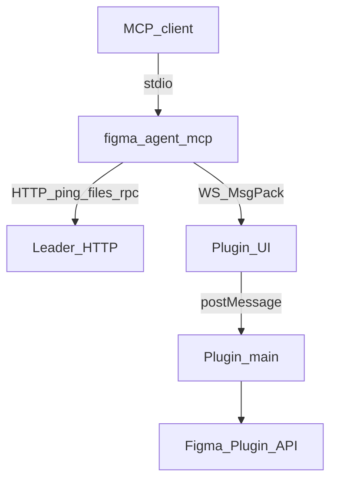
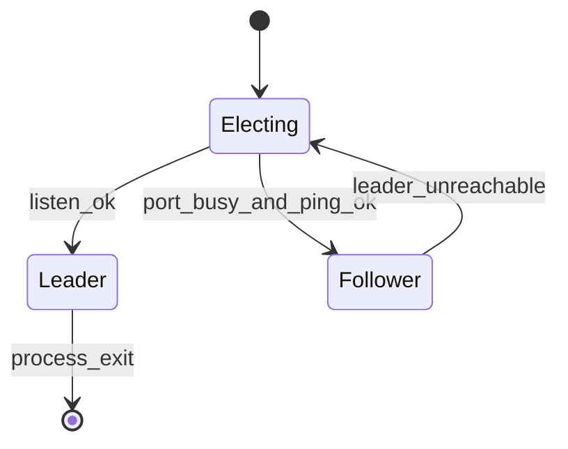

# 桥接协议

[English](../bridge-protocol.md) | **简体中文**

**figma-agent-mcp** 与 **figma-agent-plugin** 的通信方式。桥流量全部在 **localhost**。

总览与流程图见 [架构说明](./architecture.md)。

## 概览



默认端口来自仓库根目录 **`bridge.config.json`**（构建时同步进 MCP、插件 UI、`manifest.json`）。

MCP 可另设 `FIGMA_AGENT_MCP_PORT`（必须与插件内嵌端口一致）。

## 序列化（MessagePack）

桥 **WebSocket** 帧与 Leader↔Follower 的 **`POST /rpc`** 体使用 **MessagePack**（`application/msgpack`），经 [`msgpackr`](https://github.com/kriszyp/msgpackr)，`useRecords: false`。

| 通道 | 编码 |
|------|------|
| `WS /ws` | 二进制 WebSocket（MsgPack） |
| `POST /rpc` | `Content-Type: application/msgpack` |
| `GET /ping`、`GET /files` | JSON（健康检查 / 发现） |

### 为何用 MsgPack

- PNG 截图以 **MsgPack `bin`** 传输，避免 base64 约 33% 膨胀
- 大节点树比 JSON 更紧凑
- 逻辑消息形状不变，仅线格式为二进制

### 截图载荷

插件 → MCP：

```js
{
  images: [
    { nodeId: "1:2", format: "png", data: Uint8Array /* 原始 PNG 字节 */ }
  ]
}
```

- `save_screenshots` 直接写磁盘（可选压缩）
- `get_screenshot` 将 `data` 转为 **base64** 给 Agent

## 角色



| 角色 | 职责 |
|------|------|
| Leader | 绑端口、接插件 WS、提供 `/ping`、`/files`、`/rpc` |
| Follower | 经 `POST /rpc`（MsgPack）转发；经 `GET /files` 列文件 |

Leader 挂掉后，Follower 尝试接管。

## 插件 WebSocket

### 连接

```text
ws://localhost:1998/ws?fileKey=<FILE_KEY>&fileName=<ENCODED_NAME>
```

- `fileKey` 必填（`figma.fileKey`，或未保存文件的本地回退）
- 每个 `fileKey` 仅一条活跃连接（新连接替换旧连接）
- 客户端须设 `binaryType = "arraybuffer"`

### 心跳

Leader 约每 **30s** 发送：

```js
{ type: "ping" }
```

插件回复：

```js
{ type: "pong" }
```

无 `requestId`，不可当工具 RPC。漏两轮 → 关闭码 `4002`。

其他关闭码：`4000` 缺 `fileKey`，`4001` 被新连接替换。

### 请求 / 响应

请求：

```js
{
  type: "get_selection",  // 或 tool
  requestId: "unique-id",
  nodeIds: ["1:2"],
  params: {}
}
```

成功：`{ requestId, ok: true, data }`；失败：`{ requestId, ok: false, error }`。  
MCP 侧超时 **180 秒**。

## HTTP

### `GET /ping`

```json
{ "ok": true, "role": "leader" }
```

### `GET /files`

```json
{ "ok": true, "files": [{ "fileKey": "…", "fileName": "…" }] }
```

### `POST /rpc`

MsgPack 体：`{ tool, nodeIds?, params?, fileKey? }` → `{ ok, data | error }`。

## 文件路由

多文件同时连接时，工具参数传入 `fileKey`。`list_files` 返回当前映射。

## 稳定性建议

- 勿向 **stdout** 打印 MCP 协议流量
- 优先 Figma Desktop
- 尽量保存文件以稳定 `fileKey`
- **插件与 MCP 一起升级** — 桥路径要求 MsgPack
