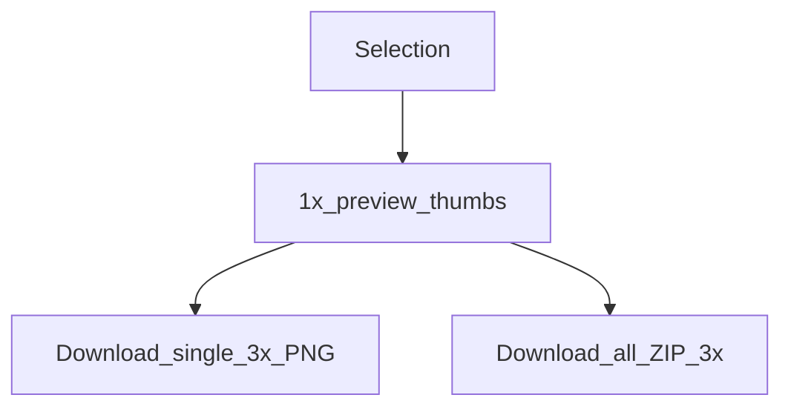

# 导出切图

[English](../exporting-slices.md) | **简体中文**

插件 UI 可将选中图层导出为 **PNG 切图**（及 ZIP），与 MCP `save_screenshots` 相互独立。

## 何时用哪条路径

| 路径 | 倍率 | 压缩 | 适合 |
|------|------|------|------|
| 插件 **导出切图** | 预览 **1×**，下载 **3×** | 浏览器下载 / ZIP | 设计师手工导出 |
| MCP `save_screenshots` | 默认 **2**，对齐请用 **`scale=3`** | PNG 默认 TinyPNG 风格 | Agent / 自动化 |



## 插件流程

1. 选中一个或多个可导出节点（最多 **50**）
2. 打开 **导出切图** — 自动生成 1× 预览
3. 点击缩略图可放大预览
4. 单张下载 PNG，或 **打包下载 ZIP**（UI 内 JSZip）


文件名会做文件系统消毒。不可导出类型会给出明确提示。

## MCP 对齐

```json
{
  "nodeIds": ["2009:2"],
  "scale": 3,
  "format": "PNG",
  "compress": true,
  "path": "./screenshots"
}
```

完整参数见 [tools.md](./tools.md)。

## 实现位置

- 逻辑：[`export/slices.ts`](../../packages/figma-agent-plugin/src/export/slices.ts)
- UI：[`ui.html`](../../packages/figma-agent-plugin/src/ui/ui.html)
- MCP 压缩：[`compress-png.ts`](../../packages/figma-agent-mcp/src/compress-png.ts)
