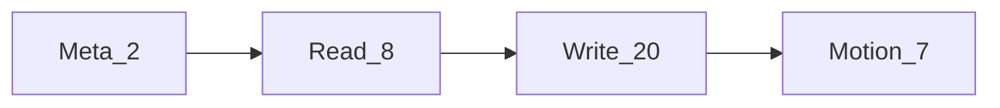

# MCP 工具

[English](../tools.md) | **简体中文**

**figma-agent-mcp** 暴露的工具（共 37 个）。除非注明，调用会经桥转发到已打开的 Figma 插件。

## 约定

| 约定 | 说明 |
|------|------|
| `fileKey` | 几乎所有工具可选 — 指定连接的文件 |
| 扁平字段 vs `properties` | 写工具可接受扁平字段，或嵌套 `properties`（插件侧合并） |
| 选区回退 | 截图 / metadata / design context / zoom 省略 `nodeIds` 时用**当前选区** |
| Motion | 需 Figma 暴露 Motion API，否则返回明确能力错误 |

## Meta（MCP 本地）

| 工具 | 说明 |
|------|------|
| `list_files` | 列出桥上已连接文件（Leader 本地 / Follower 经 `/files`） |
| `save_screenshots` | 导出到磁盘。PNG 默认 TinyPNG 风格压缩（`compress=true`）。`scale` 默认 **2**；切图对齐插件 UI 请用 **`scale=3`**。支持 `format`：PNG / SVG / JPG / PDF，以及 `clip`、`path` |

## 读

| 工具 | 说明 |
|------|------|
| `get_document` | 当前页面树（可选 `depth` 0–20） |
| `get_selection` | 当前选区 |
| `get_node` | 按 id 序列化（必填 `nodeIds`，可选 `depth`） |
| `get_styles` | 本地 paint / text / effect styles |
| `get_metadata` | 轻量 id / name / type / size |
| `get_design_context` | 供 Agent 的设计上下文 |
| `get_variable_defs` | 本地变量集合 |
| `get_screenshot` | 导出图；线为原始字节，Agent 侧为 base64。默认 PNG、`scale=2`。**不压缩** — 压缩切图请用 `save_screenshots` |

## 写 / 变更

| 工具 | 说明 |
|------|------|
| `set_node_visibility` | 显隐 |
| `set_text_content` | 改文字 |
| `set_text_properties` | 字号 / 字体 / 对齐 / 间距 |
| `set_node_properties` | 名称、位置、尺寸、透明度、旋转 |
| `set_solid_fill` | 纯色填充 |
| `set_gradient_fill` | 渐变 |
| `set_effects` | 阴影 / 模糊 |
| `set_stroke_properties` | 描边 |
| `set_auto_layout` | Auto Layout |
| `create_frame` / `create_text` / `create_shape` / `create_image` | 创建节点 |
| `duplicate_nodes` | 复制 |
| `reparent_nodes` | 改父级（`parentId`，可选 `index`） |
| `group_nodes` / `ungroup_node` | 成组 / 解组 |
| `set_selection` | 改选区 |
| `scroll_and_zoom_into_view` | 视口聚焦 |
| `delete_nodes` | 删除 |

## Motion（Figma Motion API beta）

| 工具 | 说明 |
|------|------|
| `get_motion_styles` | 列出动画样式 / 预设 |
| `get_node_motion` | 读节点动画、关键帧、时间线 |
| `apply_animation_style` | 应用样式（`styleId`，可选 `animationStyleData`）— 内置预设用 `animationStyleData.type: "FIGMA"` |
| `remove_animation_style` | 移除一个或全部 |
| `apply_manual_keyframe_track` / `remove_manual_keyframe_track` | 手动关键帧轨 |
| `set_timeline_duration` | 设置时间线时长 |

## 示例 Agent 流程

1. `list_files`
2. `get_selection` / `get_node`
3. `get_screenshot` 快速预览
4. `save_screenshots`（`scale: 3`，`compress: true`）交付切图
5. `set_text_content` / `set_node_properties`（或 Motion）应用修改

## Schema 源码

Zod：[`packages/figma-agent-mcp/src/schema.ts`](../../packages/figma-agent-mcp/src/schema.ts)  
注册：[`tools.ts`](../../packages/figma-agent-mcp/src/tools.ts)
